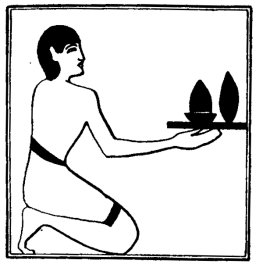

  
[Intangible Textual Heritage](../../index)  [Egypt](../index) 
[Index](index)  [Previous](lfo047)  [Next](lfo049) 

------------------------------------------------------------------------

### THE FORTY-NINTH CEREMONY.

In the next ceremony there were presented as a *Shebu* offering a Tua
cake and a Shens cake, and the Kher heb said:--

"Let there be praise to thee and to thy KA, O Osiris,

 

   
The Sem priest presenting the Tua cake and the Shens cake.

 

which hath been cut away from the hand of him that doeth violence to the
dead. O Unas, thou hast received these thy bread-cakes, which are from
the Eye of Horus.

"Osiris Unas, the Eye of Horus hath been presented unto thee, \[that is
to say,\] that which hath been mixed together for thee by it, so that
thou mayest be filled with that which hath been pressed out and hath

p. 110

come forth from thee." This sentence was recited four times.

The presentation of the following offerings then took place; each object
was offered to the mummy (or,

statue) four times, and each formula was recited by the Kher heb four
times.

------------------------------------------------------------------------

[Next: The Fiftieth Ceremony](lfo049)
