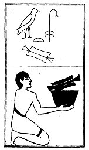

  
[Intangible Textual Heritage](../../index)  [Egypt](../index) 
[Index](index)  [Previous](lfo048)  [Next](lfo050) 

------------------------------------------------------------------------

### THE FIFTIETH CEREMONY.

The Sut joint, with the formula:--

"Osiris Unas, the Sut joint hath been presented unto thee \[as\] the Eye
of Horus."

 

   
The Sem priest presenting the Sut joint.

 

------------------------------------------------------------------------

[Next: The Fifty-first Ceremony](lfo050)
