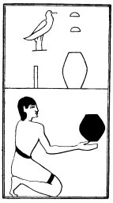

  
[Intangible Textual Heritage](../../index)  [Egypt](../index) 
[Index](index)  [Previous](lfo052)  [Next](lfo054) 

------------------------------------------------------------------------

### THE FIFTY-FOURTH CEREMONY.

Two Tut cakes, with the formula:--

"Osiris Unas, the Eye of Horus hath been presented unto thee, which
struck down Set."

 

   
The Sem priest presenting two Tut cakes.

 

------------------------------------------------------------------------

[Next: The Fifty-fifth Ceremony](lfo054)
