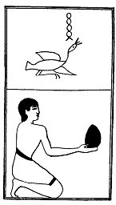

  
[Intangible Textual Heritage](../../index)  [Egypt](../index) 
[Index](index)  [Previous](lfo054)  [Next](lfo056) 

------------------------------------------------------------------------

### THE FIFTY-SIXTH CEREMONY.

Two Heth cakes, with the formula:--

"Osiris Unas, the Eye of Horus hath been presented unto thee, that thou
mayest seize it for thy mouth."

 

   
The Sem priest presenting two Heth cakes.

 

------------------------------------------------------------------------

[Next: The Fifty-seventh Ceremony](lfo056)
