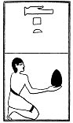

  
[Intangible Textual Heritage](../../index)  [Egypt](../index) 
[Index](index)  [Previous](lfo056)  [Next](lfo058) 

------------------------------------------------------------------------

### THE FIFTY-EIGHTH CEREMONY.

Four Tept cakes, with the formula:--

"Osiris Unas, \[the Eye of Horus hath been presented unto thee\], and
hath been given unto thine Eye for thee to taste."

 

   
The Sem priest presenting Tept cakes.

 

------------------------------------------------------------------------

[Next: The Fifty-ninth Ceremony](lfo058)
