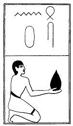

  
[Intangible Textual Heritage](../../index)  [Egypt](../index) 
[Index](index)  [Previous](lfo058)  [Next](lfo060) 

------------------------------------------------------------------------

### THE SIXTIETH CEREMONY.

Four Shens cakes, (or Shens), with the formula:--

"Osiris Unas, thou hast received thy head."

 

   
The Sem priest presenting the Shens cakes.

 

------------------------------------------------------------------------

[Next: The Sixty-first Ceremony](lfo060)
