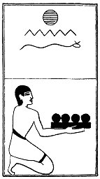

  
[Intangible Textual Heritage](../../index)  [Egypt](../index) 
[Index](index)  [Previous](lfo060)  [Next](lfo062) 

------------------------------------------------------------------------

### THE SIXTY-SECOND CEREMONY.

Four Khenfu cakes with the formula:--

"Osiris Unas, the Eye of Horus, which hath been made in the form of
fish-scales for thee, hath been presented unto thee."

 

   
The Sem priest presenting the Khenfu cakes.

 

------------------------------------------------------------------------

[Next: The Sixty-third Ceremony](lfo062)
