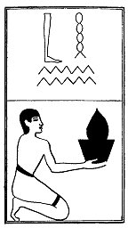

  
[Intangible Textual Heritage](../../index)  [Egypt](../index) 
[Index](index)  [Previous](lfo061)  [Next](lfo063) 

------------------------------------------------------------------------

p. 117

### THE SIXTY-THIRD CEREMONY.

Four baskets of Hebennet cakes (?), with the formula:--

"Osiris Unas, the Eye of Horus hath been presented unto thee, that it
may well up with water(?) \[before thee\]."

 

   
The Sem priest presenting the Hebennet cakes.

 

------------------------------------------------------------------------

[Next: The Sixty-fourth Ceremony](lfo063)
