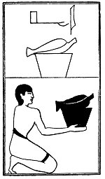

  
[Intangible Textual Heritage](../../index)  [Egypt](../index) 
[Index](index)  [Previous](lfo068)  [Next](lfo070) 

------------------------------------------------------------------------

### THE SEVENTIETH CEREMONY.

A loin of beef (?), *Aa*, with a formula, two versions of which are
extant. The rendering of one is:--

"Osiris Unas, \[here is\] the marked piece of flesh and bone from which
Seb cuts not off the *aau* joint," [1](#fn_74)

 

   
The Sem priest presenting the loin of beef.

 

p. 121

and of the other

\[Osiris\] Peta-Amen-apt, the mark of that which is "abominable (or, the
abominable one) is burnt into the *aa* joint." [1](#fn_75)

------------------------------------------------------------------------

### Footnotes

[120:1](lfo069.htm#fr_74) Maspero, "Osiris, le
marqué, do la chair duquel Sibou ne retranche pas chair."

[121:1](lfo069.htm#fr_75) Dümichen, "O
Obercherheb Petamenap, das Malzeichen des Schändlichen ist eingebrannt
an der Lende."

------------------------------------------------------------------------

[Next: The Seventy-first Ceremony](lfo070)
