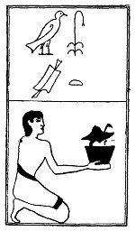

  
[Intangible Textual Heritage](../../index)  [Egypt](../index) 
[Index](index)  [Previous](lfo070)  [Next](lfo072) 

------------------------------------------------------------------------

p. 122

### THE SEVENTY-SECOND CEREMONY.

The Sut joint, with the formula:--

"Osiris Unas, the Sut joint hath been presented unto thee as the Eye of
Horus.'"

 

   
The Sem priest presenting the Sut joint.

 

------------------------------------------------------------------------

[Next: The Seventy-third Ceremony](lfo072)
