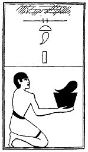

  
[Intangible Textual Heritage](../../index)  [Egypt](../index) 
[Index](index)  [Previous](lfo073)  [Next](lfo075) 

------------------------------------------------------------------------

### THE SEVENTY-FIFTH CEREMONY.

A liver, with the formula:--

"Osiris Unas, the Eye of Horus hath been presented unto thee, so that
thou mayest journey with it."

 

   
The Sem priest presenting a liver.

 

------------------------------------------------------------------------

[Next: The Seventy-sixth Ceremony](lfo075)
