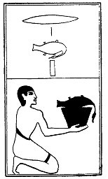

  
[Intangible Textual Heritage](../../index)  [Egypt](../index) 
[Index](index)  [Previous](lfo077)  [Next](lfo079) 

------------------------------------------------------------------------

### THE SEVENTY-NINTH CEREMONY.

A Re goose, with the formula:--

"Osiris Unas, the heads of the followers of Set have been presented unto
thee \[in the form of this\] Sera goose."

 

   
The Beni priest presenting a Re goose.

 

------------------------------------------------------------------------

[Next: The Eightieth Ceremony](lfo079)
