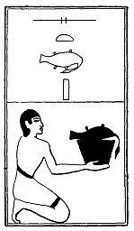

  
[Intangible Textual Heritage](../../index)  [Egypt](../index) 
[Index](index)  [Previous](lfo079)  [Next](lfo081) 

------------------------------------------------------------------------

### THE EIGHTY-FIRST CEREMONY.

A Set goose, with the formula:--

"Osiris Unas, the Eye of Horus hath been presented unto thee, and it is
carried unto thee."

 

   
The Sem priest presenting a Set goose.

 

------------------------------------------------------------------------

[Next: The Eighty-second Ceremony](lfo081)
