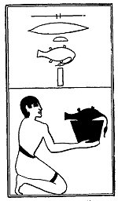

  
[Intangible Textual Heritage](../../index)  [Egypt](../index) 
[Index](index)  [Previous](lfo080)  [Next](lfo082) 

------------------------------------------------------------------------

p. 127

### THE EIGHTY-SECOND CEREMONY.

A Sert goose, with the formula:--

"Osiris Unas, the Eye of Horus hath been presented unto thee \[in the
form of\] the things which come for thee."

 

   
The Sem priest presenting a Sert goose.

 

------------------------------------------------------------------------

[Next: The Eighty-third Ceremony](lfo082)
