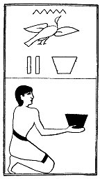

  
[Intangible Textual Heritage](../../index)  [Egypt](../index) 
[Index](index)  [Previous](lfo084)  [Next](lfo086) 

------------------------------------------------------------------------

p. 129

### THE EIGHTY-SIXTH CEREMONY.

Two baskets of Nepat grain, with the formula:--

"Osiris Unas, the Eye of Horus, which hath been counted [1](#fn_76) (or reckoned up), hath been presented unto
thee."

 

   
The Sem priest presenting two baskets of Nepat grain.

 

------------------------------------------------------------------------

### Footnotes

[129:1](lfo085.htm#fr_76) I.e., restored to its
master Horus.

------------------------------------------------------------------------

[Next: The Eighty-seventh Ceremony](lfo086)
