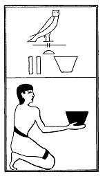

  
[Intangible Textual Heritage](../../index)  [Egypt](../index) 
[Index](index)  [Previous](lfo085)  [Next](lfo087) 

------------------------------------------------------------------------

### THE EIGHTY-SEVENTH CEREMONY.

Two baskets of Mest grain, with the formula:--

"Osiris Unas, the Eye of Horus hath been taken, and the water which is
in it hath been made to be with thee."

 

   
The Sem priest presenting two baskets of Mest grain.

 

------------------------------------------------------------------------

[Next: The Eighty-eighth Ceremony](lfo087)
