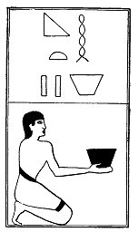

  
[Intangible Textual Heritage](../../index)  [Egypt](../index) 
[Index](index)  [Previous](lfo089)  [Next](lfo091) 

------------------------------------------------------------------------

### THE NINETY-FIRST CEREMONY.

Two vessels of Heqt beer, with the formula:--

"Osiris Unas, thou art filled with that which hath been pressed out and
hath come forth from thee."

 

   
The Sem priest presenting two vessels of beer.

 

------------------------------------------------------------------------

[Next: The Ninety-second Ceremony](lfo091)
