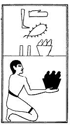

  
[Intangible Textual Heritage](../../index)  [Egypt](../index) 
[Index](index)  [Previous](lfo093)  [Next](lfo095) 

------------------------------------------------------------------------

### THE NINETY-FIFTH CEREMONY.

Two baskets of figs, with the formula:--

"Osiris Unas, the breast of Horus hath been presented unto thee, and the
gods eat of it together with thee."

 

   
The Sem priest presenting two baskets of figs.

 

------------------------------------------------------------------------

[Next: The Ninety-sixth Ceremony](lfo095)
