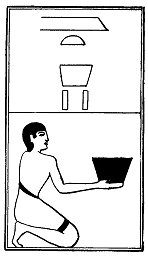
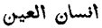
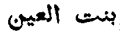
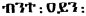

  
[Intangible Textual Heritage](../../index)  [Egypt](../index) 
[Index](index)  [Previous](lfo096)  [Next](lfo098) 

------------------------------------------------------------------------

### THE NINETY-EIGHTH CEREMONY.

Two vessels of Amt (?) wine, or wine of Pelusium, with the formula:--

"Osiris Unas, the child which is in the Eye of Horus hath been presented
unto thee, and thy mouth hath been opened thereby."

p. 136

 

   
The Sem priest presenting two vessels of Amt wine.

 

By the words "child which is in the Eye," we are to understand "pupil of
the eye," or "apple of the eye," i.e., that which is guarded as the most
precious thing. The same idea exists in Hebrew, compare אִשׁו{! 0x5e ^
!}^ן, the "little man" of the eye (Deut. xxxii. 10; Proverbs vii. 2),
and in Arabic  . We have
also "daughter of the eye," בַּת-עַיַן in Psalm xvii. 8, in Arabic  , and in Ethiopic   = Greek κόρη (Deut. xxxii, 10
Psalm xvi. 9; Proverbs vii. 2).

------------------------------------------------------------------------

[Next: The Ninety-ninth Ceremony](lfo098)
