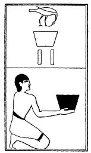

  
[Intangible Textual Heritage](../../index)  [Egypt](../index) 
[Index](index)  [Previous](lfo097)  [Next](lfo099) 

------------------------------------------------------------------------

p. 137

### THE NINETY-NINTH CEREMONY.

Two vessels of Qem wine, or wine of Mareotis, with the formula:--

"Osiris Unas, the Eye of Horus which was snared in a net hath been
presented unto thee, and thy mouth hath been opened thereby."

 

   
The Sem priest presenting two vessels of Qem wine.

 

------------------------------------------------------------------------

[Next: The One Hundredth Ceremony](lfo099)
