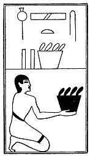

  
[Intangible Textual Heritage](../../index)  [Egypt](../index) 
[Index](index)  [Previous](lfo102)  [Next](lfo104) 

------------------------------------------------------------------------

### THE ONE HUNDRED AND FOURTH CEREMONY.

Two vessels of White Seshet grain, with the formula:--

"Osiris Unas, the Eye of Horus hath been presented unto thee, the White
One, the Glorious One, and it shall serve for thy food."

 

   
The Sem priest presenting two vessels of Seshet grain.

 

------------------------------------------------------------------------

[Next: The One Hundred and Fifth Ceremony](lfo104)
