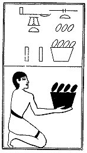

  
[Intangible Textual Heritage](../../index)  [Egypt](../index) 
[Index](index)  [Previous](lfo104)  [Next](lfo106) 

------------------------------------------------------------------------

### THE ONE HUNDRED AND SIXTH CEREMONY.

Two vessels of roasted Set grain, with the formula:--

"Osiris Unas, the Eye of Horus, the Glorious One, which shall turn back
\[the fiends of Set\], hath been presented unto thee."

 

   
The Sem priest presenting two vessels of roasted Set grain.

 

------------------------------------------------------------------------

[Next: The One Hundred and Seventh Ceremony](lfo106)
