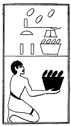

  
[Intangible Textual Heritage](../../index)  [Egypt](../index) 
[Index](index)  [Previous](lfo105)  [Next](lfo107) 

------------------------------------------------------------------------

p. 141

### THE ONE HUNDRED AND SEVENTH CEREMONY.

Two vessels of roasted Set grain, with the formula:--

"Osiris Unas, the Eye of Horus hath been presented unto thee, the
Glorious One, which shall turn back \[the fiends of Set\]."

 

   
The Sem priest presenting two vessels of roasted Set grain.

------------------------------------------------------------------------

[Next: The One Hundred and Eighth Ceremony](lfo107)
