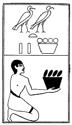

  
[Intangible Textual Heritage](../../index)  [Egypt](../index) 
[Index](index)  [Previous](lfo106)  [Next](lfo108) 

------------------------------------------------------------------------

### THE ONE HUNDRED AND EIGHTH CEREMONY.

Two vessels of Babat fruit, with the formula:--

"Osiris Unas, the Eye of Horus hath been presented unto thee, and
behold, it is from Baba (?)."

 

   
The Sem priest presenting two vessels of Babat fruit.

 

p. 142

Dümichen thought that Baba was a name of Set, but it seems more probable
that the Baba mentioned here is the first-born son of Osiris.

------------------------------------------------------------------------

[Next: The One Hundred and Ninth Ceremony](lfo108)
