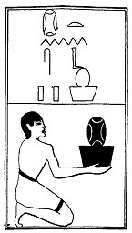

  
[Intangible Textual Heritage](../../index)  [Egypt](../index) 
[Index](index)  [Previous](lfo109)  [Next](lfo111) 

------------------------------------------------------------------------

### THE ONE HUNDRED AND ELEVENTH CEREMONY.

Two vessels of Hua grain, with the formula:--

"Osiris Unas, the Eye of Horus hath been presented unto thee, the
Glorious One, who was in his throat (?)."

 

   
The Sem priest presenting two vessels of Hua grain.

 

------------------------------------------------------------------------

[Next: The One Hundred and Twelfth Ceremony](lfo111)
