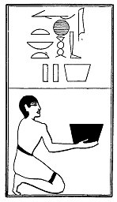

  
[Intangible Textual Heritage](../../index)  [Egypt](../index) 
[Index](index)  [Previous](lfo110)  [Next](lfo112) 

------------------------------------------------------------------------

p. 144

### THE ONE HUNDRED AND TWELFTH CEREMONY.

Two measures of sweet things of all kinds, with the formula:--

"Osiris Unas, the Eye of Horus hath been presented unto thee, the
sweetness of which followeth thee."

 

   
The Sem priest presenting sweet things of all kinds.

 

------------------------------------------------------------------------

[Next: The One Hundred and Thirteenth Ceremony](lfo112)
