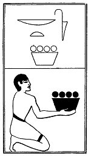

  
[Intangible Textual Heritage](../../index)  [Egypt](../index) 
[Index](index)  [Previous](lfo111)  [Next](lfo113) 

------------------------------------------------------------------------

### THE ONE HUNDRED AND THIRTEENTH CEREMONY.

Two baskets of spring fruit, flowers, and vegetables, with the formula
--

"Osiris Unas, the Eye of Horus hath been presented unto thee, and thou
hast had experience thereof."

 

   
The Sem priest presenting spring fruit, flowers, &c.

 

------------------------------------------------------------------------

[Next: The One Hundred and Fourteenth Ceremony](lfo113)
