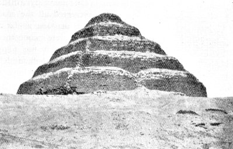

  
[Intangible Textual Heritage](../../index)  [Egypt](../index) 

------------------------------------------------------------------------

<table width="75%">
<colgroup>
<col style="width: 50%" />
<col style="width: 50%" />
</colgroup>
<tbody>
<tr class="odd">
<td width="50%"></td>
<td width="50%"><h1 id="the-pyramid-texts" data-align="center">The Pyramid Texts</h1>
<h2 id="translation-by-samuel-a.-b.-mercer" data-align="center">Translation by Samuel A. B. Mercer</h2>

[1952, copyright not renewed]
</td>
</tr>
</tbody>
</table>

------------------------------------------------------------------------

[Contents](#contents)    [Start Reading](pyt00)

------------------------------------------------------------------------

The Pyramid Texts were funerary inscriptions that were written on the
walls of the early Ancient Egyptian pyramids at Sakkara. These date back
to the fifth and sixth dynasties, approximately the years 2350-2175
B.C.E. However, because of extensive internal evidence, it is believed
that they were composed much earlier, circa 3000 B.C.E. The Pyramid
Texts are, therefore, essentially the oldest sacred texts known.

Samuel Mercer was the first to produce a complete English translation of
this mysterious text, in 1952. This was also the first complete
translation in any language. The Mercer translation was followed by the
R.O. Faulkner translation in 1969, which is considered the standard
today. However, this does not diminish the usefulness of Mercer's
version, particularly because it has fallen into the public domain and
is now available freely online here at Intangible Textual Heritage, the
first complete version of the Pyramid Texts on the Internet.

PRODUCTION NOTES: The four volume edition from which this was scanned is
today very rare and sells for upwards of $800 on the used market. This
etext is the complete text of volume one of this set, and includes the
complete Mercer translation of the Pyramid Texts. Volumes 2-4 are
commentary by Mercer and others. I do not currently plan to scan the
remaining volumes.

I believe that this work is in the public domain in the United States.
It will not be in the public domain in the UK or EU until 2022. Here are
the facts. Mercer, a Canadian by birth, published this work in 1952. It
was published simultaneously in the United States and Canada. Samuel
Mercer died on January 12, 1969 at the age of 89. By US copyright law at
the time, the copyright should have been registered at the US copyright
office in 1952 and renewed in 1980. However there is no evidence that
this is the case, based on an extensive search of the online US
Copyright Office database. The GATT restoral of 1/1/1996 restored
copyrights on foreign works which were not registered properly in the
US; however, this does not apply to works simultaneously published in
the US and abroad.

--John Bruno Hare, June 2, 2004

------------------------------------------------------------------------

 [Title Page](pyt00)  
[Preface](pyt01)  
[Contents](pyt02)  
[Introduction](pyt03)  

### The Pyramid Texts

[1. Nut and the Deceased King, Utterances 1-11](pyt04)  
[2. Ritual of Bodily Restoration of the Deceased, and Offerings,
Utterances 12-203](pyt05)  
[3. A Group of Prayers And Charms, Utterances 204-212](pyt06)  
[4. A Series of Old Heliopolitan Texts Partly Osirianized, Utterances
213-222](pyt07)  
[5. The Deceased King Receives Offerings and is Re-Established in His
Functions and Possessions, Utterances 223-225](pyt08)  
[6. Mostly Serpent Charms, Utterances 226-243](pyt09)  
[7. The Deceased King Arrives in Heaven Where He is Established,
Utterances 244-259](pyt10)  
[8. The Deceased King Triumphs Over His Enemies and is Recognized by the
Gods, Utterances 260-262](pyt11)  
[9. Means Whereby the Deceased King Reaches Heaven, Utterances
263-271](pyt12)  
[10. The Deceased King in Heaven, Utterances 272-274.](pyt13)  
[11. Charms, Utterances 275-299](pyt14)  
[12. The Ferryman and the Deceased King's Ascension, Utterances
300-311](pyt15)  
[13. A Series of Five Charms, Utterances 312-316](pyt16)  
[14. Miscellaneous Utterances on the Career of the Deceased King in the
Hereafter, 317-337](pyt17)  
[15. Offerings for the Deceased King, Utterances 338-349](pyt18)  
[16. Miscellaneous Utterances on the Hereafter, 350-374](pyt19)  
[17. Conjurations and Charms, Utterances 375-400](pyt20)  
[18. Utterances Concerning Well-Being, Especially Food and Clothes,
401-426](pyt21)  
[19. In Praise of Nut, Utterances 427-435](pyt22)  
[20. Miscellaneous Texts--Some Largely Osirian, Utterances
436-442](pyt23)  
[21. Second Series in Praise of Nut, Utterances 443-452](pyt24)  
[22. A Miscellaneous Group, Utterances 453-486](pyt25)  
[23. A Series of Food Texts, Utterances 487-502](pyt26)  
[24. A Series of Reed-Floats and Ferryman Texts, Utterances
503-522](pyt27)  
[25. Miscellaneous Texts Chiefly About the Deceased King's Reception and
Life in Heaven, Utterances 523-533](pyt28)  
[26. For The Protection of the Pyramid Enclosure Against Osiris and His
Cycle, Utterance 534](pyt29)  
[27. Texts of Miscellaneous Contents, Utterances 535-538](pyt30)  
[28. A Litany of Ascension, Utterance 539](pyt31)  
[29. Texts of Miscellaneous Contents, Utterances 540-552](pyt32)  
[30. Resurrection, Meal, and Ascension of the Deceased King, Utterance
553](pyt33)  
[31. Texts of Miscellaneous Contents, Utterances 554-562](pyt34)  
[32. A Purification Litany, Utterance 563](pyt35)  
[33. Texts of Miscellaneous Contents, Utterances 564-569](pyt36)  
[34. New-Birth of the Deceased King as a God in Heaven, Utterance
570](pyt37)  
[35. Texts of Miscellaneous Contents, Utterances 571-575](pyt38)  
[36. The Resurrection and Ascension of the Deceased King, Utterance
576](pyt39)  
[37. The Resurrection of Osiris with whom the Gods are Satisfied,
Utterance 577](pyt40)  
[38. Texts of Miscellaneous Contents, Utterances 578-586](pyt41)  
[39. An Early Hymn to the Sun, Utterance 587](pyt42)  
[40. Texts of Miscellaneous Contents, Utterances 588-600](pyt43)  
[41. A Litany-Like Incantation for the Endurance of a Pyramid and
Temple, Utterance 601](pyt44)  
[42. Texts of Miscellaneous Contents, Utterances 602-605](pyt45)  
[43. The Resurrection, Ascension, and Reception of the Deceased King in
Heaven, Utterance 606](pyt46)  
[44. Texts of Miscellaneous Contents, Utterances 607-609](pyt47)  
[45. The Deceased King on Earth and in Heaven Utterance 610](pyt48)  
[46. Texts of Miscellaneous Contents, Utterances 611-626](pyt49)  
[47. The Ascended King, His Works, and Identifications, Utterance
627](pyt50)  
[48. Texts of Miscellaneous Contents, Utterances 628-658](pyt51)  
[49. The Death of the King and His Arrival in Heaven, Utterance
659](pyt52)  
[50. Texts of Miscellaneous Contents, Utterances 660-669](pyt53)  
[51. The Death, Resurrection, and Spiritualization of the King,
Utterance 670](pyt54)  
[52. Texts of Miscellaneous Contents, Utterances 671-675](pyt55)  
[53. Resurrection, Transfiguration, and Life of the King in Heaven,
Utterance 676](pyt56)  
[54. Texts of Miscellaneous Contents, Utterances 677-683](pyt57)  
[55. The Deceased King Ascends to Heaven, Utterance 684](pyt58)  
[56. Texts of Miscellaneous Contents, Utterances 685-689](pyt59)  
[57. A Series of Addresses to the Deceased King as a God, Utterance
690](pyt60)  
[58. Texts of Miscellaneous Contents, Utterances 691-704](pyt61)  
[59. A Series of Unclassifiable Fragments, Utterances 705-714](pyt62)  
