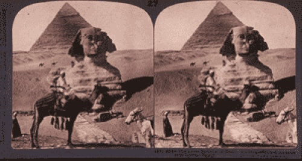

  
[Intangible Textual Heritage](../../index)  [Egyptian](../index) 

------------------------------------------------------------------------

[Buy this Book at
Amazon.com](https://www.amazon.com/exec/obidos/ASIN/B0027ISA32/internetsacredte)

------------------------------------------------------------------------

<table width="75%">
<colgroup>
<col style="width: 50%" />
<col style="width: 50%" />
</colgroup>
<tbody>
<tr class="odd">
<td width="50%" data-valign="TOP"> 
Stereoscopic photograph of the Pyramids, taken by James Henry Breasted [1908] (Public Domain Image)</td>
<td width="50%" data-valign="CENTER"><h1 id="development-of-religion-and-thought-in-ancient-egypt" data-align="CENTER">Development of Religion and Thought in Ancient Egypt</h1>
<h2 id="by-james-henry-breasted" data-align="CENTER">by James Henry Breasted</h2>
<h4 id="section" data-align="CENTER">[1912]</h4></td>
</tr>
</tbody>
</table>

------------------------------------------------------------------------

[Contents](#contents)    [Start Reading](rtae00)    [Page
Index](pageidx)    [Text \[Zipped\]](rtae.txt.gz)

------------------------------------------------------------------------

|                                                                                                                           |
|---------------------------------------------------------------------------------------------------------------------------|
|  |

Most of the 19th century work in Egyptology was done by German, French
or English researchers. James Henry Breasted (1865-1935) was the first
American citizen to get a PhD in Egyptology, at the University of
Berlin. In this book, Breasted details the evolution of religious belief
through thousands of years of Egyptian history. He describes (and quotes
extensively from) the great funerary texts, most importantly the Pyramid
texts, as well as the Coffin texts and the Book of the Dead. He covers
the history of Egyptian religion from the earliest Osiran beliefs up to
the groundbreaking monotheism of Akhenaton. This book is a must-read for
anyone interested in Egyptian religion.--J.B. Hare, April 25th, 2009.

------------------------------------------------------------------------

 [Title Page](rtae00)  
[Preface](rtae01)  
[Epitome of the Development](rtae02)  
[Contents](rtae03)  
[Chronology](rtae04)  
[Lecture I. The Origins: Nature and the State in their Impression on
Religion—Earliest Systems](rtae05)  
[Lecture II. Life After Death—The Sojourn in the Tomb—Death Makes its
Impression on Religion](rtae06)  
[Lecture III. The Realms of the Dead—The Pyramid Texts—The Ascent to the
Sky](rtae07)  
[Lecture IV. Realms of the Dead—The Earliest Celestial
Hereafter](rtae08)  
[Lecture V. The Osirianization of the Hereafter](rtae09)  
[Lecture VI. The Emergence of the Moral Sense—Moral Worthiness and the
Hereafter—Scepticism and the Problem of Suffering](rtae10)  
[Lecture VII. The Social Forces make their Impression on Religion—The
Rise of Social Reformers—The Earliest Social Regeneration](rtae11)  
[Lecture VIII. Popularization of the Old Royal Hereafter—Triumph of
Osiris—Conscience and the Book of the Dead—Magic and Morals](rtae12)  
[Lecture IX. The Imperial Age—The World-State Makes its Impression on
Religion—Triumph of Re—Earliest Monotheism—Ikhnaton (Amenhotep
IV)](rtae13)  
[Lecture X. The Age of Personal Piety—Sacerdotalism and Final
Decadence](rtae14)  
[Index](rtae15)  
