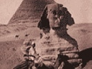

  
[Intangible Textual Heritage](../../index)  [Egyptian](../index) 
[Index](index)  [Previous](rtae01)  [Next](rtae03) 

------------------------------------------------------------------------

[Buy this Book at
Amazon.com](https://www.amazon.com/exec/obidos/ASIN/B0027ISA32/internetsacredte)

------------------------------------------------------------------------

  
*Development of Religion and Thought in Ancient Egypt*, by James Henry
Breasted, \[1912\], at Intangible Textual Heritage

------------------------------------------------------------------------

p. xix

### EPITOME OF THE DEVELOPMENT

Nature furnishes the earliest gods—The
national state makes early impression on religion—Its forms pass over
into the world of the gods—Their origin and function in nature retire
into the background—The gods become active in the sphere of human
affairs—They are intellectualized and spiritualized till the human arena
becomes their domain—The gods are correlated into a general system—In
the conception of death and the hereafter we find a glorious celestial
realm reserved exclusively for kings and possibly nobles—Herein, too, we
discern the emergence of the moral sense and the inner life in their
influence on religion—Recognition of futility of material agencies in
the hereafter and resulting scepticism—Appearance of the capacity to
contemplate society—Recognition of the moral unworthiness of society and
resulting scepticism—The cry for social justice—The social forces make
their impression on religion—Resulting democratization of the formerly
royal hereafter—Magic invades the realm of morals—The Empire (the
*international* state) and political universalism so impress religion
that the "world-idea" emerges and monotheism results—Earliest
manifestation of personal piety growing out of paternal monotheism and
the older social justice—The individual in religion—The age of the
psalmist and the sage—Sacerdotalism triumphs, resulting in intellectual
stagnation, the inertia of thoughtless acceptance, and the development

p. xx

ceases in scribal conservation of the old teachings—The retrospective
age—A religious development of three thousand years analogous in the
main points to that of the Hebrews.

------------------------------------------------------------------------

[Next: Contents](rtae03)
