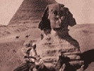

  
[Intangible Textual Heritage](../../index)  [Egyptian](../index) 
[Index](index)  [Previous](rtae13)  [Next](rtae15) 

------------------------------------------------------------------------

[Buy this Book at
Amazon.com](https://www.amazon.com/exec/obidos/ASIN/B0027ISA32/internetsacredte)

------------------------------------------------------------------------

  
*Development of Religion and Thought in Ancient Egypt*, by James Henry
Breasted, \[1912\], at Intangible Textual Heritage

------------------------------------------------------------------------

p. 344

### LECTURE X

#### THE AGE OF PERSONAL PIETY—SACERDOTALISM AND FINAL DECADENCE

The fall of Ikhnaton is shrouded in
complete obscurity. The ultimate result was the restoration of Amon by
Tutenkhamon, one of Ikhnaton's feeble successors. The old régime
returned. Tutenkhamon's account of his restoration of the gods is an
interesting revelation of the religious and intellectual attitude of the
leading men of affairs when Ikhnaton had passed away. The new king
refers to himself as "the good ruler, who did excellent things for the
father of all gods (Amon), who restored for him that which was in ruin
as everlasting monuments; cast out for him sin in the Two Lands (Egypt),
so that righteousness endured . . .; and made lying to be the
abomination of the land, as in the beginning. For when his majesty was
crowned as king, the temples of the gods and goddesses were
\[desolat\]ed from Elephantine as far as the marshes of the Delta [1](#fn_859) . . . (hammered out). Their holy places
were ⌈forsaken⌉ and had become overgrown tracts, . . . their sanctuaries
were like that which has never been, and their houses were trodden
roads. The land was in an evil pass, and as for the gods, they had
forsaken this land. If people were sent to Syria to extend

p. 345

the borders of Egypt, they prospered not at all; if men prayed to a god
for succor, he came not; . . . if men besought a goddess likewise, she
came not at all. Their hearts were ⌈deaf⌉ in their bodies, and they
diminished what was done. Now, after days had passed by these things,
\[his majesty\] appeared upon the throne of his father, he ruled the
regions of Horus. . . . His majesty was making the plans of this land
and the needs of the two regions were before his majesty, as he took
counsel with his own heart, seeking every excellent matter and searching
for profitable things for his father Amon, fashioning his august
emanation of pure gold, and giving to him more than was done
before." [1](#fn_860)

Thus was the memory of the great idealist execrated. When in a state
document it was necessary to refer to him, he was called "the criminal
of Akhetaton." The reestablished priesthood of Amon rejoiced in the
restoration of their power, especially when the ephemeral successors of
Ikhnaton were followed by the able rule of Harmhab, a military leader
who had contrived gradually to secure control of the situation. A hymn
to Amon from this period reveals the exultant triumph of his devotees as
they sing to him:

"Thou findest him who transgresses against thee;  
 Woe to him who assails thee!  
 Thy city endures;

p. 346

\[paragraph
continues\]  But he who assails thee falls.  
 Fie upon him who transgresses against thee in every land.  
 .   .   .   .   .   .   .   .   .   .   .   .   .   .   .   .   .  
 The sun of him who knows thee not goes down,  
 O Amon! But as for him who knows thee, he shines.  
 The forecourt of him who assailed thee is in darkness,  
 But the whole earth is in light.  
 Whosoever puts thee in his heart, O Amon,  
 Lo, his sun dawns." [1](#fn_861)

This very hymn, however, betrays its connection with the old Solar faith
and the paternal interpretation of Re, as it goes on to the praise of
Amon as the "good shepherd" and the "pilot," ideas which, we recall,
arose in the social movement of the Feudal Age. Indeed, notwithstanding
the restoration of Amon, the ideas and the tendencies which had given
birth to the revolution of Ikhnaton were far from disappearing. It was
not possible to carry them on, under a monotheistic form, involving the
annihilation of the old gods; but the human and beneficent aspects of
Aton, in his care for all men, had taken hold upon the imagination of
the thinking classes, and we find the same qualities now attributed to
Amon. Men sang of him:

"Lord of truth, father of gods,  
 Maker of men and creator of animals,  
 Lord of that which is,  
 Creator of the tree of life,  
 Maker of herbs, sustaining the cattle alive." [2](#fn_862)

The hymn from which these lines are quoted does not hesitate to call the
god thus praised Re or Atum, showing

p. 347

that the Aton movement had left the traditional prestige of the
Heliopolitan Re unblemished. Another passage contains evident echoes of
the Aton faith:

"Hail to thee! Re, lord of Truth,  
 Whose sanctuary is hidden, lord of gods,  
 Khepri in the midst of his barque,  
 Who commanded and the gods became;  
 Atum, who made the people,  
 Who determined the fashion of them,  
 Maker of their sustenance,  
 Who distinguished one color (race) from another;  
 Who hears the prayer of him who is in captivity,  
 Who is kindly of heart when one calls upon him,  
 Who saves the timid from the haughty,  
 Who separates the weak from the ⌈strong⌉,  
 Lord of Knowledge, ⌈in⌉ whose mouth is Taste;  
 For love of whom the Nile comes,  
 Lord of sweetness, great in love,  
 At whose coming the people live."

Even the old monotheistic phrases have here and there survived, and this
hymn employs them without compunction, though constantly referring to
the gods. It says:

"Sole ⌈likeness⌉, maker of what is,  
 Sole and only one, maker of what exists.  
 From whose eyes men issued,  
 From whose mouth the gods came forth,  
 Maker of herbs for the cattle,  
 And the tree of life for mankind,  
 Who maketh the sustenance of the fish \[in\] the stream,  
 And the birds that ⌈traverse⌉ the sky,  
 Who giveth breath to that which is in the egg,  
 And maketh to live the son of the worm,  
 Who maketh that on which the gnats live,  
 The worms and the insects likewise,  
 Who supplieth the needs of the mice in their holes,  
 Who sustaineth alive the ⌈birds⌉ in every tree.

p. 348

\[paragraph
continues\]  Hail to thee, who hast made all these,  
 Thou sole and only one, with many arms,  
 Thou sleeper waking while all men sleep,  
 Seeking good things for his cattle.  
 Amon, enduring in all things,  
 Atum-Harakhte,  
 Praise to thee in all that they say,  
 Jubilation to thee, for ⌈thy tarrying with us⌉,  
 Obeisance to thee, who didst create us,  
 'Hail to thee,' say all cattle;  
 'Jubilation to thee,' says every country,  
 To the height of heaven, to the breadth of earth,  
 To the depths of the sea."

A hymn to Osiris of the same age says to him: "Thou art the father and
the mother of men, they live from thy breath." [1](#fn_863) There is a spirit of humane solicitude
in all this, which, as we have seen, appeared as early as the social
teaching of the Feudal Age. Especially the preference for the "timid" as
over against the "haughty" and overbearing, and the discerning "taste"
and "knowledge, "which are the royal and divine prerogatives, we have
already discovered in social tractates like Ipuwer, and even in a state
document like the Installation of the Vizier in the Twelfth Dynasty.
That God is the father and mother of his creatures was, of course, a
doctrine of the Aton faith. Such hymns also still preserve the
universalism, the disregard for national lines, which was so prominent
in the teaching of Ikhnaton. As we look further into the simpler and
less ecclesiastical professions of the thirteenth and twelfth centuries
before Christ, the two centuries after Ikhnaton, the confidence of the
worshipper in the solicitude of the Sun-god for all, even the least of
his creatures, has developed into a devotional

p. 349

spirit, and a consciousness of personal relation with the god, which was
already discernible in Ikhnaton's declaration to his god: "Thou art in
my heart." The surviving influence of the Aton faith and the doctrines
of social justice of the Feudal Age now culminated, therefore, in the
profoundest expression or revelation of the devotional religious spirit
ever attained by the men of Egypt. Furthermore, although rooted in the
teaching of an exclusive few heretofore, these beliefs in an intimate
and personal relation between the worshipper and his god had now, with
the lapse of centuries and by slow and gradual process, become
widespread among the people. An age of personal piety and inner
aspiration to God now dawned among the masses. It is a notable
development and, like so many of the movements which we have followed in
these lectures, the earliest of its kind as yet discernible in the
history of the East, or for that matter in the history of man. We are
able to follow it only at Thebes, and it is not a little interesting to
be able to look into the souls of the common folk who thronged the
streets and markets, who tilled the fields and maintained the
industries, who kept the accounts and carried on the official records,
the hewers of wood and the drawers of water, the men and women upon
whose shoulders rested the great burden of material life in the vast
capital of the Egyptian Empire during the twelfth and thirteenth
centuries before Christ.

A scribe in one of the treasury magazines of the Theban necropolis prays
to Amon, as to him

"Who cometh to the silent,  
 Who saveth the poor,  
 Who giveth breath to every one he loveth,  
  .   .   .   .   .   .   .   .   .   .   .   .   .  
 Give to me \[thy\] hand,

p. 350

\[paragraph
continues\]  Save me,  
 Shine upon me,  
 For thou makest my sustenance.  
 Thou art the sole god, there is no other,  
 Even Re, who dawneth in the sky,  
 Atum maker of men,  
 Who heareth the prayers of him who calls to him,  
 Who saveth a man from the haughty,  
 Who bringeth the Nile for him who is among them,  
 Who leadeth—for all men,  
 When he riseth, the people live,  
 Their hearts live when they see him  
 Who giveth breath to him who is the egg,  
 Who maketh the people and the birds to live,  
 Who supplieth the needs of the mice in their holes,  
 The worms and the insects likewise." [1](#fn_864)

To a god, the least of whose creatures are the object of his care, these
men of Thebes might bring their misfortunes and their daily cares,
confident in his kindness and beneficence. A painter of tomb scenes in
the necropolis erected a stela in one of the necropolis sanctuaries,
telling how Amon, in gracious mercy, had saved his son from
sickness. [2](#fn_865) Amon is to him the
"august god, who heareth petitions, who cometh at the cry of the
afflicted poor, and giveth breath to him who is bowed down," and the
story of Amon's goodness he tells thus:

"Praise to Amon!  
 I make hymns in his name,  
 I give to him praise,  
 To the height of heaven,

p. 351

\[paragraph continues\]  And the breadth
of earth;  
 I tell of his prowess  
 To him who sails down-stream,  
 And to him who sails up-stream.

"Beware of him!  
 Repeat it to son and daughter,  
 To great and small,  
 Tell it to generation after generation,  
 Who are not yet born.  
 Tell it to the fishes in the stream,  
 To the birds in the sky,  
 Repeat it to him who knoweth it not  
 And to him who knoweth it.  
 Beware of him.

"Thou, O Amon, art the lord of the silent,  
 Who cometh at the cry of the poor.  
 When I cry to thee in my affliction,  
 Then thou comest and savest me.  
 That thou mayest give breath to him who is bowed down,  
 And mayest save me lying in bondage. [1](#fn_866)  
  .   .   .   .   .   .   .   .   .   .   .   .   .  
 Thou, Amon-Re, Lord of Thebes, art he,  
 Who saveth him that is in the Nether World,  
 When men cry unto thee,  
 Thou art he that cometh from afar."

"Nebre, painter of Amon in the necropolis, son of Pai, painter of Amon
in the necropolis, made this in the name of his lord, Amon, Lord of
Thebes, who cometh at the cry of the poor; making for him praises in his
name, because of the greatness of his might, and making for him prayers
before him and before the whole land, on behalf of the painter
Nakht-Amon, [2](#fn_867) when he lay sick unto
death, being ⌈in⌉ the power of Amon, because of his sin."

p. 352

"I found that the lord of gods came as the north wind, while fragrant
air was before him, that he might save the painter Nakht-Amon, son of
the painter of Amon in the necropolis, Nebre, born of the housewife,
Peshed."

"He saith, 'Though the servant be wont to commit sin, yet is the lord
wont to be gracious. The lord of Thebes spends not the whole day wroth.
If he be wroth for the space of a moment, it remaineth not . . . turns
to us in graciousness, Amon turns ⌈with⌉ his breath.'" [1](#fn_868)

"By thy ka, thou wilt be gracious, and that which is turned away will
not be repeated."

"He saith, 'I will make this stela in thy name, and I will record this
hymn in writing upon it, if thou wilt save for me the painter
Nakht-Amon.' Thus I spake to thee, and thou hearkenedst to me. Now
behold I do that which I said. Thou art the lord of the one who calls
upon him, who is satisfied with righteousness, the lord of Thebes."

"Made by the painter, Nebre and \[his\] son Khai."

Similarly in a year of unseasonable weather and resulting distress a man
prays: "Come to me, O Amon, save me in this year of distress. As for the
sun, when it happens that he shines not, then winter comes in
summertime, the months are ⌈retarded⌉ and the days are belated. The
great cry out to thee, O Amon, and the small seek after thee. Those who
are in the arms of their nurses say, 'Give us breath, O Amon.' Then is
Amon found coming in peace with the sweet air before him. He transforms
me into a vulture-wing, like a barque manned, ⌈saying⌉, 'Strength to the
shepherds in the field, the washers on the dike, the ⌈guards⌉ who come
forth from the district, the gazelles in the desert."

p. 353

"Thou findest that Amon doeth according to thy desire, in his hour of
peace, and thou art praised in the midst of the officials and
established in the place of truth. Amon-Re, thy great Nile ascendeth the
mountains, thou lord of fish, rich in birds; and all the poor are
satiated." [1](#fn_869)

The Sun-god, or his supplanter, Amon, has thus become the champion of
the distressed, "Who heareth the petition, who heareth the prayers of
him who crieth out to him, who cometh at the voice of him who mentions
his name," [2](#fn_870) "the loving god who
heareth prayers, \[who giveth the hand\] to the poor, who saveth the
weary." [3](#fn_871) So the injured mother,
neglected by her son, "raises her arms to the god, and he hears her
cry." [4](#fn_872) The social justice which
arose in the Middle Kingdom is now a claim which every poor man pleads
before the god, who has himself become a "just judge, not accepting a
bribe, uplifting the insignificant, \[protecting\] the poor, not
extending thy hand to the rich." [5](#fn_873)
And so the poor man prays: "O Amon, lend thine ear to him who stands
alone in the court (of justice), who is poor while his \[opponent\] is
rich. The court oppresses him (saying), 'Silver and gold for the
scribes! Clothing for the servants!' But Amon transforms himself into
the vizier, that he may cause the poor man to triumph; the poor man is
just and the poor man ⌈overcomes⌉ the rich. Pilot \[in\] front who
knoweth the water, Amon, thou Rudder, . . . who giveth bread to him who
has none, and preserveth alive the servant of his house." [6](#fn_874) For the god is now that "Amon-Re who
first became king, O god of the beginning, thou vizier of the poor man,
not taking the corrupt reward, not saying,

p. 354

\[paragraph continues\] 'Bring witnesses;'
Amon-Re who judgeth the earth with his finger, whose words are before
the heart. He assigneth him that sinneth against him to the fire, and
the just \[to\] the West." [1](#fn_875) Rich
and poor alike may suffer the displeasure of the god aroused by sin. An
oath taken lightly or falsely calls down the wrath of the god, and he
smites the transgressor with sickness or blindness, from which relief
may be obtained as we have seen, if repentance follows and the offender
humbly seeks the favor of his god. [2](#fn_876)
Now for the first time conscience is fully emancipated. The sinner
pleads his ignorance and proneness to err. "Thou sole and only one, thou
Harakhte who hath none other like him, protector of millions, savior of
hundred-thousands, who shieldeth him that calleth upon him, thou lord of
Heliopolis; punish me not for my many sins. I am one ignorant of his own
body, I am a man without understanding. All day I follow after my own
dictates as the ox after his fodder." [3](#fn_877) This is in striking contrast with the
Book of the Dead, in which the soul admits no sin and claims entire
innocence. But now in this posture of unworthiness and humility there is
inner communion with God night and day. "Come to me, O Re-Harakhte, that
thou mayest guide me; for thou art he that doeth, and none doeth without
thee, but thou art he who doeth it. Come to me, Atum, thou art the
august god. My heart goes out to Heliopolis My heart rejoiceth and my
bosom is glad. My petitions are heard, even my daily prayers, and my
hymns by night. My supplications shall flourish in my mouth, for they
are heard this day." [4](#fn_878)

p. 355

In the old hymns, made up of objective descriptions, quotations from the
myths, and allusions to mythical incidents, all matters entirely
external to the life of the worshipper, every man might pray the same
prayer; but now prayer becomes a revelation of inner personal
experience, an expression of individual communion with God. It is a
communion in which the worshipper discerns in his god one nourishing the
soul as a shepherd feeds his flock. "O Amon, thou herdman bringing forth
the herds in the morning, leading the suffering to pasture; as the
herd-man leads the herds \[to\] pasture, so dost thou, O Amon, lead the
suffering to food, for Amon is a herdman, herding him that leans upon
him. . . . O Amon-Re, I love thee and I have filled my heart with thee.
. . . Thou wilt rescue me out of the mouth of men in the day when they
speak lies; for the Lord of Truth, he liveth in truth. I will not follow
the anxiety in my heart, (for) that which Amon hath said
flourisheth." [1](#fn_879) There are, to be
sure, external and material means which will further this spiritual
relation with the god. The wise man sagely admonishes to" celebrate the
feast of thy god, repeat his seasons; the god is wroth \[with\] him who
transgresses \[against\] him." [2](#fn_880)
Nevertheless, even in the opinion of the sages, who are wont to
compromise with traditional customs, the most effective means of gaining
the favor of God is contemplative silence and inner communion. "Be not
of many words, for in silence shalt thou gain good. . . . As for the
precinct of God, his abomination is crying out; pray thou with a
desiring heart whose every word is hidden,

p. 356

and he will supply thy need, and hear thy speech and receive thy
offering." [1](#fn_881) It is in such an
attitude as this that the worshipper may turn to his God as to a
fountain of spiritual refreshment, saying, "Thou sweet Well for him that
thirsteth in the desert; it is closed to him who speaks, but it is open
to him who is silent. When he who is silent comes, lo, he finds the
well." [2](#fn_882) This attitude of silent
communion, waiting upon the gracious goodness of God, was not confined
to the select few, nor to the educated priestly communities. On the
humblest monuments of the common people Amon is called the god "who
cometh to the silent," or the "lord of the silent," as we have already
observed. [3](#fn_883) It is in this final
development of devotional feeling, crowning the religious and
intellectual revolution of Ikhnaton, and also forming the culmination of
the doctrines of social justice emerging in the Feudal Age, that the
religion of Egypt reached its noblest and most exalted period. The
materials for the age of the decadence which followed are too scanty to
reveal clearly the causes of the stagnation which now ensued, a decline
from which the religious life of Egypt never recovered.

In morals and in the attitude toward life the sages continued to
maintain a spirit of wholesome regard for the highest practical ideals,
an attitude in which we discern a distinct advance upon the teachings of
the fathers. Reputation was strictly to be guarded. "Let every place
which thou lovest be known," says the sage; [4](#fn_884) and drunkenness and dissolute living are
exhibited in all their disastrous consequences for the young. To the
young man the dangers of immorality are bared with naked frankness.

p. 357

\[paragraph continues\] "Guard thee from
the woman from abroad, who is not known in her city; look not on her, .
. . know her not in the flesh; (for she is) a flood great and deep,
whose whirling no man knows. The woman whose husband is far away, 'I am
beautiful,' says she to thee every day. When she has no witnesses, she
stands and ensnares thee. O great crime worthy of death when one
hearkens, even when it be not known abroad. (For) a man takes up every
sin \[after\] this *one*." [1](#fn_885) As for
the good things of life, they are to be regarded with philosophical
reserve. It is foolish to count upon inherited wealth as a source of
happiness. "Say not, 'My maternal grandfather has a house on the estate
of So and So.' Then when thou comest to the division (by will) with thy
brother, thy portion is (only) a storage-shed." [2](#fn_886) In such things indeed there is no
stability. "So it is forever, men are naught. One is rich, another is
poor. . . . He who was rich last year, he is a vagrant this year. . . .
The watercourse of last year, it is another place this year. Great seas
become dry places, and shores become deeps." [3](#fn_887) We have here that Oriental resignation
to the contrasts in life which seems to have developed among all the
peoples of the early East. [4](#fn_888)

The speculations of the thinking class, especially those which we have
found in intimations of pantheism as far back as the Pyramid Age, had
also now gained currency among the common people, although of course in
the concrete form in which such reflections always find expression in
the East. A picturesque tale of the twelfth century

p. 358

\[paragraph continues\] B.C. expresses in
graphic form the thought of the people concerning these complicated and
elusive matters. It is now commonly known as the Tale of the Two
Brothers. [1](#fn_889) The two gods who appear
as the chief characters in the tale are pictured in the naïve
imagination of the folk as two peasants, whose names, Anubis and Bata,
have disclosed them as gods of the town of Kasa, [2](#fn_890) who had a place in the religion of Egypt
at an enormously remote date. [3](#fn_891)
Anubis, the elder brother, is married; Bata, the younger, lives with
them almost as their son, when the idyllic round of picturesque rustic
life is forever ended by an attempt on the part of the wife, enamoured
of the younger brother, to establish improper relations with him. The
youth indignantly refuses, exemplifying the current wisdom of the wise
man as we have already met it. The incident later found place in the
Hebrew tradition of Joseph in Egypt. Deceived by his wife into believing
a perverted version of the affair foisted upon him by the false woman,
Anubis lies in wait to slay his brother. Warned by his cattle, however,
the youth flees, and his brother's pursuit

p. 359

is cut off by the Sun-god, who places between them a torrent filled with
crocodiles. Then Bata, calling upon the Sun-god "who distinguisheth
between good and evil" to judge between them, reproaches his brother
with his easy credulity as they converse across the stream and tells him
that all is now over. As for the youth himself, he must depart to the
"Valley of the Cedar," a place which must have been on the Phoenician
coast, as there were no cedars in Egypt. There he will await the coming
of Anubis to succor him, whenever Anubis observes commotion in the jar
of beer which he drinks. Anubis returns and slays his unfaithful wife,
while the youth wanders on to the Valley of the Cedar. Maintaining
himself there as a hunter, the Sun-god sends him a beautiful wife to
solace his loneliness. Although she escapes the sea that would have
carried her away, a stray lock of her perfumed hair wandering to Egypt
betrays her to the Pharaoh, who searches for her far and wide, and, like
Cinderella, she is at last brought to the palace. She at once prays the
king to send emissaries to cut down the cedar with which the life of
Bata, her husband, is mysteriously involved. When this is done, Bata
falls dead, and his treacherous wife feels free to live in splendor at
the court. Then Bata's brother, Anubis, observes a commotion in the beer
he is drinking, and he sets out at once to search for Bata, whose body
he soon finds in the "Valley of the Cedar." For three years he sought
the cedar blossom in which was the soul of Bata, and wearying, he was
about to return to Egypt, when in the fourth year, as he was walking by
the cedar, he chanced upon it. Then he hastened to place it in a jar of
water, and having given the water to Bata to drink, his dead brother
revived, and they embraced each other and talked together. Bata now
informs his brother

p. 360

that he must assume the form of a sacred bull, and going in this guise
to the court, he will reckon with the faithless beauty whom the gods
gave him. But the court beauty compasses the death of the bull, and from
his blood which spatters the door-posts of the palace two beautiful
persea-trees spring up, one on either side of the doorway. When the
Pharaoh's favorite induces him to cut these down, a chip from one of
them flies into her mouth, and as a result she bears a son, who proves
to be Bata himself. The Pharaoh makes him heir to the throne, to which
Bata finally succeeds, and after a long and happy reign is followed as
king by his brother, the faithful Anubis.

It is easy to discern in the imperishable life of Bata, as it emerges in
one form after another, especially in the cedar and the persea-tree, a
folk version of some of the Osiris incidents interwoven with the myth of
the Sun-god. But it will be noticed that Bata is alternately the persea
of Osiris and the bull of the Sun, who still remains, as he has been
throughout its history, the great god of Egypt. "The god of this land is
the Sun in the horizon, (while) his statues are on earth," says the
sage; [1](#fn_892) but the other gods have now
in the thought of the time completely coalesced with him. This Solar
pantheism now took definite form in the thought of the theologian, and
we ultimately find an "Amon-Re-Wennofer (Osiris)" as king of Egypt, with
his name inclosed in a cartouche like an earthly ruler. [2](#fn_893) Amon as Sun-god becomes the
all-pervasive, life-giving air. "He emits air, refreshing the throat, in
his name of 'Amon,' who abides (mn) in all things, the soul of Shu (god
of the air) for all gods, the substance of life, who created the tree of
life, . . . flooding

p. 361

the Two Lands (Egypt), without whom none liveth in Egypt." [1](#fn_894) As god of the universal air, "his voice
is heard though he is not seen, refreshing every throat, strengthening
the heart of the pregnant woman in travail, and the man-child born of
her." [2](#fn_895) In the words of an old
Sun-hymn of Aton times, the worshipper says, "Thou art he who fashions
his body with his own hands in any form he desires;" [3](#fn_896) and Amon, "lord of Thebes shines in his
forms, which are in every province," [4](#fn_897) indicating that the local gods of the
provinces or nomes are but forms and names of Amon. The priests narrated
too how this had come to pass. "Thou didst establish thy throne in every
place thou lovest, in order that thy names might be many. Cities and
nomes bear thy beauty, and there is no ⌈ region⌉ without thy image."
Then they told how in the beginning Amon had gone from one great
sanctuary to the other, and how in each one he had established himself
as the god of the place. At Heliopolis he had become Atum, at Memphis he
had become Ptah, at Heracleopolis he had become Harsaphes. Not only are
the gods but forms of Amon, Amon is in all, and he is all. "Thy form is
the Nile, the first-born, older than the gods; thou art the great
waters, and when they penetrate into the soil, thou makest it to live by
thy flood. Thou art the sky, thou art the earth, thou art the Nether
World, thou art the water, thou art the air that is between them. Men
rejoice because of thee, (for) thou ceasest not [5](#fn_898) to care for all that is." [6](#fn_899)

p. 362

\[paragraph continues\] Thus those
pantheistic speculations which we found as far back as the Pyramid Age,
after two thousand years of slow development have finally resulted in
identifying the world with God.

In form all the old faiths went on as before, maintaining all the old
externals. This was especially true of mortuary practices, which
developed under the Empire as never before. All men of whatever class,
no matter how poor and needy, desired and received some mortuary
equipment, when laid away in the grave, which might enable the departed
to share in the blessed destiny of Osiris. The material equipment of the
dead for eternity, in spite of the impressive demonstration of its
futility furnished by the desolate pyramid cemeteries, had now become a
vast industry which all classes of society called into requisition. The
sages cautioned even the young to make ready their tombs. "Say not 'I am
(too) young to be taken.' Thou knowest not thy death. Death comes and
takes the child who is in his mother's arms, like the man who has
reached old age." [1](#fn_900) "Adorn thy seat
which is in the valley, the tomb which shall hide thy body. Put it
before thee in thy affairs, which are made account of in thy eyes, like
the very old whom thou layest to rest in the midst of their ⌈dwelling⌉.
There is no blame to him who doeth it, it is good that thou be likewise
equipped. When thy messenger comes ⌈to take thee he shall find thee
equipped⌉." [2](#fn_901) Neither should a man
forget those who already lie there: "Put water for thy father and thy
mother who rest in the valley. . . . Thy son shall do likewise for
thee." [3](#fn_902)

Under such influences as these grew up the vast cemetery of Thebes, in
which myriads of the common people

p. 363

of a class who had never before enjoyed Osirian burial were now laid
away. The great mass of material remains from such cemeteries, however,
reveals only the popularization of tendencies and beliefs long before
observable among the higher and the educated classes. It is rarely that
such tendencies were more than mechanically and thoughtlessly followed
by the common folk, and seldom do we find such important developments
among them as those manifestations of personal piety among the poor, to
which we have already given attention.

With the decline of the Empire from the thirteenth century onward, the
forces of life both within and without were exhausted and had lost their
power to stimulate the religion of Egypt to any further vital
development. Stagnation and a deadly and indifferent inertia fell like a
stupor upon the once vigorous life of the nation. The development which
now ensued was purely institutional and involved no progress in thought.
The power of the priesthood as a political influence is observable as
far back as the rise of the Fifth Dynasty, in the middle of the
twenty-eighth century B.C. In the Empire, however, vast temples, richly
endowed, became an economic menace. Moreover, the great Pharaohs of this
age began to recognize oracles of Amon as mandatory. Thutmose III was
seated on his throne by a conspiracy of the priests of Amon, supported
by an oracle of the great god recognizing him as king. [1](#fn_903) When Thutmose III, therefore, made the
High Priest of Amon primate of all the priesthoods of Egypt, the chief
sacerdotal official of the state, he was but paying his political debts.
This Amonite papacy suffered severely at the hands of Ikhnaton, as we
have seen. After his overthrow, however, it recovered all it had lost

p. 364

and much more. Ramses II even allowed an oracle of Amon to guide him in
the appointment of the god's high priest, [1](#fn_904) and under such circumstances it was easy
for the high priests of Amon to make the office hereditary. Unable to
resist the political power of this state within the state, a constant
victim of its economic encroachments, Egypt rapidly degenerated into a
sacerdotal state, and by 1100 B.C. the Pharaoh had yielded the sceptre
to the head of the state church. It was in the course of this long
development which placed the sacerdotal party in control of the throne,
that the outward and official manifestations of religion took on those
forms of dignity and splendor such as no Oriental religion had before
displayed. The sanctuaries of this age will always form one of the most
imposing survivals from the ancient world. Not only in their grandeur as
architecture, but also in their sumptuous equipment, these vast palaces
of the gods lifted the external observances of religion to a plane of
splendor and influence which they had never enjoyed before. Enthroned in
magnificence which not even the sumptuous East had ever seen, Amon of
Thebes became in the hands of his crafty priesthood a mere oracular
source for political and administrative decisions. Even routine legal
verdicts were rendered by the nod of the god, and such matters as wills
and testaments were subject to his oracles. [2](#fn_905) The old prayer of the oppressed, that
Amon might become the vizier of the poor man, was receiving a very
literal fulfilment, and with results little foreseen by the men who had
framed this prayer. As Thebes degenerated into a sacerdotal principality
after 1000 B.C.,

p. 365

and the great cities of the north, especially of the Delta, eclipsed the
splendor of the old imperial capital, Amon slowly lost his pre-eminence,
although he was not wholly neglected. Even the venerable supremacy of
the Sun-god was encroached upon by the other gods of the north. On the
other hand, it is evident that Osiris, who was more independent of state
patronage and support, rather gained than lost in popularity.

When the decadence, which had continued for five hundred years, was
slowly transformed into a restoration, after 700 B.C., the creative age
of inner development was forever past. Instead of an exuberant energy
expressing itself in the spontaneous development of new forms and new
manifestations, as at the beginning of the Empire, the nation fell back
upon the past, and consciously endeavored to restore and rehabilitate
the vanished state of the old days before the changes and innovations
introduced by the Empire. [1](#fn_906) Seen
through the mist of two thousand years, what was to them ancient Egypt
was endowed with the ideal perfection of the divine régime which had
preceded it. In the endeavor to reconstitute modern religion, society,
and government upon ancient lines, the archaizers must consciously or
unconsciously have been constantly thwarted by the inevitable mutability
of the social, political, and economic conditions of a race. The two
thousand years which had elapsed since the Pyramid Age could not be
annihilated. Through the deceptive mantle of antiquity with which they
cloaked contemporary conditions, the inexorable realities of the present
were discernible. The solution of the difficulty, when perceived, was
the same as that attempted by the Hebrews

p. 366

in a similar dilemma: it was but to attribute to the modern elements
also a hoary antiquity, as the whole body of Hebrew legislation was
attributed to Moses. The theoretical revival was thus rescued.

The ancient mortuary texts of the pyramids were revived, and although
frequently not understood, were engraved upon the massive stone
sarcophagi. The Book of the Dead, still undergoing further redaction,
shows plain traces of this influence. In the tomb-chapels we find again
the fresh and pleasing pictures from the life of the people in marsh and
meadow, in workshop and ship-yard. They are perfect reproductions of the
relief scenes in the mastaba tombs of the Pyramid Age, so perfect indeed
that at the first glance one is not infrequently in doubt as to the age
of the monument. Indeed a man named Aba, at Thebes, sent his artists to
an Old Kingdom tomb near Siut to copy thence the reliefs for use in his
own Theban tomb, because the owner of the ancient tomb was also named
Aba.

There is a large black granite stela in the British Museum, [1](#fn_907) a copy, dating from the dawn of the
Restoration, of an ancient papyrus book of the Old Kingdom, a "work of
the ancestors, which was eaten of worms." Thus the writings and sacred
rolls of bygone days were now eagerly sought out, and, with the dust of
ages upon them, they were collected, sorted, and arranged. The past was
supreme. The priest who cherished it lived in a realm of shadows, and
for the contemporary world he had no vital meaning. Likewise in Babylon
the same retrospective spirit was now dominant in the reviving empire of
Nebuchadnezzar. It was soon to take possession

p. 367

of the returning Hebrew exiles. The world was growing old, and men were
dwelling fondly and wistfully on her far-away youth. In this process of
conserving the old, the religion of Egypt sank deeper and deeper in
decay, to become, what Herodotus found it, a religion of innumerable
external observances and mechanical usages, carried out with such
elaborate and insistent punctiliousness that the Egyptians gained the
reputation of being the most religious of all peoples. But such
observances were no longer the expression of a growing and developing
inner life, as in the days before the creative vitality of the race was
extinct. To be sure, many of the finest of the old teachings continued
as purely literary survivals, and new ones unconsciously crept in,
chiefly due to foreign influence. [1](#fn_908)

In the days of the Greek kings, the Osirian faith finally submerged the
venerable Sun-god, with whose name the greatest movements in the history
of Egyptian religion were associated, and when the Roman emperor became
an Oriental Sun-god, *sol invictus*, the process was in large measure
due to the influence of Asiatic Solar religion rather than to the Solar
Pharaoh, who, as we have seen in the Pyramid Texts, had been sovereign
and Sun-god at the same time many centuries before such doctrines are
discernible in Asia. Whether they are in Asia the result of Egyptian
influence is a question still to be investigated. In any case, as
Osiris-Apis or Serapis, Osiris gained the supreme place in the popular
as well as the state religion, and through him the subterranean
hereafter, rather than

p. 368

the Sun-god's glorious celestial kingdom of the dead, passed over into
the Roman world. The imposing *mêlée* of thought and religion from the
most remote and racially divergent sources, with which the historian is
confronted as he surveys the Mediterranean world at the beginning of the
Christian era, was not a little modified by the current which constantly
mingled with it from the Nile. It has not been the purpose of these
lectures to include this period of far-reaching syncretism of the
Græco-Roman world; but as we stand at the close of the long religious
development which we have been endeavoring to trace, we may ask
ourselves the question whether the ancient religion of Egypt, as we have
found it in old native sources long antedating Greek civilization, now
passed out unalloyed into the great Mediterranean world. It has of
course long since been evident that the religions of the Mediterranean,
from the fourth century B.C. onward, or beginning perhaps even earlier,
were gradually Orientalized, and in this process of Orientalization the
progress of Christianity was but a single phenomenon among others like
it. We all know that it was not the Christianity of Judea in the first
decades after the crucifixion which conquered the Roman world. It seems
equally evident that it was the religion of Egypt as viewed,
interpreted, and apprehended by generations of Greeks, it was this
Hellenized composite of old Egyptian religion and Greek
preconceptions [1](#fn_909) which passed out
into the Mediterranean world to make Isis a household word in Athens, to
give her a sanctuary even in such a provincial city as Pompeii, and to
leave such monuments in Rome

p. 369

as Hadrian's obelisk on the Monte Pincio, which in Egyptian hieroglyphs
still proclaims to the modern world not only the deification of the
beautiful Greek youth, Hadrian's favorite, as "Osiris-Antinous," but at
the same time the enthronement of the ancient mortuary god of Egypt in
the palace of the Caesars.

I believe it was Louis Agassiz who, after studying the resistless action
of the Swiss glaciers and watching the massive boulders and fragments of
rock brought down in the grip of the ice, to be dropped at the bidding
of the summer sun in a wandering rampart of tumbled rocks skirting the
mouth of the valley, at length realized that this glacial action had
been going on for ages, and the imposing truth burst upon him that the
geological processes of past æons which have made the earth are still
going on at the present day, that they have never ceased, that they will
never cease.

We have been tracing in broad lines the development of the religion of a
great people, unfolding in the course of over three thousand years as
the forces within and the forces around this ancient man wrought and
fashioned his conception of the divine powers. God as discerned
everywhere in the ancient Oriental world was a human experience. The
ancient ideas of God are but the expression of the best that man has
felt and thought embodied in a supreme character of which he dreamed.
What was intended by Ingersoll, I suppose, as a biting gibe, "An honest
god is the noblest work of man," is nevertheless profoundly true. We
have seen the Egyptian slowly gaining his honest god. We gained ours by
the same process, beginning among the Hebrews. It would be well if we of
the modern world as we look back over these ages lying behind us might
realize with Agassiz in the

p. 370

geological world, [1](#fn_910) that religion is
still in the making, that the processes which brought forth inherited
religion have never ceased, that they are going on around us every day,
and that they will continue as long as the great and complex fabric of
man's life endures.

------------------------------------------------------------------------

### Footnotes

[344:1](rtae14.htm#fr_859) "Marshes of the
Delta" (h̠’wt ydḥw) is not in the published edition of the text, but
close study of a large-scale photograph shows that it is still
discernible, though with great difficulty, on the stone.

[345:1](rtae14.htm#fr_860) These new and
interesting facts are drawn from a large stela of Tutenkhamon found by
Legrain in the Karnak temple in 1905, and
published by him in *Recueil de trav.*, XXIX, 162–173. I am indebted to
M. Legrain for kind permission to make a
series of large-scale photographs of the monument, on which it is
possible to read the important northern limits of the persecution of the
gods by Ikhnaton, not before noted. The stela was usurped by Harmhab,
who inserted his name over that of Tutenkhamon.

[346:1](rtae14.htm#fr_861) Ostrakon 5656 a in
the British Museum, published in Birch,
Inscriptions in the *Hieratic Character*, pl. xxvi. The historical
connection of the passages cited was first noted in a brilliant
interpretation by Erman, *Zeitschr. für
aegypt. Sprache*, 42, 106 *ff*.

[346:2](rtae14.htm#fr_862) Great Hymn to Amon,
Cairo Papyrus, No. 17 (Mariette, II, pls.
11–13).

[348:1](rtae14.htm#fr_863) *Zeitschr. für
aegypt. Sprache*, 38, 31.

[350:1](rtae14.htm#fr_864) Berlin Statuette,
No. 6910.

[350:2](rtae14.htm#fr_865) Berlin, No. 23077,
published by Erman, *Sitzungsber. der
Kgl. Preuss. Akad.*, 1911, XLIX, pp. 1087 *ff*. Erman first called attention to the character
of this group of necropolis votive stelæ in an essay, *Denksteine aus
dem thebanischen Gräberstadt*, *ibid.*, pp. 1086. *ff*.

[351:1](rtae14.htm#fr_866) So Erman.

[351:2](rtae14.htm#fr_867) The son of Neb-Re,
whose life Amon saves.

[352:1](rtae14.htm#fr_868) So Erman.

[353:1](rtae14.htm#fr_869) Papyrus Anastasi,
IV, 10, 1–7.

[353:2](rtae14.htm#fr_870) Erman, *ibid.*, 1107.

[353:3](rtae14.htm#fr_871) *Ibid.*, 1108.

[353:4](rtae14.htm#fr_872) *Maximes d’Ani*, 7,
3.

[353:5](rtae14.htm#fr_873) *Zeitschr. für
aegypt. Sprache*, 38, 24.

[353:6](rtae14.htm#fr_874) Papyrus Anastasi,
II, 8, 5–9, 3.

[354:1](rtae14.htm#fr_875) Papyrus Anastasi,
II, 6, 5–7.

[354:2](rtae14.htm#fr_876) Erman, *ibid.*, 1102–3, 1104, 1098–1110,
1101–2, 1107.

[354:3](rtae14.htm#fr_877) Papyrus Anastasi,
II, 10, 5–11, 2.

[354:4](rtae14.htm#fr_878) *Ibid.*, II, 10,
1–10, 5.

[355:1](rtae14.htm#fr_879) *Inscriptions in the
Hieratic Character*, XXVI, British Museum Ostrakon, No. 5656 a, ll. 6–7,
14–15, verso ll. 1–3 (after a collation by Erman. *Cf*. *Zeitschr. für aegypt. Sprache*,
42, 106).

[355:2](rtae14.htm#fr_880) *Maximes d’Ani*, 2,
3–5.

[356:1](rtae14.htm#fr_881) *Ibid.*, 3, 1–4.

[356:2](rtae14.htm#fr_882) Papyrus Saltier, I,
8, 2–3.

[356:3](rtae14.htm#fr_883) See above, pp.
[349](#page_349), [351](#page_351).

[356:4](rtae14.htm#fr_884) *Maximes d’Ani*, 3,
12.

[357:1](rtae14.htm#fr_885) *Ibid.*, 2, 13–17.

[357:2](rtae14.htm#fr_886) *Ibid.*, 5, 7–8.

[357:3](rtae14.htm#fr_887) *Ibid.*, 7, 8–9.

[357:4](rtae14.htm#fr_888) See, for example,
the song of Sindebad the porter in the court of the rich man's house.
Algiers edition of *Sindebad the Sailor*, Arabic text, p. 4.

[358:1](rtae14.htm#fr_889) Preserved in a
papyrus of the British Museum called *Papyrus D’Orbiney;* published in
*Select Papyri . . . in the British Museum*, London, 1860, part II, pls.
ix–xix. It has been often translated. A good rendering by Griffith will be found in Petrie's Egyptian Tales, London, 1895, Second
Series, pp. 36–65.

[358:2](rtae14.htm#fr_890) See Gardiner, *Proceedings of the Soc. of Bibl.
Arch.*, XXVII, 1905, p. 185, and Spiegelberg, *Zeitschr. für aegypt. Sprache*,
44, pp. 98–99.

[358:3](rtae14.htm#fr_891) Naville has called attention to the probable
occurrence of Bata in the Pyramid Texts (*Zeitschr. für aegypt.
Sprache*, 43, 77–83). Naville seems to
have overlooked the fact that Bata occurs as early as Menes's time.
Indeed he is to be found on a tablet of Menes published by Naville in the very article in question (p. 79,
fig. 3); for the bird represented there perched on the building or
sanctuary has before him a "t." The bird is to be read "B’," which with
the "t" gives us the reading Bata.

[360:1](rtae14.htm#fr_892) *Maximes d’Ani*, 6,
16.

[360:2](rtae14.htm#fr_893) Brugsch, *Reise nach der grossen Oase*, pl.
xvii.

[361:1](rtae14.htm#fr_894) *Ibid.*, pl. xv, ll.
5–6.

[361:2](rtae14.htm#fr_895) *Ibid.*, pl. xvi,
ll. 38–39.

[361:3](rtae14.htm#fr_896) *Ibid.*, pl. xv, ll.
14–16.

[361:4](rtae14.htm#fr_897) *Ibid.*, pl. xv, ll.
2–3.

[361:5](rtae14.htm#fr_898) Text has "he ceaseth
not."

[361:6](rtae14.htm#fr_899) *Ibid.*, pls.
xxv–xxvi, ll. 22–41. All the above texts from Brugsch's Grosse Oase are from the temple of
Hibeh in the oasis of el Khargeh, and date from the reign of Darius II,
the last quarter of the fifth century B.C.

[362:1](rtae14.htm#fr_900) *Maximes d’Ani*, 4,
2–4.

[362:2](rtae14.htm#fr_901) *Ibid.*, 3, 14–4, 2.

[362:3](rtae14.htm#fr_902) *Ibid.*, 3, 4–6.

[363:1](rtae14.htm#fr_903) BAR, II, 131–149.

[364:1](rtae14.htm#fr_904) Sethe, *Zeitschr. für aegypt. Sprache*, 44, 30
*ff*.

[364:2](rtae14.htm#fr_905) For the most
important of such oracles as yet known, see BAR, IV, 650–8, 725–8, 795,
etc.

[365:1](rtae14.htm#fr_906) These and the
following remarks largely after the author's *History of Egypt*, pp. 570
*ff*.

[366:1](rtae14.htm#fr_907) No. 797. See my
essay in *Zeitschr. für aegypt. Sprache*, 39, Tafel I, II, and *infra*,
pp. [41](rtae05.htm#page_41)–[47](rtae05.htm#page_47), especially [p.
46](rtae05.htm#page_46), note.

[367:1](rtae14.htm#fr_908) Especially
Babylonian astrology, see Cumont's
brilliant book, *Astrology and Religion Among the Greeks and Romans*,
New York, 1912, pp. 73–77, although the Egyptian origin of Ikhnaton's
movement is too evident to make possible M.
Cumont's suggestion of influences from Asia in it.

[368:1](rtae14.htm#fr_909) Perhaps we should
also add here the astrological elements which had invaded Egypt from
Syria, and after being Egyptianized passed on to Rome. See Cumont, *ibid.*, pp. 76–77.

[370:1](rtae14.htm#fr_910) It is, however, a
remarkable fact in this connection, that Agassiz never accepted
evolution in the *organic* world.

------------------------------------------------------------------------

[Next: Index](rtae15)
