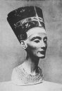

  
[Intangible Textual Heritage](../../index)  [Egypt](../index) 
[Index](index)  [Next](tut01) 

------------------------------------------------------------------------

# TUTANKHAMEN

### AMENISM, ATENISM AND EGYPTIAN MONOTHEISM

#### WITH HIEROGLYPHIC TEXTS OF HYMNS TO AMEN AND ATEN, TRANSLATIONS AND ILLUSTRATIONS BY *SIR ERNEST A. WALLIS BUDGE, LITT. D., D. LITT*. KEEPER OF THE EGYPTIAN AND ASSYRIAN ANTIQUITIES IN THE BRITISH MUSEUM

#### New York: Dodd, Mead & Co.

#### \[1923\]

###### Scanned at Intangible Textual Heritage, May 2003, J.B. Hare, redactor. This text is in the public domain because its copyright was not renewed in a timely fashion as required by US copyright law at the time. These files may be used for any non-commercial purpose, provided this notice of attribution is left intact.

 [  
Click to enlarge](img/front.jpg)  
Frontispiece  
PAINTED LIMESTONE HEAD OF A QUEEN IN THE MUSEUM AT BERLIN.  
It is supposed to represent Queen Nefertiti, wife of Amenhetep IV.

TO

THE MEMORY OF

GEORGE EDWARD STANHOPE MOLYNEUX HERBERT

EARL OF CARNARVON

------------------------------------------------------------------------

[Next: Contents](tut01)
