  
[Intangible Textual Heritage](../../index)  [Egypt](../index) 
[Index](index)  [Previous](tut04)  [Next](tut06) 

------------------------------------------------------------------------

p. 14

# TUTANKHAMEN AND THE CULT OF AMEN.

THE early history of the god Amen is somewhat obscure, and his origin is
unknown. The name Amen means "hidden (one)," a title which might be
applied to many gods. A god

<table data-cellspacing="0" data-border="0" data-cellpadding="9" width="798">
<colgroup>
<col style="width: 50%" />
<col style="width: 50%" />
</colgroup>
<tbody>
<tr class="odd">
<td width="50%" data-valign="BOTTOM">
 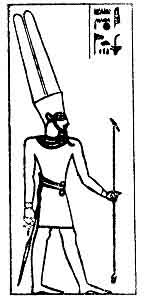 
Amen-Ra, King of the Gods, Great Lord of Thebes.
</td>
<td width="50%" data-valign="BOTTOM">
 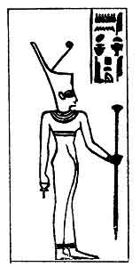 
The goddess Amenit, a female counterpart of Amen, dweller in the Northern Apt (Karnak).
</td>
</tr>
</tbody>
</table>

 

\[paragraph continues\] Amen and his consort Ament or Amenit are
mentioned in the Pyramid Texts (UNAS, line 558), where they are grouped
with Nau and Nen, and

p. 15

with the two Lion gods Shu and Tefnut. This Amen was regarded as an
ancient nature-god by the priests of Heliopolis under the Vth dynasty,
and it is possible that many of his attributes were transferred at a
very early period to Amen, the great god of Thebes. Though recent
excavations have shown that a cult of Amen existed at Thebes under the
Ancient Empire, it is doubtful if it possessed any more than a local
importance until the XIIth dynasty. When the princes of Thebes conquered
their rivals in the north and obtained the sovereignty of Egypt, their
god Amen and his priesthood became a great power in the land, and an
entirely new temple was built by them, in his honour, at Karnak on the
right bank of the Nile. The temple was quite small, and resembled in
form and arrangement some of the small Nubian temples; it consisted of a
shrine, with a few small chambers grouped about it, and a forecourt,
with a colonnade on two sides of it. Amen was not the oldest god
worshipped there, and his sanctuary seems to have absorbed the shrine of
the ancient goddess Apit. The name of Thebes is derived from T-Ape, the
Coptic name of the shrine of the goddess Apit, and the city was not
known as Nut Amen (the No Amon of the Bible, Nahum 3, 8), *i.e.*, the
"city of Amen," until a very much later date.

Although the kings of the XIIth dynasty were Thebans it is possible that
they and many of their finest warriors had Sudani blood in their veins,
and the attributes that they ascribed to Amen were similar to those that
the Nubian peoples assigned to their indigenous gods. To them Amen
symbolized the hidden but irresistible power that produces conception
and growth in

p. 16

human beings and in the animal and vegetable worlds. And in some places
in Egypt, and Nubia and the Oases, the symbol of the god Amen was either
the umbilicus [1](#fn_12) or the gravid womb.
The symbol of Amen that was shown to Alexander the Great, when he
visited the temple of Jupiter Ammon in the Oasis of Siwah, was an object
closely resembling the umbilicus, and it was inlaid with emeralds
(turquoises?) and other precious stones--umbilico maxime similis est
habitus, smaragdo et gemmis coagmentatus [2](#fn_13). The name of Amen was carried into Nubia
and the Egyptian Sudan by the kings of the XIIth dynasty when they made
raids into those countries, and his worship took root there readily and
flourished. The booty which was brought back to Thebes was shared by
them with Amen, and many captives and slaves were set apart as the
property of the god. Soon Amen gained the reputation of the god of
successful warriors, and his fame grew and spread abroad, and little by
little the attributes and powers of the older gods of Heliopolis,
Memphis and Abydos were united to his own in the minds of his priests
and followers.

Under the rule of the kings of the XVIIIth dynasty the glory and power
of Amen waxed greater and greater, and his fame spread through the
Eastern Desert and Syria. As he gave victory to the kings of the XIIth
dynasty in Nubia, so he now gave undreamed of success to Egyptian arms
in Western Asia; and the Pharaohs returned to Thebes laden with spoil of
every kind and with rich gifts from the non-combatant peoples in

p. 17

\[paragraph continues\] Phoenicia and Syria. And Amen might well be
declared to be the "god of the world," especially during the reign of
Thothmes III. Never before had such wealth flowed into the treasury of
the temple of Amen, or Amen-Ra, as he began to be called, and never
before had the power of his priests been so great. Amenhetep I, the
second king of the dynasty, had been a strong supporter of the cult of
Amen, and he seems to have been the founder of the order of the priests
of Amen, and certainly endowed the temple in the Northern Apt with great
wealth. His prenomen and nomen are often seen occupying prominent places
on the coffins of the priests of Amen. The work of establishing the
order begun by Amenhetep I was consolidated and extended by Thothmes
III, who set the priesthood in order, appointed a high priest, and
provided them with rich revenues and gave them large estates for their
maintenance. The gifts that the temple of Amen received as a result of
the seventeen expeditions made by Thothmes III into Phoenicia and Syria,
and into the country in the neighbourhood of the waters of the Upper
Euphrates, and the share of the tribute received from Cyprus and the
Sudan must have been well-nigh incalculable. The treasury of Amen was so
well supplied by Thothmes III, and the affairs of his priesthood so well
regulated by him, that his two immediate successors, Amenhetep II and
Thothmes IV, were not called upon to make extraordinary raids into
Western Asia for the purpose of collecting spoil.

Amenhetep II, about B.C. 1500, devoted his energies to the conquest of
the southern portion of the Egyptian Sudan, which he penetrated as far
as Wad Ba-Nagaa, a district lying about 80 miles to the north of the
modern city of Khartum. But it is doubtful if he possessed any

p. 18

effective hold on the Sudan beyond Napata (Jabal Barkal), at the foot of
the Fourth Cataract. During one of his wars, or raids, into Syria, he
slew a rebel chief and sent his body to Napata to be hung upon the city
walls, so that the natives might see it and tremble. We may be sure that
the priesthood of Amen at Thebes took great care to inform their
colleagues at Napata that it was their god Amen who had given the king
the victory. Amenhetep II was a loyal servant of Amen, for on the stele
which he set up after his return from Upper Rethennu he says that he
came back "with a heart expanded with joy to Father Amen because he had
overthrown all his enemies, and enlarged the: frontiers of Egypt, and
had slain seven chiefs with his own club whilst they were living in
Thekhsi, and had hung their bodies up head downwards on the bows of his
boat as he sailed up the Nile to Thebes."

Amenhetep II was succeeded about B.C. 1450 by his son Thothmes IV, who
seems to have owed his accession to the throne, not to the priests of
Amen, but to the priests of Heliopolis. His mother was not of royal
rank, and it is probable that her religious sympathies were with the old
solar gods of Heliopolis rather than with Amen, or Amen-Ra, of Thebes.
On a huge red granite stele, which stands between the paws of the Sphinx
at Gizah immediately in front of its breast, is cut an important
inscription which throws light on the subject of the accession to the
throne of Thothmes IV. According to the text, the young prince Thothmes
was hunting at Gizah and sat down to rest himself under the shadow of
the Sphinx. Whilst there he fell asleep, and the fourfold Sun-god,
Heraakhuti-Khepera-Ra-Tem, appeared to him in a dream and promised him
the crowns of Egypt if he would clear away from the Sphinx and his
temple the

p. 19

desert sand, which had swallowed them up. Now the Sphinx was believed to
be the image and dwelling-place of Temu-Heraakhuti, a solar god in whom
were united the attributes and powers of Tem, the oldest sun-god of
Heliopolis, and Heraakhuti, a still older sun-god. Thothmes did as the
god wished, that is to say, as the priests of Heliopolis wished, and by
so doing forwarded their

<table data-cellspacing="0" data-border="0" data-cellpadding="9" width="798">
<colgroup>
<col style="width: 50%" />
<col style="width: 50%" />
</colgroup>
<tbody>
<tr class="odd">
<td width="50%" data-valign="BOTTOM">
 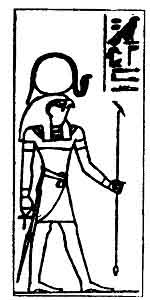 
Heraakhuti, <em>i.e.</em>, Horus of the Two Horizons, the Great God. Ra, the mid-day form of the Sun-god, is often depicted in this form.
</td>
<td width="50%" data-valign="BOTTOM">
 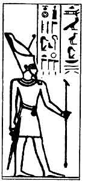 
Temu, Lord of the Two Lands, of Anu (On) Great God, Governor of the Nine Gods. He was probably the oldest man-headed god in Egypt.
</td>
</tr>
</tbody>
</table>

 

political aspirations and secured their assistance in obtaining the
throne. During his short reign of about nine years Thothmes IV made
raids into Syria and the Egyptian Sudan, and the temple of Amen no doubt
obtained a share in the spoil which he brought back-in fact, an
inscription at Karnak contains a list of the gifts that he

p. 20

made to Amen on his return from a very successful raid. We may note in
passing that although the name of Amen forms part of his personal name,
his Nebti name was "Stablished in sovereignty like Tem."

The opening up of Western Asia by the victorious arms of Amasis I and
his successors was followed by a great increase in the communications
that passed between Egypt and the peoples of Syria, Mitanni, Assyria and
Babylonia. The trade between these countries increased, and the merchant
caravans carried not only the wares and products of one country into the
other, but also information about the manners and customs and religions
of the various peoples with whom they came in contact. Thothmes IV
appears to have been the first Egyptian king who entered into friendly
relations with the kings of Karaduniyash (Babylonia) and Mitanni.
Tushratta, king of Mitanni, tells us, in a letter [1](#fn_14) which he sent to Amenhetep IV, that the
father of his father, Amenhetep III, sent to his grandfather, Artatama,
and asked for his daughter to wife; in other words, Thothmes IV wanted
to marry a princess of Mitanni. Six times did Thothmes IV make his
request in vain, and it was only after the seventh asking that the king
of Mitanni gave his daughter to the king of Egypt. As Queen of Egypt she
was styled "Hereditary Princess, Great Lady, President of the South and
the North, Great Royal Mother, MUT-EM-UAA."

The princess would naturally come to Egypt escorted by a number of her
people, and it is very probable that she and her followers introduced
into

p. 21

\[paragraph continues\] Egypt religious views that were more in harmony
with those of the priests of Heliopolis than of the votaries of Amen.

Little is known of the kingdom of Mitanni and its people. There is one
letter in Berlin written in the language of Mitanni, and the
Assyriologists who have made a special study of it assign to the
language a place among the "Caspian group," and are inclined to compare
it with Georgian; and they give it an Aryan origin. [1](#fn_15) The names of four of their gods are
mentioned in the text of a Treaty found at Boghaz Keui, and the
Mitannians swore by them to observe this Treaty. These gods are:--1.
Mi-it-ra-ash-shi-il. 2, U-ru-wa-na-ash-shi-il. 3, In-tar. 4,
Na-sha-atti-ya-an-na. And their identifications with the Indian gods
Mitra (Mithras), Varuna, Indra and Nasatiya seem to be certain. The
solar and celestial character of these Indian gods has much in common
with that of the solar gods of Heliopolis, and if the princess of
Mitanni who married Thothmes IV carried her worship of them into Egypt,
it is easy to believe that her religious sympathy and support would be
given to Tem and his cognate gods, and not to Amen. With her arrival at
Thebes there came an influence

p. 22

which was hostile to Amen, but her husband's reign was too short for it
to produce any great material effect.

Thothmes IV was succeeded by his son by Queen Mutemuaa, who ascended the
throne under the name of Amenhetep (III); thus the name of the god Amen
once again formed part of the personal name of the reigning king. The
meaning of this name, "Amen is content, or satisfied," is significant.
He reigned for about thirty-six years, probably in the latter half of
the fifteenth century B.C. A legend [1](#fn_16)
was current in Egypt under the Ancient Empire in which it was asserted
that the god Ra came to earth and, assuming the form of a priest of Ra,
the husband of one Ruttet, appeared to his wife and, companying with
her, begot three sons, each of whom became King of all Egypt. From that
time every king prefixed to his personal name the title SA RA, "son of
Ra." Nearly two thousand years later the great Queen Hatshepsut
decorated her temple at Der al-Bahari with bas-reliefs, on which were
sculptured scenes connected with her conception and birth. In these the
god Amen, in the human form of her father Thothmes I, is seen companying
with Queen Aahmes, and the inscriptions prove that Hatshepsut believed
that she was of the god's seed and that his divine blood flowed in her
veins. [2](#fn_17) As Amen had in the XVIIIth
dynasty assumed all the powers and attributes of Ra of Heliopolis, the
father of the kings who ruled from Memphis, it was only fitting that he
should assume human form and become the physical father of the kings who
ruled from his city of Thebes. The same

p. 23

 

BAS-RELIEF REPRESENTING AMENHETEP III AS AN INCARNATION OF AMEN-RA  
 [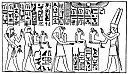  
Click to enlarge](img/02300.jpg)

 

p. 24

fiction was promulgated by the priests of Amen in respect of their god
and Amenhetep III. According to the bas-relief in the sanctuary of the
temple which he built in the Northern Apt in honour of Amen, Mut and
Khensu, Amen came to Queen Mutemuaa in the human form of Thothmes IV,
and begot by her the son who reigned as Amenhetep III. Both scenes and
texts were copied from the bas-reliefs in Hatshepsut's temple, which in
turn were probably copied from some popular document compiled by the
priests of Amen at the beginning of the XVIIIth dynasty, perhaps with
special reference to Amenhetep I.

Whatever views Amenhetep III held concerning Amen and his worship, he
did not allow them to interfere with or obstruct his public allegiance
to that god. This fact is proved by his building operations at Luxor and
the gifts which he made to the temples and priesthood of Amen throughout
the country. But he honoured other Egyptian gods besides Amen, for he
built a temple at Elephantine to Khnemu, a very ancient god of the
region of the First Cataract. To commemorate his victory over the
Nubians in the fifth year of his reign, he built the great temple called
Het Kha-em-Maat at Sulb, in the Egyptian Sudan. He dedicated it to
Father Amen, Lord of the Thrones of the Two Lands, to Khnemu and to "his
own Image living upon earth, Neb-maat-Ra. [1](#fn_18)" On a bas-relief published by
Lepsius [2](#fn_19) we see him worshipping
himself, as Lord of Ta-Kenset. In several of the scenes sculptured on
the walls he is represented making offerings to Amen-Ra, Khnemu and
other gods, and he is

.

p. 25

<table data-cellspacing="0" data-border="0" data-cellpadding="9" width="798">
<colgroup>
<col style="width: 33%" />
<col style="width: 33%" />
<col style="width: 33%" />
</colgroup>
<tbody>
<tr class="odd">
<td width="33%" data-valign="BOTTOM">
 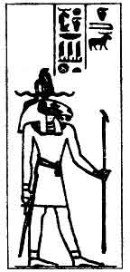 
Khnem, who became incarnate in a species of ram.
</td>
<td width="33%" data-valign="BOTTOM">
 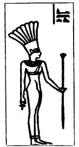 
Anqit, the female counterpart of Khnem.
</td>
<td width="33%" data-valign="BOTTOM">
 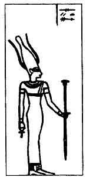 
Sati, daughter of Khnem and Anqit.
</td>
</tr>
</tbody>
</table>

The Triad of the First Cataract, in whose honour Amenhetep III built a
temple at Elephantine.

 

p. 26

frequently accompanied by his wife Ti. At Saddenga he built a temple to
Ti as the goddess of the Sudan.

In Egypt, at all events, the people were not prohibited from worshipping
the old gods of

 

 [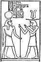  
Click to enlarge](img/02600.jpg)  
Amenhetep III worshipping himself as a member of the Triad in the Temple
of Sudan.

 

the country, and that his own high officials did so openly is evident
from the grey granite stele of the architects Her and Suti in the
British Museum. [1](#fn_20) The stele is in the
form of the door of a tomb and has a plain cornice and a raised

p. 27

border. In the upper Part of the central panel are the two *utchats*, or
eyes of the Sun and Moon, and the winged disk, and below these are
figures of Osiris and Anubis; the figures of the architects and their
wives are obliterated. In the inscriptions above the panel Her
beseeches: I, Hathor of Thebes, the mistress of the goddesses,

<table data-cellspacing="0" data-border="0" data-cellpadding="9" width="798">
<colgroup>
<col style="width: 50%" />
<col style="width: 50%" />
</colgroup>
<tbody>
<tr class="odd">
<td width="50%" data-valign="BOTTOM">
 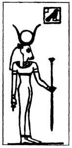 
Hathor of Thebes, who was incarnate in the form of a cow and a woman.
</td>
<td width="50%" data-valign="BOTTOM">
 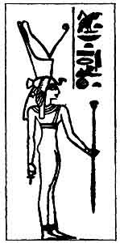 
Mut, Lady of Asher, a female counterpart of Amen-Ra.
</td>
</tr>
</tbody>
</table>

 

to grant to him a coming forth into the presence \[of the god\]; 2,
Khensu to give him all good sweet and pleasant things; and 3, Hathor of
Thebes to receive them in the temples. Suti beseeches: 1, Amen-Ra to
give him sepulchral meals in Hermonthis; 2, Mut to give him all good
things; and 3, Hathor of the cemetery to give him beautiful life and
pleasure upon earth.

p. 28

On the right-hand side of the panel Her beseeches: 1, Ra-Heraakhuti,
lord of heaven, to let him see Aten and to look at the Moon as he did
upon earth; 2, Anpu (Anubis) to give him a beautiful funeral after old
age and a burial in the western part of Thebes; and 3, the divine Queen
Nefertari to give him the sweet breath of the north wind, coolness and
wine, and a coming forth into the presence \[of the God\].

On the left-hand side of the panel Suti beseeches: 1, Osiris, Governor
of eternity, to give him cakes and offerings in the presence of
Un-Nefer; 2, Seker, lord of the coffin chamber, to let him go in and out
of the underworld, without obstruction to his soul, at pleasure; and 3,
Isis, the mother of the god, to grant him power to move freely about in
the Peqa (at Abydos) under a decree of the great god.

Here, then, we have these two high officials, the one overseer of the
works in the temple of Karnak, and the other overseer of the works in
the temple of Luxor, men of learning and culture, praying for the
goodwill, help and favour of Hathor of the city, of Hathor of the
cemetery, of Mut, the consort of Amen. of Khensu, son of Amen and Mut,
of the old Sun-god Ra-Heraakhuti, of Anpu, god of the tomb, of
Nefertari, the deified Queen of Amasis I, of Osiris, god and judge of
the dead, of Isis, his consort, and of Seker, the old god of the
Underworld of Memphis. Amen is not mentioned with these old gods, into
whose hands Her and Suti were content to commit their souls after death.
But Amen was the great god of their city, and to him they owed their
occupation and daily bread, and they acknowledged his power in the hymn
which they caused to be cut on the panel of their funerary stele. The
importance of this hymn is considerable, for the stele is dated, in

p. 29

line 15, by the mention of the name of the king they served, Amenhetep
III. It is quite short, consisting of less than eight lines, and it
tells us little about Amen. The opening words say that it is a hymn to
Amen when he rises as Heraakhuti; that is to say, it is addressed to
Amen in his character of a solar god. It might equally well be addressed

<table data-cellspacing="0" data-border="0" data-cellpadding="9" width="798">
<colgroup>
<col style="width: 50%" />
<col style="width: 50%" />
</colgroup>
<tbody>
<tr class="odd">
<td width="50%" data-valign="TOP">
 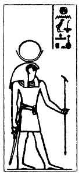 
Khensu, a Moon-god, third member of the great Theban Triad Amen-Ra, Mut and Khensu.
</td>
<td width="50%" data-valign="TOP">
 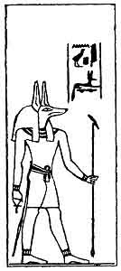 
Anpu, or Anubis, son of Set and Nephthys.
</td>
</tr>
</tbody>
</table>

 

to Ra or Horus or any solar god. The writer calls the god a "daily
beauty that never fails to rise," and identifies him with Khepera, an
ancient god of creation, who is mighty in works. His rays which strike
the face cannot be known (or estimated), and the brilliantly bright and
shining

p. 30

metal called *tcham* cannot be compared for splendour with his beautiful
appearance. The caps on the pyramidions of obelisks were made of *tcham*
metal, and the brightness of them could be seen many leagues away. In
line 3 Amen is said to have been *ptah-tu*, *i.e.*, he was "designed,"
just as an object is designed, or plotted out, by a draughtsman, and the
correct meaning of the

<table data-cellspacing="0" data-border="0" data-cellpadding="9" width="798">
<colgroup>
<col style="width: 50%" />
<col style="width: 50%" />
</colgroup>
<tbody>
<tr class="odd">
<td width="50%" data-valign="TOP">
 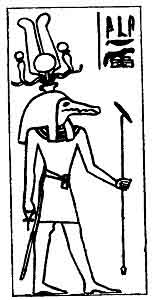 
Sebak, an ancient Crocodile-god.
</td>
<td width="50%" data-valign="TOP">
 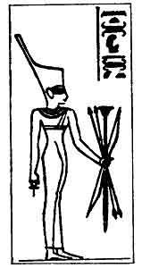 
Net (Neith), the female counterpart of Sebak, or Sebek.
</td>
</tr>
</tbody>
</table>

 

word may be that Amen designed his own form. Next the god "plated his
limbs," *i.e.*, he made them to have the appearance of plates made of
*tcham* metal. This statement is followed by the words, "\[He\] gives
birth, but was not himself born: Only One in his characteristics,
qualities, powers and operations."

Thus we learn that Amen was, like Khepera, self-designed, self-created,
self-existent in a form that

p. 31

was never born as ordinary creatures are, and that he was One and Alone
without equal, or fellow, or counterpart. The writer next refers to the
duration of the god's existence, as the traverser of eternity, and the
passer over the roads of millions of years with his form. His splendour
is the splendour of heaven, and though "all men see his passage, he is

<table data-cellspacing="0" data-border="0" data-cellpadding="9" width="798">
<colgroup>
<col style="width: 50%" />
<col style="width: 50%" />
</colgroup>
<tbody>
<tr class="odd">
<td width="50%" data-valign="TOP">
 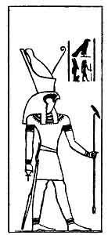 
Her-Semsu, or Horus the Aged.
</td>
<td width="50%" data-valign="TOP">
 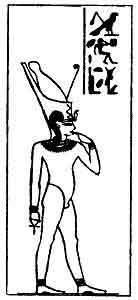 
Her-pa-khart (Harpokrates), or Horus the Child.
</td>
</tr>
</tbody>
</table>

 

hidden from their faces" (in his character of the "hidden" god). He
travels over the celestial waters vast distances in a moment of time
every day. There is no cessation in his work, and every one sees him,
never ceasing to do so. When he sets he rises upon the denizens of the
Tuat, and his rays force their way into the eyes \[of the dead\] (?)
When he sets in the western horizon men fall asleep and

p. 32

become motionless like the dead. With these words the Hymn to Amen comes
to an end.

But during the lifetime of these twin brothers, Her and Suti, the cult
of Aten must have made considerable progress at Thebes, for, in spite of
their loyalty to Amen, and to the old solar gods of the country, and to
Osiris and Isis being manifest, they caused a Hymn to Aten to be
engraved on their funerary stele. It has no title, and follows the Hymn
to Amen immediately, beginning with the words, "Homage to thee, ATEN of
the day!" He is called "creator of men and women, maker of their lives,"
and is identified with the "Great Hawk of many-coloured plumage." He
performed the act of creation which "raised" himself up \[out of the
primeval watery abyss\]. "The creator of himself he was not born." He is
next identified with the "Aged Horus," the dweller in Nut, the oldest
solar god or sky-god in Egypt, and is acclaimed joyfully at rising and
setting. He created the earth (?). The next words, *Khnem Amen
Henmemit*, are difficult. If the writer of the hymn meant to identify
Aten with Khnem-Amen, a god of the region of the First Cataract, that is
understandable, but how, then, is Henmemit, if that be the correct
reading, to be fitted in? [1](#fn_21) Aten is
next called "Conqueror of the Two Lands from the greatest to the least."
Another difficulty meets us in the words "glorious mother of gods and
men," and the words that follow, "gracious artificer, most great,
prospering in her work," seem to apply to this mother. Perhaps the
writer of the hymn wished to compare Aten to such a mother, or he may
have regarded Aten

p. 33

as father-mother. After another line containing obscure allusions we
read, "How marvellous is production of him who raises up his beauty from
the womb of Nut, and who illumines the Two Lands with his Aten (Disk)!
He the Pautti (the primeval matter out of which the world and all in it
were made) created himself. He is the LORD ONE. He made the Seasons out
of the

<table data-cellspacing="0" data-border="0" data-cellpadding="9" width="798">
<colgroup>
<col style="width: 50%" />
<col style="width: 50%" />
</colgroup>
<tbody>
<tr class="odd">
<td width="50%" data-valign="TOP">
 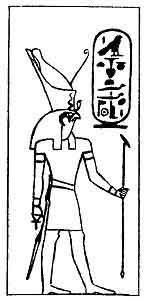 
Her-netch-tef-f, or Horus the Avenger of his Father.
</td>
<td width="50%" data-valign="TOP">
 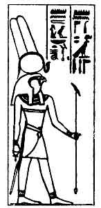 
Her-aakhuti as Ment, or Menthu, the War-god of Hermonthis.
</td>
</tr>
</tbody>
</table>

 

months, Summer because he loves heat, and Winter because he loves the
cold; \[during the former\] he makes men's bodies to become exhausted.
The apes sing hymns to him when he rises daily." What follows on the
stele concerns the lives of Her and Sub, and the text is translated on
pp. [46](tut06.htm#page_46)-68.

Judging by what is said in the Hymn to Aten,

p. 34

the origin, nature and attributes of Aten closely resemble those of
Amen. Both gods are identified with the oldest gods in Egypt. Each is
declared to be self-created and not to have been born, therefore not
begotten, and to each is applied the epithet "ONE." It is interesting to
note that Aten is identified with Pautti, the oldest of all the gods,
and with the Aged Horus, or Horus the Elder. As Aten is said to be. the
maker of Summer and Winter and the months, it is clear that a tradition,
probably going back to pre-dynastic times, associated him with the
primitive Year-god. This Hymn shows that our two architects regarded
Aten as a thoroughly Egyptian god, and as one who could be and ought to
be worshipped side by side with Amen, who had condescended to become the
begetter of their lord and master, Amenhetep III.

Notwithstanding the influence of his mother the Mitannian princess, and
of his wives, some of whom also came from Mitanni, Amenhetep strongly
supported the cult of Amen throughout the country, and kept on good
terms with the: priesthood of Amen. The consolidation of that order by
Thothmes III has already been mentioned, and it would seem that this
king instituted, or, at all events, sanctioned the daily performance of
a very important service in the sanctuary of Amen in the temple of
Karnak. In the sanctuary there was placed a naos, or shrine, containing
a gold or gilded wooden figure of Amen, with moveable head, arms and
legs; sometimes a boat took the place of the shrine, and in such cases
the figure of the god was set inside the cabin. The figure might
represent the god standing upright or seated on a throne. During the
service the king, or his deputy, purified the sanctuary and himself by
burning incense and pouring out

 

 [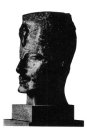  
Click to enlarge](img/pl03.jpg)  
*Plate III*.  
Head of a colossal statue of Amenhetep III, wearing the uraeus, the
symbol of sovereignty, above his forehead. Found by Mr. H. Salt (luring
the excavations which he made near the Colossi in Western Thebes.  
British Museum, Northern Egyptian Gallery.

 [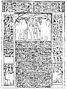  
Click to enlarge](img/pl04.jpg)  
*Plate IV*.  
Stele of Her and Suti, twin brothers who were overseers of the works of
Amenhetep III at Thebes. The text contains a Hymn to Amen, and a Hymn to
Aten.  
British Museum, No. 475.

 

p. 35

libations of fresh water. He then advanced to the naos, broke the seal
which closed its doors, and made obeisance to the figure of the god.
Having performed further rites of purification on the figure, he
advanced and embraced it, in order that the soul of the god might enter
into his body. The naos was closed, and the king left the sanctuary, but
he returned immediately, when the naos was reopened, and he performed
further acts of obeisance, and made offerings which included a figure of
the goddess Maat or TRUTH. Next the king dressed the figure in symbolic
garments, and purified it, and anointed it with scented unguents and
perfumes, and placed on it a necklace, amulets, rings, etc. By these
acts the king intended to imply that he, the son of a god, was adoring
his father, just as children in general adore their fathers and mothers
in the tomb. During some of these ceremonies the god laid his hands on
the body of the king, and by so doing transmitted to him the fluid of
life, which enabled the king to live day by day, and to rule over his
people with wisdom and justice. Now the king himself might well perform
his part in this great, solemn service at Thebes, but he could not be at
the same time at Abydos or elsewhere in Egypt. Therefore in Thebes and
other cities deputies were chosen to represent the king, and they were
everywhere regarded with the reverence that was due to the performers of
such exalted duties. During the performance of these rites and
ceremonies hymns were chanted to Amen or Amen-Ra, and of these the
following are specimens: [1](#fn_22):--

p. 36

I. "Homage to thee, O Amen-Ra, Lord of Thebes,  
Thou Boy, the ornament of the gods!  
All men lift up their faces to gaze upon him.  
Thou art the Lord, inspiring awe, crushing those who would revolt
\[against thee\].  
Thou art the King of all the gods.  
Thou art the great god, the Living One.

 

 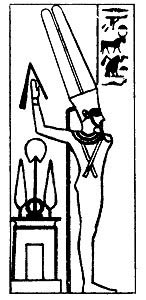  
Menu Ka-mut-f, or Menu, Bull of his mother, a god of new birth and
virility, with whom Amen and Amen-Ra were identified.

 

\[paragraph continues\] Thou art beloved for thy words,  
\[Which are\] the satisfaction of the gods.  
Thou art the King of heaven, thou didst make the stars.  
Thou art the *tcham* metal (gold) of the gods (*i.e.*, the gold out of
which the gods are made).

p. 37

\[paragraph continues\] Thou art the Maker of heaven, thou didst open
the horizon and make the gods to come into being according to thy
behests.  
\[O\] Amen-Ra, Lord of the Throne of the Two Lands, President of the
Apit, Amen-Ra, Bull of his mother, who art upon thy great throne, Lord
of rays, Maker of multitudes, god of the lofty plumes, thou art the King
of the gods, the Great Hawk, who makest the breast to rejoice. Thou art
praised by all rational beings \[because\] they have life."

II\. Watch, being at peace! Thou watchest in peace. Watch, Amen-Ra, Lord
of the Throne of the Two Lands, in peace.  
Watch, being at peace! Thou watchest in peace. Watch, Chief in On, Great
One in Thebes, in peace.  
Watch, being at peace! Thou watchest in peace. Watch, Creator of the Two
Lands (Egypt), in peace.  
Watch, being at peace! Thou watchest in peace. Watch, thou who didst
build up thyself, in peace.  
Watch, being at peace! Thou watchest in peace. Watch, Creator of heaven
and the hidden things of the two horizons, in peace.  
Watch, being at peace! Thou watchest in peace. Watch, O thou to whom the
gods come with bowings, Lord who art feared,  
Mighty One whom the hearts of all rational beings hold in awe, in
peace." (*Ibid*., p. 122.)

III\. "Image of the Eldest Son, Heir of the earth before thy father the
Earth \[Geb and\] thy mother Nut, Divine Image, who camest into being in
primeval time,

p. 38

when a god did not exist, and when the name of nothing whatsoever had
been recorded, when thou didst open thy two eyes and didst look out of
them light appeared unto every man. When shadow is pleasing to thy two
eyes, day exists no longer.  
Thou openest thy mouth, thy word is therein.

<table data-cellspacing="0" data-border="0" data-cellpadding="9" width="798">
<colgroup>
<col style="width: 50%" />
<col style="width: 50%" />
</colgroup>
<tbody>
<tr class="odd">
<td width="50%" data-valign="TOP">
 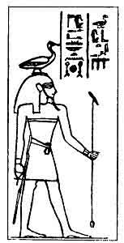 
Geb, the Earth-god, Father of the Gods, Great God, Lord of Eternity.
</td>
<td width="50%" data-valign="TOP">
 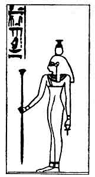 
Nut, the Sky-goddess, the Lady of Heaven, who gave birth to Osiris and Isis and Set and Nephthys.
</td>
</tr>
</tbody>
</table>

 

\[paragraph continues\] Thou stablishest heaven with thy two arms, and
the West (*Ament*) in thy name of Amen.  
Thou art the Image of the Ka (or Double) of all the gods, Image of Amen,
Image of Atem, Image of Khepera, Image of the Lord of all the earth,
Image of the Lord who is crowned King of the South and North in the
North and South, Image who gavest birth to the gods, who gavest birth

p. 39

to men, who gavest birth to everything, the Lord of life, thou Living
One, who possessest power greater than that of all the gods. Thou hast
conquered the Nine Gods, thou hast presented to them their offering.
Thou hast bound them together, thou hast made them to live. O thou Image
who hast created their doubles (?), thou hast

<table data-cellspacing="0" data-border="0" data-cellpadding="9" width="798">
<colgroup>
<col style="width: 50%" />
<col style="width: 50%" />
</colgroup>
<tbody>
<tr class="odd">
<td width="50%" data-valign="TOP">
 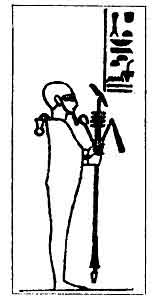 
Ptah, lord of Maat, king of the Two Lands (Egypt), the great Man-god of Memphis.
</td>
<td width="50%" data-valign="TOP">
 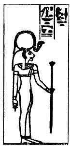 
Sekhmit, the great lady, the lady of heaven, the mistress of the Two Lands (Egypt). She was a female counterpart of Ptah.
</td>
</tr>
</tbody>
</table>

 

given that which Horus has obtained for himself from the Company of the
gods. Thou art like a god who designs with thy fingers, Eke a god who
designs with thy toes. Thou hast become the Lord of everything, Aten who
came into being in primeval time, god of the two high plumes. Thou
Begetter, thou hast created more than all the gods." (Ibid., p. 129.)

p. 40

A papyrus at Leyden contains a series of very interesting hymns to Amen,
and the following extracts are quoted from it.

IV\. "'Thou sailest, Heraakhuti, and each day thou dost fulfil the
behest of yesterday. Thou art the maker of the years and captain of the
months; days and nights and hours are according to his stride. Thou
makest thyself new to-day for yesterday; though going in as the night
thou art the day. The One Watcher, he hates slumber. Men sleep on their
beds, but his eyes watch. (Chap. VI.)

Fashioning himself none knows his forms. (Chap. VIII.)

Mingling his seed with his body to make his egg to come into being
within himself. (Chap. VIII.)

The Aten (Disk) of heaven, his rays are on thy face.

He drove out the Nile from his cavern for thy Pautti. The earth is made
thy statue. Thy name is victorious, thy souls (or Will) are weighty.

Hawk destroying his attacker straightway. Hidden (or secret) Lion
roaring loudly, driving his claws into what is under his paws, Bull for
his town, Lion for his people. The earth shakes when he sends forth his
voice. Every being is in awe of him, mighty in power there is none like
him. He is the Beneficent Power of the births of the Nine gods. (Chap.
IX.)

p. 41

Loosing evils, driving away sicknesses. A physician healing the eye
without medicines; Opener of the eye, destroyer of the cast in it. Being
in the Tuat he releases him whom he loves. Removing from Destiny
according to his heart's desire. Possessing eyes and ears he is on every
path of him that loves him.

He hears the petitions of him that invokes him. Being afar off he comes
in a moment to him that calls him.

He adds to the term of life and he shortens it. To him whom he loves he
gives more than Fate has allotted to him.

To the man who sets him in his heart he is more than millions.

With his name one man is stronger than hundreds of thousands. (Chap.
XI.)

Thou didst exist first in the forms of the Eight Gods \[of Hermopolis\],
and then thou didst complete them and become ONE.

Thy body is hidden in the Chiefs, thou art hidden as Amen at the head of
the gods.

Thy form was that of Tanen in order to give birth to the Pautti gods in
thy primeval matter. Thou dost enter fathers making their sons. Thou
didst first come into being when there was no being in existence. All
the gods came into being after thee. (Chap. XIII.)

Amen came into being in primeval time, none knows the form in which he
appeared. No god existed before him, there was no other god with him to
declare his form.

p. 42

He had no mother for whom his name was made. He had no father who begot
him, saying, It is even myself. He shaped his own egg; the divine god,
becoming of himself; all the gods were created after he came into being.
(Chap. XIV.)

One is Amen, he hides himself from them, he conceals himself from the
gods.

The man who utters his secret (or mystery) name, which cannot be known,
falls down upon his face straightway and dies a violent death. No god
knows how to call upon him." (Chap. XV.) [1](#fn_23)

The extracts given in the last section are taken, from a work on Amen
which was not intended to be sung in the temples. It is, more or less,
a, philosophical treatise on the origin, nature, and powers of the god,
showing that he is the source of all life, animate and inanimate. The
existence of other gods is admitted, but they are merely forms of him,
the great god whose three characters or persons were called Amen (of
Thebes), Ra (of Heliopolis) and Ptah (of Memphis). His ONENESS, or
Unity, was absolute. We may now give an extract from the famous Hymn to
Amen which is preserved in a papyrus in the Egyptian Museum,
Cairo, [2](#fn_24) and was undoubtedly sung by
men and women to the accompaniment of music in the temples.

p. 43

A HYMN TO AMEN-RA.

§ I. Bull, dwelling in On, President of all the gods,  
Beautiful god, Meriti (he who is loved),  
Giving all life of warmth  
To all beautiful cattle.

§ II. Hail to thee, Amen-Ra, Lord of the Throne of the Two Lands!  
First One in the Apts (*i.e.*, Karnak),  
Bull of his mother, first one of his pasture,  
Extended of stride, first one of the Land of the South,  
Lord of the Matchaiu (Nubians), Governor of Punt,  
Prince of Heaven, Eldest one of Earth,  
Lord of things which are, stablisher of creation, stablisher of all
creation.

§ III. ONE, through his unrivalled powers among the gods, Chief of all
the gods,  
Lord of Truth, Father of the gods,  
Maker of men, creator of beasts,  
Lord of the things that are, creator of the plant of life (wheat),  
Maker of green plants, making to live the cattle.

§ IV. POWER, produced by Ptah,  
Beautiful Boy of love,  
The gods ascribe praises to him,  
Maker of things below and of things above, illumining Egypt,  
Sailing over the heavens in peace.  
King of the South and North RA  
Whose word is true, Chief of the Two Lands (Egypt),

p. 44

\[paragraph continues\] Great of power, Lord of awe,  
Chief, making the earth like his form,  
Dispenser of destinies (or plans) more than any god.

§ IX. Casting down his enemy into the flame,  
His eye overthroweth the Sebau fiends.  
It maketh her spear stab Nun (the abyss of heaven),  
It maketh the serpent fiend Nak vomit what he hath swallowed.

§ X. Hail to thee, Ra, Lord of Truth!  
Hidden one in his shrine, Lord of the gods,  
Khepera in his boat.  
He sent out the Word, the gods came into being,  
Temu, maker of men,  
Making different their characters and forms, making their life,  
Distinguishing by their skins one from the other.

§ XI. He hearkeneth to the groan of the afflicted,  
Being gracious to him that crieth to him,  
Delivering the timid man from the bully.  
Judging between the oppressor and the helpless one.

§ XV. Image ONE, maker of everything that is,  
ONE ALONE, maker of things that are.

p. 45

\[paragraph continues\] Men proceed from his eyes,  
The gods come into being by his utterance;

Maker of green herbs, Vivifier of the cattle,  
The staff of life of the Henmemet beings,  
Making the fish to live in the river,  
And the geese in the sky,  
Giving air to the creature in the egg,  
Making to live feathered fowl,  
Making *khennur* birds to live,  
And creeping things and insects likewise,  
Providing food for the mice in their holes,  
And making the birds to live on every branch.

§ XIX. Chief of the Great Nine Gods,  
ONE ALONE, without a second

------------------------------------------------------------------------

### Footnotes

[16:1](tut05.htm#fr_12) See Daressy, *Une
Nouvelle Forme d'Amon* in *Annales du Service des Antiquités de
l'Egypte*, tome IX, p. 64 ff.

[16:2](tut05.htm#fr_13) Quintus Curtius, lib.
IV, §7. See also Naville, *Le Dieu de l'Oasis de Jupiter-Amon* in
*Comptes Rendus de l'Académie*, 1906, p. 25.

[20:1](tut05.htm#fr_14) Preserved in Berlin; see
Winckler, *Die Thontafeln von Tell-el-Amarna*, No. 24, p. 51.

[21:1](tut05.htm#fr_15) Bork, *Die Mitanni
Sprache*, Berlin, 1909.

[22:1](tut05.htm#fr_16) See Erman, *Die Märchen
des Papyrus Westcar*, Berlin, 1890.

[22:2](tut05.htm#fr_17) See Naville's edition of
the texts, Vol. II, pl. 46-55.

[24:1](tut05.htm#fr_18) Neb-maat-Ra is the
prenomen of Amenhetep III

[24:2](tut05.htm#fr_19) *Denkmäler*, III, 85.

[26:1](tut05.htm#fr_20) No. 475, Bay 9. Old No.
826. See *A Guide to the Egyptian Galleries*, p. 134.

[32:1](tut05.htm#fr_21) The true reading may be
*hememit* and so be connected with the word to "roar"--Khnem Amen of the
roarings. Amenhetep IV dedicated a scarab to a god of roarings (British
Museum, No. 51084).

[35:1](tut05.htm#fr_22) A hieroglyphic
transcript of the hieratic text will be found in Moret, *Le Rituel du
Culte Divin Journalier en Égypte*, Paris, 1902, p. 69.

[42:1](tut05.htm#fr_23) For transcripts of the
hieratic texts, translations, etc., see, Gardiner in *Aegyptische
Zeitschrift*, Bd. 42 (1905), p. 12 ff.

[42:2](tut05.htm#fr_24) A complete transcript of
the hieratic text into hieroglyphs, with a French translation, has been
published by Grébaut, *Hymne à Ammon-Ra*, Paris, 1875.

------------------------------------------------------------------------

[Next: A Hymn to Amen and Aten](tut06)
