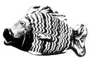

  
[Intangible Textual Heritage](../../index)  [Egypt](../index) 
[Index](index)  [Previous](tut11) 

------------------------------------------------------------------------

p. 140

# EGYPTIAN MONOTHEISM.

During the last eighty years the gods of Egypt and the religion of the
Ancient Egyptians have been carefully studied by many Egyptologists, but
the difficulties which surround these subjects have not yet been cleared
away. The responsibility for the existence of these difficulties rests
upon the Egyptians themselves, because they did not write books on their
religion or explanations of what they believed. But a great many hymns
to their gods and legends of their gods and goddesses have come down to
us, and from these, thanks to the publication of Egyptian texts during
the last thirty years, it is now possible to arrive at a number of
important conclusions about the Egyptian religion and its general
character. The older Egyptologists debated the question whether it was
monotheistic, polytheistic, or pantheistic, and the differences in the
opinions which they formed about it will illustrate its difficulty.
Champollion believed it to have been "a pure monotheism, which
manifested itself externally by a symbolic polytheism." [1](#fn_66) Tiele thought that in the beginning it was
polytheistic, but that it developed in two opposite directions; in the
one direction gods were multiplied, and in the other it drew nearer and
nearer to monotheism. [2](#fn_67) Naville
treated it as a "religion of

p. 141

nature, inclining to pantheism." [1](#fn_68)
Maspero admitted that the Egyptians applied the epithets, "one God" and
"only God" to several gods, even when the god was associated with a
goddess and a son, but he adds "ce dieu Un n'etait jamais DIEU tout
court"; [2](#fn_69) the "only god" is the only
god Amen, or the only god Ptah, or the only god Osiris, that is to say,
a being determinate possessing a personality, name, attributes, apparel,
members, a family, a man infinitely more perfect than men. He is a
likeness of the kings of this earth, and his power, like that of all
kings, is limited by the power of neighbouring kings. The conception of
his unity is geographical and political at least as much as it is
religious. Ra, only god of Heliopolis, is not the same as Amen, only god
of Thebes. The Egyptian of Thebes proclaimed the unity of Amen to the
exclusion of Ra, the Egyptian of Heliopolis proclaimed the unity of Ra
to the exclusion of Amen. Each one god, conceived of in this manner, is
only the one god of the nome or of the town, and not the one god of the
nation recognized as such throughout the country.

On the other hand, de Rougé wrote in 1860, "The unity of a supreme and
self-existent being, his eternity, his almightiness, and eternal
reproduction as God; the attribution of the creation of the world and of
all living beings to this supreme God; the immortality of the soul,
completed by the dogma of punishments and rewards; such is the sublime
and persistent base which, notwithstanding all deviations and all
mythological embellishments, must secure for the beliefs of the Ancient
Egyptians a most

p. 142

honourable place among the religions of antiquity." [1](#fn_70) And in his work on the Religion and
Mythology of the Ancient Egyptians [2](#fn_71)
Brugsch expressed his conviction that, from the earliest times, a
nameless, incomprehensible and eternal God was worshipped by the
inhabitants of the Valley of the Nile. This conviction he based on many
passages in the religious and moral texts of the Egyptians, in which
reference is made to a self-existent almighty Being who seems to be none
other than the God of modern nations. From these documents we learn that
the Egyptian theologians believed that at one time, which was even to
them infinitely remote, nothing existed except a boundless primeval mass
of water which was shrouded in darkness, but which contained the
ultimate sources of everything that now exists in the universe. In late
times this watery mass, which was called Nunu, was regarded as the
"Father of the Gods." A something in this water, which formed an
essential part of it, felt the desire to create and, having imagined in
itself the forms of the beings and things that it intended to create,
became operative, and the first creature produced was the god Tem or
Khepera, who was the personification of the creative power in the
primeval water. This god sent forth from his body Shu (*i.e.*, Heat) and
Tefnut (Moisture), and these produced Geb (Earth) and Nut (Sky). Tem or
Khepera fashioned the form of everything in his mind and made known his
desires to create to his heart, which was personified as Thoth. This god
received the creative impulse and invented in his mind a

p. 143

name for the object that was to be created, and when he uttered that
name the object came into being. In the texts of the early Dynastic
Period Ptah and Khnemu were associated with the god of the primeval
water, Nunu or Nu, and they were said to fashion the creatures and
things the names of which were pronounced by Thoth. Moreover, they
associated the goddess Maat with Thoth, and the part she played at the
creation was very much like that which is attributed to Wisdom in the
Book of Proverbs.

What the earliest pictorial forms of Tem, Ptah and Khnemu were is not
known, but the first and second appear as men at an early period, and
the third is represented by a special form of ram or *kudu*. Ra, who
usurped the attributes of Tem, also appears as a man. But of the
original creative power which existed of and by itself in the watery
mass of Nunu no form is known. The mind of man was incapable of
imagining him, and the hand of man was incapable of making a figure that
could be considered to be an image or likeness of him. Under the XVIIIth
dynasty an Egyptian scribe composed a hymn to Hep (or Hap or Hapi), the
Nile-god, in which he traced his origin back to the great watery mass of
Nunu. He says of him, "He cannot be sculptured in stone in figures
whereon is placed the White Crown. He cannot be seen. Service cannot be
rendered to him. Gifts cannot be presented to him. He is not to be
approached in the sanctuaries. Where he is is not known. He is not to be
found in inscribed shrines. No habitation can contain him. There is none
who acteth as guide to his heart." [1](#fn_72)
The

p. 144

\[paragraph continues\] Nile-god is thus described only because he was
the direct emanation from the great unseen, unknown and incomprehensible
creative power, which had existed for ever and was the source of all
created things. Statues of the Nile-god were made under the last
dynasties of the New Empire, but the hymn quoted above was written many
centuries earlier.

The religious literature of Ancient Egypt of all periods is abundant,
yet in no class of it do we find any prayer or petition addressed to
this unseen and unknown god. But in the Collections of Moral Aphorisms,
or "Teachings," composed by ancient sages, we find several allusions to
a divine power to which no personal name is given. The word used to
indicate this power is NETER or NETHER. Many have tried to assign a
meaning to this word and to find its etymology, but the original meaning
of it is at present unknown. The contexts of the passages in which it
occurs suggest that it means something like "eternal God." The same word
is often used to describe an object, animate or inanimate, which
possesses some unusually remarkable power or quality, and in the plural
*neteru*, it represents the beings and things to which adoration in one
form or another is paid. The great God referred to in the Moral
Aphorisms is also spoken of as *pa neter*, "the God," just as the Arabs
speak of Al-Allah, *i.e.*, "the Allah." The following examples drawn
from the Precepts of Kagemna

p. 145

\[paragraph continues\] (IVth dynasty) and the Precepts of Ptah-hetep
(Vth dynasty) will illustrate this use of Neter. [1](#fn_73)

1\. The things which God, (*neter*), doeth cannot be known.

2\. Terrify not men. God, (*neter*), is opposed thereto.

3\. The daily bread is under the dispensation of God, (*neter*).

4\. When thou ploughest, labour (?) in the field God, (*neter*), hath
given thee.

5\. If thou wouldst be a perfect man make thy son pleasing to God,
(*neter*).

6\. God, I 1, loveth obedience; disobedience I is hateful to God,
(*neter*).

7\. Verily a good (or, beautiful) son is the gift of God, (*neter*).

These extracts suggest that the writers of the Precepts believed in a
God whose plans were inscrutable, who was the feeder of men, who
assigned to each a share of the goods of this world, and who expected
men to obey his behests and to bring up their children in a way pleasing
to him. As time went on the ideas of the Egyptians about God changed,
and under the XVIIIth dynasty he lost something of the aloofness with

p. 146

which they regarded him, and a fuller idea of his personality existed in
their minds. This is clear from the following extracts taken from the
Precepts, or Teaching, of Khensu-hetep, [1](#fn_74) more generally known as the "Maxims of
Ani."

1\. The God magnifies his name.

2\. The house of God abominates overmuch speaking. Pray with a loving
heart, the words of which are hidden. He will do what is needful for
thee, he will hear thy petitions and will accept thine oblations.

3\. It is thy God, who gives thee existence.

4\. The God is the judge of the truth.

5\. When thou makest an offering to thy God beware of offering what he
abominates.

The unknown God of the early dynasties has now become a Being who gives
men their lives and means of subsistence, who can be approached in a
temple, or house, who is pleased with offerings, and with prayers
offered up silently to him, and who wishes his name to be magnified.
Another extract reads:--

6\. "Observe with thine eye his plans (or dispensation). Devote thyself
to singing praises to his name. He gives souls to hundreds of thousands
of forms. He magnifies him that magnifies him."

p. 147

The text continues: "Now the god of this earth is Shu, who is the
President of the Horizons. His similitudes are upon the earth, and to
them incense and offerings are made daily." Shu in mythological language
was the light and heat that emanated from the self-created,
self-subsistent and self-existent primeval god, Horus, or Tem, or
Khepera. The being who is referred to in the first part of extract No. 6
seems to me to be different from Shu, the god of this earth. And it will
be remembered that Amenhetep IV, the "Disk-worshipper," adored "Horus of
the Two Horizons in his name of Shu (*i.e.*, Heat) who is in the Aten
(Disk)."

The Teaching of Amenemapt, the son of Kanekht, a work that was probably
written under the XVIIIth dynasty, proves quite plainly that the writer
distinguished very clearly between God and the gods Ra, the Moon-god,
Thoth, Khnem-Ra, Aten, etc. In the following extracts he clearly refers
to God.

1\. Leave the angry man in the hands of God . . . God knows how to
requite him (Col. V).

2\. Carry not away the servant of the God for the benefit of another
(Col. VI).

3\. Take good heed to Nebertcher, (Lord of the Universe) (Col. VIII).

4\. Though a man's tongue steers the boat, it is Nebertcher who is the
pilot (Col. XIX).

5\. Truth is the great porter (or bearer) of God (Col. XXI).

6\. Seat thyself in the hands of God (Col. XXII).

p. 148

7\. A man prepares the straw for his building, but God is his architect.

It is he who throws down, it is he who builds up daily.

It is he who makes a man to arrive in Amentt (the Other World) \[where\]
he is safe in the hand of God (Col. XXIV).

8\. The love of God, praised and adored be he is more than the respect
of the Chief (Col. XXVI). [1](#fn_75)

It will be noted that in none of these extracts is any attempt made to
describe God, *Neter*, and that he is never called "One," or "Only One."
The truth is that the Egyptians felt that they could not describe him
and that they knew nothing about him, except that he existed. This great
nameless. unseen and unknown God handed over to a number of inferior
beings the direction and management of heaven and earth and everything
which was in them. Those that were kind and considerate to the human
race men called gods, and those that were malevolent and inimical they
called devils. Each community or village, however small, possessed its
own "god," whose power and importance depended upon the wealth and
social position of his worshippers. But the Egyptian, whilst adoring the
"god," *Neter*, of his native city, was ready to admit the existence of
another *Neter*, who was probably the Being whom we call God. Thus, in
Chapter CXXV of the Book of the Dead, the deceased says in his
declaration before the Forty-two gods, "I have not cursed God,"

p. 149

and "I have not contemned the god of my city [1](#fn_76). The distinction between "God" and "god of
the city" was quite clear in the mind of the Egyptian.

It has been claimed by some that Amenhetep IV was the first monotheist
in Egypt, but the acceptance of this statement depends upon what meaning
is given to the word monotheism, *i.e.*, the doctrine of there being
only one god. The passages from the Moral Papyri quoted above show that
the Egyptian priests and learned men were monotheistic, even though they
do not proclaim the oneness of the god to whom they refer. The idea of
oneness was well understood under the Ancient Empire, but in the Pyramid
Texts the attribute is ascribed to the "gods" and to kings as well as to
God. Thus in Teta (l. 237) the "lord one" is mentioned; in Merenra I the
king is called "great god alone," (l. 127), [2](#fn_77) and is said to be stronger than every god;
and in Pepi II (l. 952) the king is called the "one of heaven," Now the
monotheism of Amenhetep IV was different from that of the writers of the
Moral Papyri, and the oneness of Aten which he proclaimed resembled the
oneness of several other Egyptian solar gods and also

p. 150

gods to whom solar attributes had not been originally ascribed. Tem,
Horus of the Two Horizons, and Ra, each of these is called "One," and
"only one," whether mentioned singly or together as a triad, and the
same title was given to Amen after his fusion with Ra. And whilst
Amenhetep IV was proclaiming the oneness of Aten in the city of Aten,
the worshipper of Amen was proclaiming the oneness of Amen in Thebes,
the worshipper of Ra or Tem was proclaiming the oneness of his god in
Heliopolis, and so on throughout the country. And it is interesting to
note that votaries of Neith of Saïs proclaimed that their goddess was
"One," [1](#fn_78) that she first created
herself and then produced Ra from her own body. The second portion of a
fine Hymn to the solar triad, which is preserved in the Papyrus of Ani
(sheet 19), and is addressed to Ra-Tem-Heraakhuti the "only one," adds
Osiris to this "only one" thus "Praise be to thee, O Osiris, eternal
Lord, Un-nefer, Heraakhuti, whose forms are manifold and whose
attributes axe majestic, Ptah-Seker-Tem in Anu, lord of the hidden
shrine and creator of Hetkaptah (Memphis) . . . thou turnest thy face to
the Other World, thou makest the earth to shine like *tcham* (gilded
copper?). The dead rise up to look at thee, they breathe the air and
they see thy face like that of the Aten (Disk) when he rises on his
horizon. Since they see thee their hearts are content, O thou who art
Eternity and Everlastingness."

It is impossible for Amenhetep IV to have indulged in the philosophical
speculations as to the unity of God, with which he is sometimes
credited, but which were only evolved by the Greek

p. 151

philosophers a thousand years later. It is, however, very probable that
he wished Aten, as the god of absolute truth and justice, to become the
national god of Egypt and divine ruler of all the countries of the Sudan
and Western Asia that formed his dominions. If that be so, he was born
too late to bring this about, even supposing that he was physically and
mentally fit to undertake such a task. When he ascended the throne,
Amen, or Amen-Ra, the King of the Gods, the Lord of the world, was
actually what Amenhetep wished Aten to be. Amen had expelled: the Hyksos
and set the first king of the XVIIIth dynasty upon his throne, and he
had given victory to the successors of Aahmes I and filled Egypt with
the wealth of the Sudan and Western Asia. Amen had become the overlord
of the gods, and his fame filled the greater part of the world that was
known to the Egyptians. It was impossible to overthrow the great and
wealthy priesthood of Amen. to say nothing of the social institutions of
which Amen was the head. The monotheism of Amenhetep from a religious
point of view was not new, but from a political point of view it was. It
consisted chiefly of the dogma that Amen was unfit to be the national
god of Egypt, the Sudan and Syria, and that Aten was more just, more
righteous, and more merciful than the upstart god of Thebes, and that
Aten alone was fitted to be the national god of Egypt and her dominions.
When Amenhetep tried to give a practical form to his views, his attempt
was accompanied, as has frequently been the case with religious
"reformers," by the confiscation of sacrosanct property, and by social
confusion and misery. It was fortunate for Egypt that she only produced
one king who was an individualist and idealist, a pacifist and a
religious "reformer" all in one.

p. 152

Amenhetep IV attempted to establish a *positive* religion, and as a
religious innovator he spoke and acted as if he were divinely inspired
and had a divine revelation to give to men, and in every way he tried to
depart from the traditions of the past. He never realised that if his
religion was to take root and flourish it must be in contact all along
the line with the older ideas and practices which he found among his
people. Religion did not begin with him in Egypt. He failed in his
self-appointed task because his religion did not appeal to the tradition
and religious instincts and susceptibilities that already existed among
the Egyptians, and because he would not tolerate the traditional forms
in which their spiritual feelings were embodied.

 

 [  
Click to enlarge](img/15200.jpg)  
Variegated glass bottle in the form of a fish.  
From Tall al-'Amarnah. British Museum, No. 55193.  
\[Presented by the Egypt Exploration Society, 1921.\]

------------------------------------------------------------------------

### Footnotes

[140:1](tut12.htm#fr_66) *L'Égypte*, Paris,
1839, p. 245.

[140:2](tut12.htm#fr_67) *Geschiedenis van den
Godsdienst in de Oudheid*, Amsterdam, 1893, p. 25.

[141:1](tut12.htm#fr_68) *La Religion*, p. 92.

[141:2](tut12.htm#fr_69) *Histoire Ancienne*,
Paris, 1904, p. 33.

[142:1](tut12.htm#fr_70) *Études sur le Rituel
Funéraire* (in *Rev. Arch.*, Paris, 1860, p. 12).

[142:2](tut12.htm#fr_71) *Religion und
Mythologie*, Leipzig, 1885, p. 90.

[143:1](tut12.htm#fr_72) See *Egyptian Hieratic
Papyri in the British Museum*, Second Series, London, 1923, pl. LXXIII.
(Introduction, p. 31.)

[145:1](tut12.htm#fr_73) They are taken from the
Prisse Papyrus which was written under the XIth or XIIth dynasty. See
Virey, *Études sur le Papyrus Prisse*, Paris, 1877, where a transcript
of the hieratic text and a French translation will be found.

[146:1](tut12.htm#fr_74) See Chabas,
*L'Egyptologie, Série I*., Chalon-sur-Saône, Paris, 1876-78; and
Amélineau, *La Morale Egyptienne*, Paris, 1892.

[148:1](tut12.htm#fr_75) See *Egyptian Hieratic
Papyri*, ed. Budge, Second Series, London, 1923.

[149:1](tut12.htm#fr_76) From the Papyrus of
Nebseni. Early XVIIIth dynasty.

[149:2](tut12.htm#fr_77) And "Lord of the earth
to its limit"

[150:1](tut12.htm#fr_78) See Budge, *Gods of the
Egyptians*, Vol. 1, p. 458.
