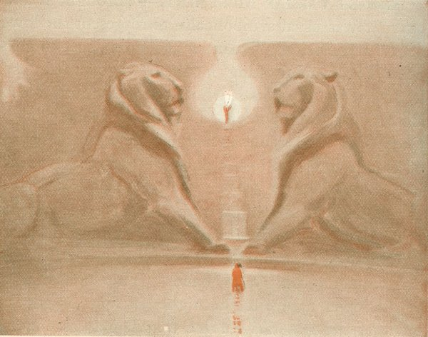
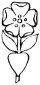

  
[Intangible Textual Heritage](../../index)  [Esoteric](../index) 
[Index](index)  [Previous](cdg09)  [Next](cdg11) 

------------------------------------------------------------------------

[Buy this Book at
Amazon.com](https://www.amazon.com/exec/obidos/ASIN/1564592014/internetsacredte)

------------------------------------------------------------------------

*Comte de Gabalis* \[1913\], at Intangible Textual Heritage

------------------------------------------------------------------------

p. 161

 

|                     |
|---------------------|
|  |

HEN the illustrious personage had taken his departure, on my return from
accompanying him to the door, I found the Comte de Gabalis in my study.

"It is a great pity," said he, "that the nobleman who has just left you
is one day to become one of the seventy-two Princes of the Sanhedrin of
the New Law [CXV](#fn_144), else he would be a
great subject for our Holy Cabala. His mind is profound,

pure, broad, lofty and fearless. Here is the geomantic [CXVI](#fn_145) figure which I cast for him while you
were talking

p. 162 p. 163

together. I have never seen happier aspens nor those denoting a finer
soul. Just look at this 'Mother'--what magnanimity it gives him; and
this 'Daughter' will procure him the purple. Bad luck to her and to
destiny since they deprive Philosophy of a subject who might perhaps
surpass you. But where were we when he came in?"

"You were speaking, Sir," said I, "of a Saint whom I have never seen in
the Roman Calendar. I think you called him Danhuzerus."

"Ah! I remember," he replied, "I was bidding you put yourself in the
place of one of your doctors and suppose that the Blessed Danhuzerus had
just laid bare to you his conscience and said, 'Sir, the fame of your
learning has brought me from beyond the mountains. I have a slight
scruple which is troubling me. A Nymph holds her court in a mountain in
Italy: and a thousand Nymphs almost as beautiful as their Queen attend
upon her. The handsomest and most learned and most worthy men resort
thither from all the habitable globe. They love these Nymphs and are
beloved by them; they lead the most delightful life in the world; the
Nymphs whom they love bear them very fine children; they worship the
living God, injure no. one and hope for immortality. I was one day
walking upon this mountain and found favour in the eyes of the Queen of
the Nymphs, who appeared to me and showed me her charming court. The
Sages

p. 164 p. 165

perceiving that she loved me, reverenced me almost as their Prince. They
exhorted me to yield to the Nymph's sighs and beauty. She told me of her
martyrdom, and left unsaid nothing which might touch my heart, and in
short convinced me that she would die if I did not love her, and that if
I loved her she would be indebted to me for her immortality. The
arguments of those learned men prevailed over my principles, even as the
charms of the Nymph won my heart. I love her and she has borne me
children of great promise, but in the midst of my felicity I am
sometimes troubled by the recollection that the Church of Rome might not
approve of all this. I have come to consult you, Sir, about this Nymph,
those Sages, these children and the state of my conscience.' Well, Mr.
Doctor, what answer would you make to my Lord Danhuzerus?"

"I should say to him," I answered, "With all due respect to you, Lord
Danhuzerus, you are letting your imagination run away with you, or else
your vision is an enchantment, your children and your mistress are
hobgoblins, your Sages are fools, and I must say that your conscience is
thoroughly cauterized."

"By such an answer, my Son, you might achieve a doctor's hood, but you
would not merit admission to our Order," rejoined the Comte with a deep
sigh. " Such is the barbarous tendency ofall your doctors nowa-days. A
poor Sylph would never dare show himself

p. 166 p. 167

lest he be straightway mistaken for a hobgoblin; a Nymph cannot labour
to become immortal without passing for an impure phantom; and a
Salamander [CXVII](#fn_147) would not dare
appear for fear of being taken for the Devil himself, while the pure
flames of which he is composed would be thought the hell fire which ever
attends upon the Prince of Darkness. To dissipate these Most injurious
suspicions they vainly make the sign of the cross on appearing, bow the
knee at Divine Names, and even pronounce them with reverence. All these
precautions are futile. They cannot succeed in changing their reputation
for being enemies of the God whom they worship more devoutly than do
those who flee from them."

"But seriously, Sir," said I, "do you really believe these Sylphs to be
such extraordinarily devout folk?"

"Most devout," he answered, "and most zealous for Divinity. The
superlatively excellent discourses upon the Divine Essence which they
deliver to us, and their wonderful prayers edify us greatly."

"Have they prayers as well? " said I. "I should very much like to hear
one of their making."

"It is easy to gratify you," he rejoined, "and that I may not quote
anything of questionable authority, and that you may be unable to
suspect me of having fabricated it, listen to the prayer which the
Salamander who gave answers in the Temple of Delphi was pleased to teach
the Pagans, and which is recorded

p. 168 p. 169

by Porphyry. It contains a sublime theology from which you will perceive
that if mankind did not worship the true God, it was through no fault of
these Sage Beings.

PRAYER OF THE SALAMANDERS.

*Immortal, Eternal, Inejble and Sacred Father of all things, Thou who
art borne upon the ceaselessly-rolling chariot of the ever-turning
worlds. Thou Ruler of the Etherial Countries where the Throne of Thy
power is raised, from the summit whereof Thy formidable eyes discover
all things, and Thine excellent and holy ears hear all things. Hearken
nto Thy children whom Thou hast loved from the birth of time; for Thy
golden, mighty, and eternal Majesty shines above the world and above the
firmament of the Stars. Thou art exalted above them, O radiant Fire!
There Thou kindlest Thyself and maintainest Thyself by Thine own
Splendour, and there go forth from Thine Eternal Essence inexhaustible
streams of Light which nourish Thine Infinite Spirit. Thine Infinite
Spirit produces all things and causes the inexhaustible treasure of
matter, which can never fail in that generation which forever environs
it, because .of the forms without number wherewith it is pregnant and
wherewith Thou in the beginning didst fill it. From this Thy Spirit,
likewise, are born those Holy Kings who stand about Thy Throne,
and* [CXVIII](#fn_149) *who compose Thy court,
O Universal Father! O Thou Unique God! O Father of mortal and immortal
Saints!* [CXIX](#fn_150)

p. 170 p. 171

\[paragraph continues\] *Thou hast in
particular created Powers which are marvellously like unto Thine Eternal
Thought, and unto Thine Adorable Essence. Thou hast set them higher than
the Angels who announce to the world Thy Will. Lastly Thou hast created
in the Elements a third rank of Sovereigns. Our continual exercise is to
praise Thee and to worship Thy Will. We burn with desire to possess
Thee, O Father, O Mother, who art tenderest of Mothers, O wonderful
exemplar of the sentiments and tenderness of Mothers, O Son, the flower
of all Sons, O Form of all Forms, Thou Soul, Spirit, Harmony and Number
of all things!* 

"What say you to this prayer of the Salamanders? Is it not exceedingly
learned, lofty and devout?"

"And exceedingly obscure as well," I answered. "I once heard it
paraphrased by a preacher who proved thereby that the Devil, in addition
to his other vices, is above all else a great hypocrite."

"Alas!" exclaimed the Comte, "Poor Elementary Peoples! What resource is
left you? You tell marvellous things concerning the Nature of God, the
Father, Son, and Holy Ghost, the Assisting Intelligences, Angels and
Heavens. "You make wonderful prayers and teach them to man; yet after
all you are nothing but hypocritical hobgoblins!"

"Sir," I hastily observed, "it makes me uncomfortable to have you thus
apostrophise these Peoples." "Nay, my Son," he replied, "do not fear
lest I

p. 172 p. 173

summon them, but rather lest your faintheartedness should in the future
prevent you from having any realisation beyond that of amazement that
you see fewer examples of their alliance with men than you could wish
for. Alas! Where is the woman whose imagination has not been beclouded
by your doaors, and who does not look with horror upon this
relationship, and who would not tremble at the appearance of a Sylph?.
Where is the man with least pretension to being good who does not flee
the sight of them? Do we find, save very rarely, a man of worth who
would care to be on familiar terms with them? Only profligates, misers,
ambitious men or knaves court this honour to which, however, PRAISE GOD,
they shall never attain; 'for the fear of the Lord is the beginning of
Wisdom.'"

"Then what is to become of all these flying Nations," I inquired, "now
that honest folk are so prejudiced against them?"

"Ah!" said he, "The arm of God is in no wise shortened, and the Devil
does not derive all the advantage he anticipated from the ignorance and
error which he has spread to their detriment; for in addition to the
fact that the Philosophers, of whom there are a great number, do their
utmost to remedy it by absolutely renouncing women, God has given all
these Peoples permission to make use of every innocent artifice of which
they can bethink themselves in order to converse

p. 174 p. 175

with men without their knowledge."

"What do I hear, Sir?" I exclaimed.

"You hear nothing but the truth," he replied. "But I have a much greater
secret to communicate to you. Know, my Son, that many a man believes
himself to be the son of a man, who is really the son of a Sylph. Did I
not tell you the other day that the Sylphs and other Lords of the
Elements are overjoyed that we are willing to instruct them in the
Cabala? Were it not for us their great enemy the Devil would alarm them
exceedingly, and they would have difficulty in immortalising themselves
without the knowledge of the maidens."

"I cannot sufficiently wonder at the profound ignorance in which we
live," I remarked. "It is currently believed that the Powers of the Air
sometimes help lovers to attain their desires. Apparently the contrary
is true; the Powers of the Air require the assistance of men in their
love affairs."

"Quite so, my Son," the Comte went on, "the Sage lends assistance to
these poor people who, were it not for him, would be too wretched and
too weak to resist the Devil. But when a Sylph has learned from us

to pronounce Cabalistically the potent Name NEHMAHMIHAH [CXX](#fn_153), and to combine it in mantric form
with the delicious name Eliael, all powers of darkness take flight and
the Sylph peacefully enjoys the society of his loved one."

p. 176 p. 177

"When these gentlemen are immortalised, they labour earnestly and live
most piously that they may not lose their recently-acquired right to the
possession of the Supreme Good. They therefore desire the person to whom
they are allied to live with exemplary innocence, as is apparent in that
celebrated adventure of a young Lord of Bavaria [CXXI](#fn_154). He was inconsolable at the death of
his wife, whom he loved passionately. A certain Sylphid was advised by
one of our Sages to assume the likeness of the wife. She had confidence
in the Sage and presented herself to the sorrowing young man, saying
that God had raised her from the dead to console him in his extreme
aflfliction. They lived together many years and had several beautiful
children. The young nobleman, however, was not a good enough man to
retain the gentle Sylphid; he used to blaspheme and use had language.
She often warned him, but seeing that her remonstrances were unavailing
she disappeared one day, and left him nothing but her petticoats and the
regret of having been unwilling to follow her pious counsel. Thus you
see, my Son, that Sylphs sometimes have reason to disappear. You see too
that neither the Devil nor the fantastic caprices of your theologians
can prevent the People of the Elements from working with success for
their immortality when they are helped by one of our Sages."

p. 178 p. 179

"But honestly, Sir," I asked, "are you persuaded that the Devil is so
great an enemy of these seducers of young girls?"

"A mortal enemy," said the Comte, "especially of the Nymphs, Sylphs and
Salamanders. As for the Gnomes, he does not hate them nearly so much
because, as I believe you have already learned, the Gnomes, frightened
by the howlings of the Devils which they hear in the centre of the
earth, prefer to remain mortal rather than run the risk of being thus
tormented should they acquire immortality. Thence it comes to pass that
these Gnomes and the demons, their neighbours, have a good deal to do
with one another. The latter persuade the Gnomes, who are naturally most
friendly to man, that it is doing him a very great service and
delivering him from great danger, to compel him to renounce his
immortality. In exchange, they promise the man whom they can persuade to
this renunciation that they will provide him with all the money he asks
for, will avert the dangers which might threaten his life during a given
period, or will grant any other condition pleasing to him who makes this
wretched covenant. Thus the Devil, wicked fellow that he is, through the
mediation of a Gnome, causes the soul [CXXII](#fn_155) of such a man to become mortal and
deprives it of the right to eternal life."

"Then, Sir," cried I, "in your opinion those covenants, of which
demonographers cite so many examples,

p. 180 p. 181

are not made with the Devil at all?"

"No, assuredly not," replied the Comte, "Has not the Prince of the
World [CXXIII](#fn_156) been driven out? Is he
not confined? Is he not bound? Is he not the *terra damnata et
maledicta* which is left at the bottom of the retort of the Supreme and
Archetype Distiller? Can he ascend into the Region of Light and spread
there his concentrated darkness? He can do nothing against man. He can
only inspire the Gnomes, his neighbours, to come and make these
propositions to those among mankind whom he most fears may be saved, to
the end that their souls may die with their bodies."

"Then," said I, "according to you these souls do die?"

"They die, my child," he answered.

"And are not those who enter into such covenants damned?"

"They cannot be damned," said he, "for their souls die with their
bodies."

"Then they are let off easily, and' they are very lightly punished for
so heinous a crime as that of renouncing the saving grace of their
Baptism, and the Death of Our Lord."

"Do you call it being lightly punished," said the Comte, "to return into
the black abyss of nonexistence? Know that it is a greater punishment
than that of being damned, and that there is still a remnant of mercy in
the justice which God exercises towards

p. 182 p. 183

the sinners in Hell: it is a great grace not to let them be consumed by
the fire which burns them. Nonexistence [CXXIV](#fn_157) is a greater evil than Hell. This is
what the Sages preach to the Gnomes when they assemble them to make them
understand the wrong they do themselves in preferring death to
immortality and nonexistence to the hope of a blessed eternity, which
they would have the right to possess if they would only ally themselves
to men without exacting from them such criminal renunciation. Some yield
to our persuasions and we marry them to our daughters."

"Then, Sir, do you evangelise the Subterranean Peoples?" I inquired.

"Why not?" he replied. "We are instructors to them as well as to the
Peoples of the Fire, Air and Water; and Philosophic charity is extended
without distinction to all these children of God. As they are more
subtile and more enlightened than the generality of mankind, they are
more tractable and amenable to discipline, and listen to the divine
truths with a reverence which charms us."

"It must be charming indeed," I exclaimed mirthfully, "to see a Cabalist
in the pulpit holding forth to these gentlemen!"

"You shall have that pleasure, my Son, whenever you wish," said the
Comte, "and if you so desire I will assemble them this very evening and
will preach to them at midnight."

p. 184 p. 185

"At midnight," I protested, "I have been told that that is the hour of
the Sabbat." [CXXV](#fn_158)

The Comte began to laugh. "You remind me," he said, "of all the
imbecilities related by the demonographers in that chapter on their
imaginary Sabbat. You are not going to tell me that you also believe in
it, that would indeed be a joke!"

"Oh!" I retorted, "as for those tales of. the Sabbat, I assure you I do
not believe one of them."

"That is right, my Son," said he, "for I repeat that the Devil has not
power thus to amuse himself at the expense of mankind, nor to enter into
covenants with men, still less to make himself worshipped as the
Iniquisitors believe. What has given rise to the popular rumour is that
the Sages, as I have just told you, assemble the Inhabitants of the
Elements to preach their Mysteries and Ethics to them. And as it usually
happens that some Gnome turns from his gross error, comprehends the
horrors of non-existence and consents to become immortalised, they
bestow upon him one of our daughters; he is married and the nuptials are
celebrated with all the rejoicing called for by the recent conquest.
There are dances and those shouts of joy which Aristotle says were heard
in certain isles [CXXVI](#fn_159) where,
nevertheless, no living being was visible. The mighty Orpheus was the
first to convoke these Subterranean Peoples. At his first lecture
SABAZIUS, the most ancient of the Gnomes, was îm-

p. 186 p. 187

mortalised; and from that SABAZIUS [CXXVII](#fn_161) was derived the name of this
Assembly wherein the Sages were wont to address a speech to him as long
as he lived, as is apparent in the Hymns of the divine Orpheus."

"The ignorant have confounded things, and have made them the occasion of
a thousand impertinent tales, and of defaming an Assembly which we
convene solely to the glory of the Supreme Being."

"I should never have imagined the Sabbat to be a devotional assembly,"
said I.

"And yet it is a most holy and Cabalistic one;" he rejoined, "a fact of
which it would not be easy to persuade the world. But such is the
deplorable blindness of this unjust age; people are carried away by
popular rumour and do not in the least wish to bd undeceived. Sages
speak in vain, fools are more readily believed than they. In vain does a
Philosopher bring to light the falsity of the chimeras people have
fabricated, and present manifest proofs to the contrary. No matter what
his experience, nor how sound his argument and reasoning, let but a man
with a doctor's hood come along and write them down as
false,--experience and demonstration count for naught and it is
henceforward beyond the power of Truth to re-establish her empire.
People would rather believe in a doctor's hood than in their own eyes.
There has been in your native France a memorable proof of this popular
mania. The famous. Cabalist Zedechias, [\*](#fn_160) in

p. 188 p. 189

the reign of your Pépin, took it into his head to convince the world
that the Elements are inhabited by these Peoples whose nature I have
just described to you. The expedient of which he bethought himself was
to advise the Sylphs to show themselves in the Air to everybody; they
did so sumptuously. These beings were seen in the Air in human form,
sometimes in battle array marching in good order, halting under arms, or
encamped beneath magnificent tents. Sometimes on wonderfully constructed
aerial ships, whose flying squadrons roved at the will of the Zephyrs.
What happened? Do you suppose that ignorant age would so much as reason
as to the nature of these I' marvellous spectacles? The people
straightway believed that sorcerers had taken possession of the
Air [CXXVIII](#fn_162) for the purpose of
raising tempests and bringing hail upon their crops. The learned
theologians and jurists were soon of the same opinion as the masses. The
Emperors believed it as well; and this ridiculous, ;a; chimera went so
far that the wise Charlemagne, and after him Louis the Débonnaire,
imposed grievous penalties upon all these supposed Tyrants of the Air.
You may see an account of this in the first chapter of the Capitularies
of these two Emperors." [CXXIX](#fn_163)

"The Sylphs seeing the populace, the pedants and even the crowned heads
thus alarmed against them, determined to dissipate the bad opinion
people had of their innocent fleet by carrying off men from every

p. 190 p. 191

locality and showing them their beautiful women, their Republic and
their manner of government, and then setting them down again on earth in
divers parts of the world. They carried out their plan. The people who
saw these men as they were descending came running from every direction,
convinced beforehand that they were sorcerers who had separated from
their companions in order to come and scatter poisons on the fruit and
in the springs. Carried away by the frenzy with which such fancies
inspired them, they hurried these innocents off to the torture. The
great number of them who were put to death by fire and water throughout
the kingdom is incredible."

"One day, among other instances, it chanced at Lyons that three men and
a woman were seen descending from these aerial ships. The entire city
gathered about them, crying out that they were magicians [CXXX](#fn_164) and were sent by Grimaldus, Duke of
Beneventum, Charlemagne's enemy, to destroy the French harvests. In vain
the four innocents sought to vindicate themselves by saying that they
were their own country-folk, and had been carried away a short time
since by miraculous men who had shown them unheard-of marvels, and had
desired them to give an account of what they had seen. The frenzied
populace paid no heed to their defence, and were on the point of casting
them into the fire when the worthy Agobard, Bishop [CXXXI](#fn_165) of Lyons, who having been a monk in
that city had

p. 192 p. 193

acquired considerable authority there, came running at the noise, and
having heard the accusations of the people and the defence of the
accused, gravely pronounced that both one and the other were false. That
it was not true that these men had fallen from the sky, and that what
they said they had seen there was impossible."

"The people believed what their good father Agobard said rather than
their own eyes, were pacified, set at liberty the four Ambassadors of
the Sylphs [CXXXII](#fn_166), and received with
wonder the book which Agobard wrote to confirm the judgment which he had
pronounced. Thus the testimony of these four witnesses was rendered
vain."

"Nevertheless, as they escaped with their lives they were free to
recount what they had seen, which was not altogether fruitless for, as
you will recall, the age of Charlemagne was prolific of heroic men. This
would indicate that the woman who had been in the home of the Sylphs
found credence among the ladies of that period and that, by the grace of
God, many Sylphs were immortalised. Many Sylphids also became immortal
through the account of their beauty which these three men gave; which
compelled the people of those times to apply themselves somewhat to
Philosophy; and thence are derived all the stories of the fairies which
you find in the love legends of the age of Charlemagne and of those
which followed.

p. 194 p. 195

All these so-called fairies were only Sylphids and Nymphs. Did you ever
read those histories of heroes and fairies?"

"No Sir," said I.

"I am sorry to hear it," he replied, "for they would have given you some
idea of the state to which the Sages are one day determined to reduce
the world. Those heroic men, those love affairs with Nymphs, those
voyages to terrestial paradise, those palaces and enchanted woods and
all the charming adventures that happen in them, give but a faint idea
of the life led by the Sages and of what the world will be when they
shall have brought about the Reign of Wisdom [CXXXIII](#fn_167). Then we shall see only heroes
born; the least of our children will have the strength of Zoroaster,
Apollonius or Melchizedek; and most of them will be as accomplished as
the children Adam would have had by Eve had he not sinned with her."

"Did you not tell me, Sir," I interposed, "that God did not wish Adam
and Eve to have children, that Adam was to think only of Sylphids, and
Eve only of some Sylph or Salamander?"

p. 196 p. 197

"It is true," said the Comte, "that they ought not to have had children
in the way in which they did."

"Then Sir," I continued, "your Cabala empowers man and woman to create
children otherwise than by the usual method?"

"Assuredly," he replied.

"Ah Sir," I entreated, "teach this method to me, I beg of you."

"You will not find it out to-day, and it please you," said he smilingly,
"I wish to avenge the People of the Elements for your having been so
hard to undeceive regarding their supposed deviltry. I do not doubt that
you are now recovered from your panic terrors. Therefore I leave you
that you may have leisure to meditate and to deliberate in the presence
of God as to which species of Elementary Beings will be most appropriate
to His glory and to your own, as a participant in your immortality."

"Meanwhile I go to meditate in preparation for the discourse you have
made me long to deliver to the Gnomes to-night."

p. 198 p. 199

"Are you intending to explain a chapter of Averroes. to them?" said I.

"I believe that it might be well to introduce something of the sort,"
said the Comte, "for I intend to preach to them on the excellence of
man, that I may influence them to seek his alliance. Like Aristotle,
Averroes held two theories which it would be well for me to explain, one
as to the nature of the understanding, and the other as to the Chief
Good. He says that there is only one created understanding which is the
image of the uncreated, and that this unique understanding suffices for
all men; that requires explanation. And as for the Chief Good, Averroes
says that it consists in the conversation of Angels, which is not
Cabalistic enough. For man, even in this life [CXXXIV](#fn_168) can, and is created to, enjoy God,
as you will one day understand and experience when you shall have
reached the estate of the Sages."

p. 200 p. 201

Thus ends the Discourse of the Comte de Gabalis. He returned the next
day and brought the speech that he had delivered to the Subterranean
Peoples. It was marvellous! I would publish it with the series of
Discourses which a certain Vicomtesse and I have had with this
Illustrious Man, were I certain that all my readers would have the
proper spirit, and not take it amiss that I amuse myself at the expense
of fools. If I see that people are willing to let my book accomplish  
the good that it is capable of doing, and are  
not unjustly suspeéting me of seeking to give  
credit to the Occult Sciences under  
pretence of ridiculing them, I  
shall continue to delight in  
Monsieur le Comte,  
and shall soon be  
able to publish  
another  
volume  [\*](#fn_170)  
   
.  
  

------------------------------------------------------------------------

### Footnotes

[161:CXV](cdg10.htm#fr_144) p. 162 SANHEDRIN OF THE NEW LAW.--On February 9th,
1807, one hundred and thirty-seven years after the publication of the
first edition of these Discourses, the "Grand Sanhedrin " convened at
Paris. This French Sanhedrin was the Jewish high court convoked by the
Emperor Napoleon I. for the purpose of giving legal sanction to those
principles of government which he desired to establish as the basis of
the future status of the Jews and of his New Law for them.

[161:CXVI](cdg10.htm#fr_145) GEOMANCY.--"A
forecast of the future by means of dots made in the sand. It is
mentioned by many English writers--by Chaucer and Dryden--and is at
present largely practised in China, in the Soudan and in Egypt, where
its practitioners may daily be seen making signs in the dust at the
corners of the streets. Instead of making marks on the earth itself, it
has been the habit in Europe--one may say for centuries--for the marks
to be made by pen or pencil on a sheet of paper." "'Geomancy,' according
to M. de Cattan, [\*](#fn_146) 'is a science
and an art which consists of points and lines representing the four
elements and the stars and planets of the sky.' The instruments of this
art are a pen, ink and paper, or a small stick, and earth, dust or
well-cleaned sand. This method was used by the Chaldeans, Persians,
Hebrews, and Egyptians before ink and paper were invented. The science
therefore retains the name of geomancy."

p. 164

"The great professors of the art assert for geomancy the widest possible
extension to all subjects."

"This was the distraction that Sir Edward Lytton often sought in the
intervals of business and study."

Mother and Daughter are terms denoting the so-called houses in a
geomantic figure. Further particulars as to the practice of this art,
together with Sir Edward Lytton's own geomantic tables and instruction,
as well as an international forecast of importance made by him and since
verified by the event, are to be found in the book from which the
quotations given above are made. "RAMBLING RECOLLECTIONS," BY SIR HENRY
DRUMMOND WOLFF. VOL. I., PAGE 298 AND FOLLOWING.

[161:\*](cdg10.htm#fr_146) *La Geomance do
Seigneur Christofe de Cattan, Gentilhomme Genevois. Paris, 1567*.

[167:CXVII](cdg10.htm#fr_147) ST. BENEDICT AND
THE SALAMANDER.--The truth of this statement is verified by the
following extract from "The Life of St. Benedict, by St. Gregory the
Great." [\*](#fn_148) "The castle called
Casaino is situated upon the side of a high mountain, which containeth
as it were, in the lap thereof, the same castle, and riseth into the air
three miles high so that the top seemeth to touch the very heavens: on
this stood an old temple where Apollo was worshipped by the foolish
country people, according to the custom of the ancient heathens. Round
about it, likewise, grew groves, in which even until that time the mad
multitude of infidels offered idolatrous sacrifices. The man of God
coming to that place broke down the idol, overthrew the altar, burn't
the groves, and, of the temple of Apollo, made a chapel to St. Martin,
and where the profane altar had stood, he built a chapel of St. John;
and, by continual preaching, converted many of the people thereabout.
But the old enemy not bearing this silently, did pre- sent himself, not
covertly or in a dream but openly and visibly in the sight of the
Father, and with great cries complained of the violence he had suffered,
in as much that the brethren heard him though they could see nothing.
For, as the venerable Father told his disciples, the wicked fiend
represented himself to his sight all on fire, and, with flaming mouth
and flashing eyes, seemed to rage against him. And, then, they all heard
what he said, for first, he called him by his p.
170 name, and, when the man of God would make him no answer, he
fell to reviling him. And whereas before, he cried: 'Benedict,
Benedict,' and he saw that he could get no answer, then he cried
Maledict, not Benedict, what hast thou to do with me, and why dost thou
persecute me?'"

[167:\*](cdg10.htm#fr_148) *Chapter viii*.

[169:CXVIII](cdg10.htm#fr_149) HOLY
KINGS.--These Hierarchal Beings called Kings are in reality states of
consciousness or energy within which are governing intelligences having
jurisdiction over the seven planets.

"But the Mind, The God, being masculine-feminine, originating Life and
Light, begat by Word another Mind Creator, Who being God of the Fire and
the Spirit, created some Seven Administrators, encompassing in circles
the sensible world; and their administration is called Fate." HERMES
TRISMEGISTUS. POEMANDRES I, §9.

"Grace be unto you, and peace, from Him which is, and which was, and
which is to come; and from the seven Spirits which are before His
throne." THE APOCALYPSE OR REVELATION OF ST. JOHN. CHAPTER I., VERSE 4.

[169:CXIX](cdg10.htm#fr_150) PRAYER.--There is
a mansion above through which shines down the great central Light of the
Paraclete or Holy Spirit, and through this descending column the prayers
of those who seek the Light ascend to the higher spheres. The gateway of
this mansion, known to Cabalists as the Sixth House or Hierarchy, is
guarded by two Wonderful Beings. [†](#fn_151)
These Beings symbolise the union between the human and divine, for
prayer is but the bringing together of these opposites. The divine
mingles with the human so that it also may become divine: and man's
thoughts ascending into the the Light are taken up by these
Intelligences who judge them and summon the Hosts of their Realm to
grant, according to Law, the requests made.

When you pray, think! Shut out all lower thoughts. Approach God as you
would the entrance to the Holy Place. Ask if it be well to demand to be
given wisdom according to Law. Be strong in purpose and firm in demand,
for as you seek and demand power of a spiritual nature you will balance
that power in self on the lower planes.. It is to penetrate beyond these
lower planes or spheres of illusion that Jesus said, [\*](#fn_152) "When you pray, SAY" these things. You
have by a direct and positive effort to reach the higher spheres of
consciousness, therefore let your thought be clear . and concise, for a
sincere, positive and well-defined prayer harmonises man with God. On
the other hand, an idle or unthinking prayer without definite expression
becomes an affliction to the mind and destroys its receptivity to the
Light. A fervent prayer to the Deity crystallises the mind so that other
forms of thought cannot enter, and prepares it to receive a response
from the God within.

Prayer or concentration on the Highest Source man is capable of
imagining is a path to Wisdom Found.

[169:†](cdg10.htm#fr_151) *Cherubim. [Note
aaa](cdg63.htm#an_AAA), Commentary Continued*.

[169:\*](cdg10.htm#fr_152) *Luke xi., 2.
Compare Proclus on Prayer. [Note bbb](cdg65.htm#an_BBB), Commentary
Continued*.

[175:CXX](cdg10.htm#fr_153) NEHMAHMIHAH.--The
three-syllabled word which is communicated to Master Masons as a
substitute for the Master's word, "until wiser ages shall discover the
true one," resembles Nehmahmihah: and one need not travel far to find
further indication of the identity of the esoteric teachings of Masonry
with. the Philosophy of the Comte. The following confirmation of this
fact is drawn from a manuscript on the subjea of Freemasonry now in the
Bodleian Library, and entitled "Certayne Questyons, with Answeres to the
same, concerning the Mystery of Maçonrye; written by the hande of kynge
Henrye, the sixthe of the name, and faithfullye copyed by me Johan
Leylande, Antiquarius, by the commaunde of his Highnesse." Wherein King
Henry VI, himself A Mason, says of the Craft:

"They concelethe the arte of kepynge secrettes, that soe the worlde
mayeth nothinge concele from them. Thay concelethe the arte of
wunderwerckynge, and of foresayinge thynges to comme, that so thay same
artes may not be usedde of the wyckedde to an evyell ende. Thay also
concelethe the ante of chaunges, the wey of wynnynge the facultye of
ABRAC (God), the skylle of becommynge gude and parfyghte wythouten the
holpynges of fere and hope (religion); and the universelle longage of
maçonnes."

Additional proof is found in the following statement: "Freemasonry
proclaims, as it has proclaimed from its origin, the existence of a
creative principle, p. 178 under the name of
the great Architect of the universe."

"PROCEEDINGS OF THE SUPREME COUNCIL OF SOVEREIGN GRAND
INSPECTORS-GENERAL OF THE THIRTY-THIRD AND LAST DEGREE, ETC., HELD AT
THE CITY OF NEW YORK, AUGUST 15, 1876."

[177:CXXI](cdg10.htm#fr_154) LORD OF BAVARIA.
[NOTE CCC](cdg66.htm#an_CCC), COMMENTARY CONTINUED.

[179:CXXII](cdg10.htm#fr_155) SOUL.--The word
Soul is used with the meaning of spiritual vesture throughout these
Discourses, and in their terminology may be said to be the Air and Water
bodies taken together, and in contradistinction to the Earth body and
Fire body or spirit which they unite. "For the Spirit is an invisible
thing nor doth it ever appear without another garment, which garment is
the Soul." EIRENAEUS PHILALETHES, 44RIPLEY REVIV'D," LONDON, 1678. PAGE
8.

[181:CXXIII](cdg10.htm#fr_156) p. 182 PRINCE OF THE WORLD.--And God said to
Raphael: "Go Raphael, and bind Azalzel; chain him Hand and Foot, and
cast him into Darkness; open the Desart that is in the Wilderness of
Dudael, and go, and plunge him in there; cover him with sharp and rugged
Stones; involve Darkness over him, which he shall inhabit to Eternity:
Obstruct his Sight, that he may not see the Light, and that he may be
brought out in the Day of Judgment, to be consum'd by Fire." THE HISTORY
OF THE ANGELS AND THEIR GALLANTRY WITH THE DAUGHTERS OF MEN. WRITTEN BY
ENOCH THE PATRIARCH. PUBLISH'D IN GREEK, BY DR. GRABE, MADE ENGLISH,
LONDON, 1715.

[183:CXXIV](cdg10.htm#fr_157) p. 184 NON-EXISTENCE.--The inner meaning of these
teachings is that man, by yielding to the temptations of his lower or
Gnome nature, gradually weakens the link which the immortal or Solar
Principle is able to maintain between itself and man's soul. Continued
degeneration irrevocably severs this link, and the Spirit or Solar
Principle withdraws into the Divine Essence whence it came. Once this
withdrawal of the Spirit is accomplished the soul and physical body of
man follow the trend of all mortal evolution and die or disintegrate,
reverting to the great treasury of matter and becoming for a time an
unconscious and therefore, from the standpoint of consciousness, a
non-existent part of the Divine Plan.

[185:CXXV](cdg10.htm#fr_158) p. 186 SABBAT. [NOTE DDD](cdg67.htm#an_DDD),
COMMENTARY CONTINUED.

[185:CXXVI](cdg10.htm#fr_159) ENCHANTED
ISLES.--In one of the seven islands called the Islands of Aeolus, Lipara
by name, there is, so they say, a tomb, concerning which many wonder-
ful things are told; but in this more especially all are agreed, that it
is not safe to approach the place by night. For the sound of drums and
cymbals is clearly heard proceding thence, together with laughter and
clamour and the clapping of hands. TRANSLATED FROM ARISTOTELIS DE
MIRABILIBUS AUSCULTATIONIBUS, §838b.

[187:\*](cdg10.htm#fr_161) *Zedechias. [Note
eee](cdg68.htm#an_EEE), Commentary Continued*.

[187:CXXVII](cdg10.htm#fr_160) p. 188

TO SABAZIUS.

*The fumigation from aromatics*.

Hear me, illustrious father, daemon fam'd,  
Great Saturn's offspring, and Sabazius nam'd;  
Inserting Bacchus, bearer of the vine,

And sounding God, within thy thigh divine,  
That when mature, the Dionysian God  
Might burst the bands of his conceal'd abode,  
And come to sacred Tmolus, his delight,  
Where Ippa' dwells, all beautiful and bright.  
Blest Phrygian God, the most august of all,  
Come aid thy mystics, when on thee they call.

FROM THE MYSTICAL HYMNS OF ORPHEUS. TRANSLATED FROM THE GREEK, AND
DEMONSTRATED TO BE THE INVOCATIONS WHICH WERE USED IN THE ELEUSINIAN
MYSTERIES, BY THOMAS TAYLOR.

"But the older Greeks considered the Eleusinian mysteries as much above
all other religious services as the Gods are superior to heroes."
PAUSANIAS, BOOK X., PHOCIS.

[189:CXXVIII](cdg10.htm#fr_162) p. 190 STORM WIZARDS.--In these regions nearly all
men, noble and of low degree, town folk and country folk, old and young,
think that hail and thunder can be produced at the will of man. For on
hearing thunder and seeing lightning, they say, "It is a raised breeze."
When asked what they mean by "raised," they aver, some shamefacedly,
others with confidence, as is the manner of the unexperienced, that the
storm has been raised by the incantations of certain men who are called
storm wizards, and hence the expression. Whether this common belief
agrees with the facts is a matter to be proved by the authority of Holy
Scripture. TRANSLATED FROM AGOBARD, LIBER DE GRANDINE ET TONITRUIS,
CHAPTER i.

[189:CXXIX](cdg10.htm#fr_163) CAPITULARIES,
"KAROLI MAGNI ET LUDOVICI PII CHRISTIONES CAPITULA." [NOTE
FFF](cdg69.htm#an_FFF), COMMENTARY CONTINUED.

[191:CXXX](cdg10.htm#fr_164) MAGICIANS SENT BY
GRIMALDUS, DUKE OF BENEVENTUM. [NOTE GGG](cdg70.htm#an_GGG), COMMENTARY
CONTINUED.

[191:CXXXI](cdg10.htm#fr_165) AGOBARD, BISHOP
OF LYONS. [NOTE HHH](cdg71.htm#an_HHH), COMMENTARY CONTINUED.

[193:CXXXII](cdg10.htm#fr_166) p. 194 THE FOUR AMBASSADORS OF THE SYLPHS.--We
have, however, seen and heard many men plunged in such great stupidity,
sunk in such depths of folly, as to believe and say that there is a
certain region, which they call Magonia, whence ships sail in the
clouds, in order to carry back to that region those fruits of the earth
which are destroyed by hail and tempests; the sailors paying rewards to
the storm wizards and themselves receiving corn and other produce. Out
of the number of those whose blind folly was deep enough to allow them
to believe these things possible, I saw several exhibiting, in a certain
concourse of people, four persons in bonds--three men and a woman who
they said had fallen from these same ships; after keeping them for some
days in captivity, they had brought them before the assembled multitude,
as we have said, -in our presence to be stoned. But truth prevailed.
TRANSLATED FROM AGOBARD, LIBER DE GRANDINE ET TONITRUIS, CHAPTER ii.

[195:CXXXIII](cdg10.htm#fr_167) p. 196 MARRIAGE IN THE REIGN OF WISDOM.--There is
an ancient Hermetic saying, "As above, so below," as in the universe so
in man, as in the universal principle and finer bodies of man, so in the
gross physical body. We cannot divorce the Creator from His Creation. In
like manner we cannot divorce the Divine Principle in man from man when
considering him, and must regard the physical body as the vesture and
manifestation of the God within.

It is therefore significant that Aristotle and anatomists prior to his
day and in our own have recognised the fact that the human body is
androgynous, and accurately speaking neither male nor female, but
bisexual. In the male body the female organs of sex exist in a state of
latent development; and in the female organism the male organs of sex
are present in rudimentary form. Thus we find upon the physical plane an
evidence that a dual force, male and female, positive and negative, is
manifesting in every human being. And we must inevitably conclude that
the attraéion between the sexes, since it is of a magnetic character, is
the result of the effort universal in Nature to balance these positive
and negative forces.

The existence of a dual force operative in man and its balance in the
perfect man, Adarn, is plainly stated in the first chapter of Genesis,
verse 27. " So God created man in His own image, in the image of God
created He him; male and female created He them," p.
198 and more explicitly in chapter v., verses z and 2, "In the
day that God created man, in the likeness of God made He him; male and
female created He them;

PO and blessed them and called their name Adam, in the day when they
were created."

This verse reveals the Fatherhood and Motherhood of God, making known to
us that the Divine or Solar Force is both positive and negative in its
manifestation, yet at its Source maintained in a unity of sublime
harmony and balance.

If the ultimate goal of the individual soul's evolution on this planet
is the formation of a deathless Solar Body which can only evolve when a
perfect balance of the positive and negative currents of Solar Force has
been achieved, then marriage or the effort of the soul to balance self
with its opposite-, thereby attaining a transitory equilibrium, must be
in its essence spiritual. Swedenborg affirms this truth regarding the
polarisation of the sexes when he says, "Love that is truly conjugal in
its first essence is love to the Lord." And Plato expands this divine
reality in the Phaedrus.

But whenever one who is fresh from those mysteries, who saw much of that
heavenly vision, beholds in any god-like face or form a successful copy
of original beauty,--he is inspired with a reverential awe, and did he
not fear the repute of exceeding madness, he would offer sacrifice to
his beloved as to the image of a god."

Thus the Sages of our Order teach their disciples p.
200 to worship God through the being beloved as a means of
purifying the mind and of creating chaste thought in the world. For the
person who, thinking of his beloved one, prays to God through that
being, recognising in him or in her that divinity which is of God,
breaks no law; for one cannot approach God through the being that one
loves with impure thought.

"Praise the name of thy Lord THE MOST HIGH,  
Who hath created and balanced ALL THINGS."  
THE KORAN, SURA lxxxvii.

[199:CXXXIV](cdg10.htm#fr_168) FOR MAN, EVEN IN
THIS LIFE CAN, AND IS CREATED TO, ENJOY GOD.--"He is known when realized
by an acute intellect, purified by meditation and self-control. By a
knowledge of Him assuredly man attains to bliss even in the flesh. By a
proper and thorough cultivation and development of the powers of his
soul he becomes vested with a SINGULAR ENERGY, [\*](#fn_169) and by a true realization of the nature
of the Supreme Being by means of contemplation, he attains to beatitude
on the dissolution of the physical body. If God is known and understood
in this life, the supreme object of existence is attained; if missed in
this life, the loss is indescribable." KAINOPNISHAT. TRANSLATED INTO
ENGLISH BY CHHAJJU SINGH. PAGES 13-14.

[199:\*](cdg10.htm#fr_169) Solar Force.

[201:\*](cdg10.htm#fr_170)

ANOTHER VOLUME.--Noel Argonne, in the second edition of his Mélanges
Vigneul-Marville, published in 1725, about fifty years after the
supposed death of the Abbé de Villars, includes a criticism of the Comte
de Gabalis. He says, "The world has never known whether the author
merely wished to jest or whether he spoke in good faith. The second
volume which he promised would have settled the question." This
statement made by a representative man of letters thoroughly in touch
with the literary happenings of his day, may be taken as proof that
those who were best qualified to judge did not regard the various
sequels published with  
the later editions of the Comte de Gabalis as the  
work of its author, but knew them for the  
obvious forgeries which a careful study  
of their internal evidence and style  
reveals them to be. The Comte  
de Gabalis may be said to  
stand alone as the only  
one of the Abbé de  
Villar's writings  
on occultism  
thus far  
given  
out  
   
.  

------------------------------------------------------------------------

[Next: A. Map of the Horoscope](cdg11)
