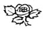

  
[Intangible Textual Heritage](../../index)  [Esoteric](../index) 
[Index](index)  [Previous](cdg78)  [Next](cdg80) 

------------------------------------------------------------------------

[Buy this Book at
Amazon.com](https://www.amazon.com/exec/obidos/ASIN/1564592014/internetsacredte)

------------------------------------------------------------------------

*Comte de Gabalis* \[1913\], at Intangible Textual Heritage

------------------------------------------------------------------------

p. 329

### SEVENTH PROPHECY.

### MERLIN'S PROPHECY OF WORLD PEACE AND ENLIGHTENMENT.

A man shall grasp the lion within the earth, and the brightness of gold
shall blind the eyes of those who behold it. Silver shall be of
brilliant whiteness upon the circumference and shall disturb the
different wine-presses. Mortals shall be drunk with the wine set forth
for them and from a deferred heaven shall look back upon the earth.
Their stern faces shall turn the stars from them and shall confound
their usual course. They shall plow fields for those who are unworthy
and for those to whom the moisture of heaven shall be denied. Roots and
branches shall change places and the newness of the world shall be a
miracle. The brilliance of the Sun shall be tarnished by Mercury's alloy
of gold and silver and there shall be dread among those who investigate.
Stilbon of Arcadia shall change the disk of the Sun. The helmet of Mars
shall call for Venus. The helmet of Mars shall cast a shadow. Iron Orion
shall unsheathe his sword. The Phoebus of the sea shall trouble the
clouds. The madness of Mercury shall pass all bounds. Jupiter shall.
forsake his lawful paths, and Venus shall desert the lines appointed for
her. The ill will of the star Saturn shall subside, and it shall hinder
mortals with a crooked sickle. The twelve houses of the stars shall
deplore the transition of their guests. Gemini shall forego their
accustomed embraces and shall call the urn to the

p. 330

fountains. The scales of Libra shall hang obliquely until Aries shall
put his curved horns under them. The tail of Scorpio shall produce
lightnings and Cancer shall quarrel with the Sun. Virgo shall mount the
back of Sagittarius and shall dim the flower of her virginity. The
chariot of the Moon shall disturb the Zodiac and the Pleiades break
forth into weeping. Hereafter the offices of Janus shàll never return
but his gates shall lie hid in the interstices of Ariadne's crown. The
waters shall rise at the stroke of a wand and the labour of the ancients
shall be recreated. The winds shall strive together with an awful blast
and shall make their sound among the stars. [†](#fn_247)

### LATIN TEXT OF MERLIN'S PROPHECY.

Amplexabitur homo leonem in humo, & fulgor auri oculos intuentium
excæcabit. Candebit argentum in circuitu, & diversa torcularia vexabit.
Imposito vino inebriabuntur mortales, postpositoque coelo in terram
respicient. \[Postpositoque e coelo in terram respicient\]. Ab eis
vultus avertent sidera, & solitum cursum confundent. Arebunt segetes his
indignantibus & humor convexi negabitur \[Arabunt segetes hi indignis
quibus humor convexi negabitur\]. Radices & rami vices mutabunt,
novitasque rei erit miraculo. Splendor Solis electro Mercurij languebit,
& erit horror inspicientibus. Mutabit clypeum Stilbon Arcadiæ. Vocabit
Venerem Galea Martis. Galea Martis

p. 331

umbram conficiet. Nudabit ensem Orion ferreus, vexabit nubes Phoebus
æquoreus. Transibit terminos furor Mercurij. Exibit Jupiter semitas
licitas & Venus deseret statutas lineas. Saturni sideris livido corruet
& falce recurva mortales perimet. Bissenus numerus domorum syderum
deflebit hospites ita transcurrere. Omittent Gemini complexus solitos, &
urnam in fontes provocabunt. Pensa libræ obliquæ pendebunt, donec aries
recurva cornua sua supponat. Cauda scorpionis procreabit fulgura, &
cancer cum sole litigabit. Ascendet virgo dorsum sagittarij & flores
virgineos obfuscabit. Currus Lunæ turbabit Zodiacum, & in fletum
prorumpent Pleiades. Officia Jani mina redibunt, sed clausa Janua in
crepidinibus Ariadnæ delitebit. In ictu radij exurgent æquora & pulvis
veterum renovabitur. Confligent venti diro suffiamine& sonitum inter
sidera conficient.

The Latin texts used are taken from Prophetia Anglicana, Merlini
Ambrosii Britanni, ex incubo olim (ut hominum fama est) ante annos mille
ducentos circiter in Anglia nati, Vaticinia & praedictiones: à Galfredo
Monumetensi Latinè conversæ: una cum septem libris explanationum in
eandem prophetiam, excellentissimi sui temporis Oratoris, Polyhistoris &
Theologi, Alani de Insulis, Germani, Dotoris (ob admirabilem & omnigenam
eruditionem, cognomento), Universalis & Parisiensis Academiæ, ante annos
300, Rectoris Amplissimi.

Opus nunc primum publici juris factum, & lectoribus

p. 332

ad historiarum, præcipue vero Britannicæ, cognitionem, non parum lucis
allaturum. Francofurti Typis Joachimi Bratheringij, MDCIII.

### NOTE ON TEXT.

The various rescensions of the text of Merlin's Prophecy exhibit marked
differences. The fad that a single word, the fifth in line one, is read
in four different ways [§](#fn_248) is but one
proof out of many which might he adduced as evidence that the original
manuscript has been much corrupted in transcription. Since certain
passages of the text as it now stands bear no relation to the general
tenor of the Prophecy they have been emended, these emendations being
inserted in brackets and followed in the translation.

### INTERPRETATION OF MERLIN'S PROPHECY.

A man shall grasp the lion within the earth, and the brightness of gold
shall blind the eyes of those who behold it..

The first lines of this Prophecy describe the coming of the
World-Saviour and its results. He is the man who shall grasp or
understand and govern the lion, [†](#fn_249)
Solar Force [\*](#fn_250) and its action in the
earth, the physical body. The brightness of gold, that is of the
Saviour's golden or Solar Body [‡](#fn_251), I
shall blind the eyes of those who behold it.

p. 333

Silver shall be of brilliant whiteness upon the circumference,

As gold is used mystically to signify that which is Solar or spiritual,
so silver is employed to symbolise that which is intellectual. To say
that silver shall be of brilliant whiteness upon the circumference of
the gold is equivalent to saying that brilliant minds shall gather about
the Manifested Spiritual Light.

and shall disturb the different wine-presses.

Wine is the symbol of the blood of Christ or spiritual life of the
church. Hence the wine-presses (the instruments through which spiritual
life should flow into the world) are the churches. Brilliant minds
inspired by the Manifested Light shall radiate the truth which they are
receiving and shall trouble and disturb the different churches and their
theological concepts of truth.

Mortals shall he drunk with the wine set forth for them and from a
deferred heaven shall look back upon the earth.

Mortals shall be intoxicated with the spiritual truth given out to them,
and from a state of felicity long deferred shall look back upon their
earthly or former conditions.

p. 334

Their stern faces shall turn the stars from them and shall confound
their usual course.

Through knowledge of the Law governing Solar Force man shall gain power
to awaken those ganglia corresponding to the planets [‡](#fn_252) and thereby controlling the planetary
forces manifesting in him, shall unfold the immortality of his own being
and become the master of his destiny.

"It is said that a wise man rules over the stars; but this does not mean
that he rules over the stars in the sky, but over the powers that are
active in his own mental constitution." PARACELSUS,
PHILOSOPHIA OCCULTA.

They shall plow fields for those who are unworthy and for those to whom
the moisture of heaven shall be denied.

The more evolved will work for the lesser evolved hitherto enslaved by
religions of men's own thought creation, and will seek to bring them
into a realisation of God's truth and omnipotence.

Roots and branches shall change places and the newness of the world
shall be as a miracle.

The spinal cord is "just like a tree with its innumerable branches
covering the whole of the human body, the roots being upwards--

p. 335

and the branches downwards." [\*](#fn_253) The
spinal cord is the tree whose roots and branches are here mentioned, and
connects those minor brain centres which are seats of the higher
consciousness in man and which when energised enable him to draw
spiritual nourishment and illumination from the heaven-world". "As trees
by their extremities are rooted in the earth, and through this are
earthly in every part, in the same manner divine natures are rooted by
their summits in the One." PROCLUS. To-day
man is rooted in the earth. To-morrow, awakening to a consciousness of
his divine nature, he shall be rooted in the One, and such radiation of
Spiritual Light will result that the newness of the world will be a
miracle.

Here ends the prophecy of the coming of the World Saviour, and some
lines are now devoted to a description of the era in which these events
will occur.

The brilliance of the Sun shall be tarnished by Mercury's alloy of gold
and silver and there shall be dread among those who investigate.

Spiritual knowledge and truth shall be tarnished and obscured by
teachings which are intellectual rather than spiritual.

p. 336

Stilbon of Arcadia shall change the disk of the Sun.

Stilbon is a Latinised form of the Greek ὁ Στίλβων, the Shining One, a
name given in antiquity to the planet Mercury;while Arcadia is a
district in Greece which latterly became so identified . with the cult
of Hermes (Mercury) that Statius terms the caduceus of the Messenger of
the Gods *virga Arcadia*, [\*](#fn_254) the
Arcadian rod. Stilbon of Arcadia would therefore appear to be a
reference to the Messenger of the Gods or World Teacher who shall change
the disk of the Sun, cause men to regard the Sun in its true light.
Aristotle in the De Mundo \[c. 2\] says, But the multitude of the
planets being collected into seven parts, is distributed into as many
circles. . . . Stilbon is the next (circle) in order, which some say is
sacred to Hermes, but others to Apollo." Hermes is the God of Intellect,
Apollo the Sun God and radiator of spiritual light and life. Hence it is
not improbable that by the beautiful title Stilbon of Arcadia, Merlin
obscurely signifies the tenor of the coming ministry to mankind which is
destined to inspire an intelledtualism vivified by spiritual
realisation.

p. 337

The helmet of Mars shall call for Venus.

Mars "was worshipped at Rome as the god of war, and war itself was
frequently designated by the name of Mars." [\*](#fn_255) Similarly Venus signifies love. The
armour of war shall call for love. The armament of war will become Aso
terrible as to compel love among the nations.

The helmet of Mars shall cast a shadow.

There shall be war.

Iron Orion shall unsheathe his sword.

"Orion, a handsome giant and hunter. Having come to Chios, he fell in
love with Merope, the daughter of Oenopion; his treatment of the maiden
so exasperated her father, that, with the assistance of Dionysus, he
deprived the giant of his sight. Being informed that he should recover
his sight if he exposed his eye-balls to the rays of the rising sun,
Orion found his way to the island of Lemnos, where Hephaestus (God of
Fire) gave him Cedalion as his guide, who led him to the East. After the
recovery of his sight he lived as a hunter along with Artemis. After his
death, Orion was placed among the stars, where he appears as a giant
with a girdle, sword, a lion's skin and a club." [\*](#fn_255) Orion typifies the enlightened soul
descended

p. 338

deep into matter who, through giving way to his lower nature, loses his
spiritual vision and after many tests and trials regains his divine
birthright through the healing power of the Solar Force or Sun
manifesting in man, being at last clothed with Light. The girdle, sword,
lion's skin and club are symbols of Initiation; the sword being emblem
of Justice and the Divine Law; the lion's skin of the lower nature slain
for the clothing of the God in man. Orion symbolises the Initiate and
his story recounts the progress of his Initiation. The meaning is that
an Initiate or God-enlightened man shall unsheathe that sword which is
the emblem of Divine Justice and God's Great Law,--shall reveal the Law
of Nature, God, which wills obedience in all things.

The Phoebus of the sea shall trouble the clouds.

The Phoebus of the sea is the Moon which symbolises the soul of man, and
the clouds are the illusion which encompasses it when incarnate. The
soul of man again awakening into a realisation of its true purpose shall
endeavour to penetrate and dispel the illusion which enthralls it and
prevents its mastery of the mind.

p. 339

The madness of Mercury shall pass all bounds.

"Mercury presides over every species of erudition." [†](#fn_256) The folly of man-made theories about
Nature shall exceed all limits. Dominating intellects will struggle for
supremacy over that which is divine.

Jupiter (Justice) shall forsake his lawful paths, and Venus (Love) shall
desert the lines appointed for her. The ill-will of the star Saturn
shall subside, and it shall hinder mortals with a crooked sickle.

The crooked sickle is the Moon. A favourable aspect of Saturn to the
Moon makes operative the sterling qualities of Saturn, restraint and a
true sense of justice. Under such an aspect, the ill will of Saturn
would subside. The word perimet (hinder) is used in this sense only when
governing an abstract object. Mortales (mortals) must therefore stand
for an abstrat idea, signifying the trend of mortal evolution which
shall be hindered or restrained in its present course by a manifestation
of Divine Justice. Saturn is said to bridge the gap between the mortal
and the immortal natures of man, and similarly that which separates the
mortal from the immortal evolution of the race. It is the property of
this planet to crystalise events, or bring them to a crisis, in order
that their lesson may be learned, and their experience garnered and
transmuted into that truth which is justice, and which brings divine
realisation and spiritual progress.

p. 340

\[paragraph continues\] Merlin
appropriately places Saturn after a prophecy of war and the confusion of
mortal concerns, and before his concluding words which shadow forth the
immortal destiny of the race.

The twelve houses of the stars (the twelve signs of the Zodiac) shall
deplore the transition. of their guests. Gemini shall forego their
accustomed embraces and shall call the urn to the fountains,

Gemini, "the well-known heroes Castor and Pollux. Although they were
buried, says Homer, yet they came to life every other day, and they
enjoyed divine honours. Castor, the mortal, fell by the hands of Idas,
but Pollux slew Lynceus. At the request of Pollux, Zeus allowed him to
share his brother's fate, and to live alternately one day under the
earth, and the other in the heavenly abodes of the gods." [\*](#fn_257) In this ancient myth the divine and
mortal natures of man are represented by the brothers Castor and Pollux.
To say that they shall cease their embraces is to imply that the divine,
when understood by man, will be differentiated from the human, and that
both will call the urn to the fountains of living waters, or consciously
partake of the same essence. " He (the Sun) enters into Gemini at the
time when the Pleiades rise." VITRUVIUS.

p. 341

The scales of Libra shall hang obliquely until Aries shall put his
curved horns under them.

Libra is the sign of the Balance, while Aries "the ram is the principle
of generation." [\*](#fn_258) Balance cannot be
achieved by man until the principle of generation is understood and
applied for the awakening and lifting up of that Regenerative Force
which is the instrument the soul uses to build up its Solar or Spiritual
Body. The spiritual equilibrium of the world will be upset until the
generative force in man is transmuted into Regenerative Power. [†](#fn_259)

The tail of Scorpio shall produce lightnings,

Scorpio represents the negative side of manifestation and here
symbolises opposition. There shall be fiery opposition to the coming
Spiritual Light.

and Cancer shall quarrel with the Sun.

Cancer represents power. Those in authority will quarrel with the Sun,
oppose the coming of Spiritual Light, because it illu minates the
ignorant and dethrones segregated forces.

Virgo shall mount the back of Sagittarius and shall dim the flower of
her virginity.

Virgo is the virgin or woman, while

p. 342

\[paragraph continues\] Sagittarius is the
house of Jupiter, the giver of the law or holder of authority. It is
possible to interpret this as an allusion to the present feminist
movement.

"Astrea in the mythology of the ancients, was the goddess of Justice,
who resided on earth during the reign of Saturn, or the golden age.
Being shocked by the impiety of mankind, she returned to heaven, and
became one of the twelve signs of the Zodiac, under the name of Virgo."

The chariot of the Moon shall disorder the Zodiac,

The Moon or soul of humanity is here represented as progressing and
thereby upsetting and disturbing existing conditions.

and the Pleiades break forth into weeping.

The Pleiades were seven in number, six of whom are described as visible
and the seventh as invisible. The Pleiades were virgin companions of
Artemis and, together with their mother, were pursued by the hunter
Orion in Boeotia; their prayer to be rescued from him was heard by the
gods, and they were metamorphosed into doves, and placed among the
stars." [†](#fn_260)

The Pleiades represent the seven principal ganglia of the sympathetic
nervous system, pursued by the Initiate Orion who seeks to

p. 343

energise them. When energised (when the Divine Force flows through them)
they are said to weep [\*](#fn_261) and through
prayer are changed into doves. The dove has been in marry ages the
symbol of the Super Solar Force. To say that the Pleiades become doves
is to say that they become vehicles of the Super Solar Force, and
energised by it appear as stars. Thus "the Pleiades break forth into
weeping" means that at a certain period of evolution the ganglia of the
sympathetic nervous system shall be highly energised, and men shall
become God-enlightened and no longer subject to illusion.

Hereafter the offices of Janus shall never return,

There shall be no more war. "Janus occupied an important place in the
Roman religion. He was the porter of heaven. On earth also he was the
guardian deity of gates. At Rome, Numa is said to have dedicated to
Janus the covered passage bearing his name, which was opened in times of
war and closed in times of peace." [†](#fn_262)
"He has also a temple at Rome with two gates, which they call the gates
of war." PLUTARCH.

p. 344

but his gates shall lie hid in the interstices of Ariadne's crown.

"Ariadne's crown, which is one of the celestial constellations, who left
the world in Saturn's reign, called the golden age." THE LIFE OF MERLIN. LONDON, .1813. PAGE 275.
Ariadne's crown here symbolises the advent of the golden age which shall
cause wars to cease.

The waters shall rise at the stroke of a wand,

The waters are influenced by the Moon, and symbolically represent
feeling or soul expression which shall flood the world when the
magician, World Saviour, shall come. The wand of the magician is the
spinal column energised by the power the Paraclete can give to man. This
is the power Moses had, and which before Moses built up ancient Egypt.

and the labour of the ancients shall be recreated.

Thus translated this passage may be taken to signify the return of the
Ancient Wisdom brought back by old souls incarnate for this purpose; or
literally rendered means "the dust of the ancients shall be restored."
When the generality of mankind become enlightened, and understand the
profound spiritual purpose which inspired the Egyptians

p. 345

to preserve their dead, they will return the sacred relics which they
have in their ignorance desecrated.

The winds shall strive together with an awful blast, and shall make
their sound among the stars.

These are the "winds" of the Apocalypse (anemoi) or differentiations of
the Solar Force manifesting in the cerebro-spinal system, and when man
is able to sustain their inflow, they shall make their sound among the
stars, energise the cerebro-spinal centres. These centres when energised
are visible to the seer as rapidly revolving stars of great luminosity
and restore to man super-physical states of consciousness. For the
purpose of clear statement we have refrained from differentiating Lunar
from Solar and Super Solar Force in this book. The Pleiades [†](#fn_263) are the ganglia of the sympathetic
nervous system energised by Lunar Force, while the stars here referred
to, are the centres of the cerebro-spinal system, vehicles of Solar
Force. The sympathetic and cerebro-spinal systems are thus prepared to
sustain the inflow of the Super Solar Force, the Redeemer and
Regenerator of mankind and the world.

p. 346

 

"And He hath subjected to you the night and the day; the sun and the
moon and the stars too are subjeeted to you by his behest; verily, in
this are signs for those who understand: KORAN SURA
xvi. THE BEE. EVERYMAN'S LIBRARY EDITION, PAGE 201.

 

Wherefore let God be exalted, the King, the Truth! There is no god but
He! Lord of the stately throne!" KORAN SURA xxiii.
THE BELIEVERS, PAGE 150.

 

------------------------------------------------------------------------

### Footnotes

[330:†](cdg79.htm#fr_247) Interpretation page
[332](#page_332).

[332:§](cdg79.htm#fr_248) *Humo, uno, auro,
vino*.

[332:†](cdg79.htm#fr_249) The Lion defined,
page [160](cdg09.htm#page_160).

[332:\*](cdg79.htm#fr_250) Solar Force defined,
pages [48](cdg05.htm#page_48), [50](cdg05.htm#page_50),
[42](cdg05.htm#page_42).

[332:‡](cdg79.htm#fr_251) The Solar Body is the
Spiritual Body.

[334:‡](cdg79.htm#fr_252) *Compare Interior
Stars, page [112](cdg07.htm#page_112)*.

[335:\*](cdg79.htm#fr_253) *Uttara Gila. D. K.
Laheri's Translation, page 28*.

[336:\*](cdg79.htm#fr_254) *Thebais ii, 70*.

[337:\*](cdg79.htm#fr_256) *Smith's Smaller
Classical Dictionary*.

[339:†](cdg79.htm#fr_257) *Thomas Taylor*.

[340:\*](cdg79.htm#fr_258) *Smith's Smaller
Classical Dictionary*.

[341:\*](cdg79.htm#fr_259) *Proclus*.

[341:†](cdg79.htm#fr_260) *Compare Dual Aspect
of Solar Force, page [110](cdg07.htm#page_110)*.

[342:†](cdg79.htm#fr_261) *Smith's Smaller
Classical Dictionary*.

[343:\*](cdg79.htm#fr_262) "*Theologists also
signify the extension of the Solar Providence to mortal natures through
tears*." *Proclus on the Timaeus of Plato. T Taylor's Translation, page
95*.

[343:†](cdg79.htm#fr_263) *Smith's Classical
Dictionary*.

[345:†](cdg79.htm#fr_264) "*Companions of
Artemis*," (*Diana the Moon Goddess*.)

------------------------------------------------------------------------

[Next: Muhammed's Prophecy of Truth](cdg80)
