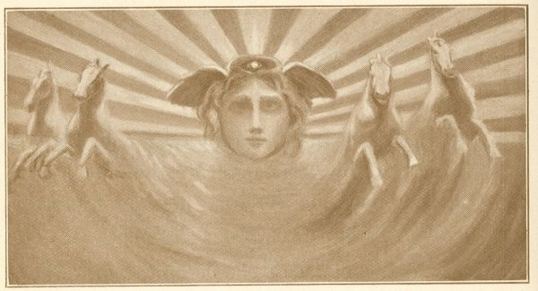

  
[Intangible Textual Heritage](../../index)  [Esoteric](../index) 
[Index](index)  [Previous](cdg82) 

------------------------------------------------------------------------

[Buy this Book at
Amazon.com](https://www.amazon.com/exec/obidos/ASIN/1564592014/internetsacredte)

------------------------------------------------------------------------

*Comte de Gabalis* \[1913\], at Intangible Textual Heritage

------------------------------------------------------------------------

p. 351

 

### "MY PORT PATERNAL IN THE COURTS OF LIGHT."

### HYMN TO THE SOVEREIGN SUN.

’Tis thine by heat apparent to exalt  
Corporeal natures from the sluggish earth,  
Inspiring vivid, vegetative power;  
And by a nature secretly divine,  
And from the base alloy of matter free,  
Inherent in thy all-productive rays,  
Thou draw’st to union with thy wond’rous form,  
Exalted souls, that in dark Hyle’s realms  
Indignant struggle for the courts of light:  
All beauteous, seven-rayed, supermundane god! p.
352  
Whose mystic essence secretly emits  
The splendid fountains of celestial light.

All-bounteous god, by whom the soul is freed  
From Generation’s dark corporeal bands,  
Assist THY OFFSPRING borne on mental wings,  
Beyond the reach of guileful Nature’s hands  
Swift to ascend, and gain thy beauteous world.  
The subtle vestment of my soul refine,  
Etherial, firm, and full of sacred light,  
Her ancient vehicle by thee assign’d  
In which invelop’d, thro’ the starry orbs,  
Urg’d by the impulse of insane desire,  
She fail’d precipitate, till Lethe’s shore,  
Involv’d in night, unhappily she touch’d,  
And lost all knowledge of her pristine state.

’Tis thine, from multitude exempt, t’ inspire  
In forms subordinate, prophetic truth;  
For truth and pure simplicity are one:  
And of preserving unpolluted power,  
Thy *liberated essence* is the source."

 

EXTRACTS FROM THE EMPEROR JULIAN'S ORATION TO THE
SOVEREIGN SUN.

 

 

 
