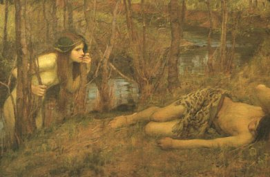

  
[Intangible Textual Heritage](../../index)  [Esoteric](../index) 

------------------------------------------------------------------------

[Buy this Book at
Amazon.com](https://www.amazon.com/exec/obidos/ASIN/1564592014/internetsacredte)

------------------------------------------------------------------------

<table width="75%">
<colgroup>
<col style="width: 50%" />
<col style="width: 50%" />
</colgroup>
<tbody>
<tr class="odd">
<td width="50%" data-valign="TOP"> 
A Naiad, by John William Waterhouse, detail [1893] (Public Domain Image)</td>
<td width="50%" data-valign="CENTER"><h1 id="the-comte-de-gabalis" data-align="CENTER">The Comte De Gabalis</h1>
<h2 id="by-abbé-n.-de-montfaucon-de-villars" data-align="CENTER">by Abbé N. de Montfaucon de Villars</h2>
<h4 id="section" data-align="CENTER">[1913]</h4></td>
</tr>
</tbody>
</table>

------------------------------------------------------------------------

[Contents](#contents)    [Start Reading](cdg00)    [Page
Index](pageidx)    [Text \[Zipped\]](cdgtxt.zip)

------------------------------------------------------------------------

|                                                                                                                           |
|---------------------------------------------------------------------------------------------------------------------------|
|  |

The core of this book is an anonymous English translation of a French
'novel of ideas' originally published in 1670. The Abbé de Villars, the
author, was a French clergyman born in 1635 in Alet, near Toulouse in
the south of France. He came to Paris in 1667, where he wrote a number
of books, most of which other than this work which have been forgotten
or lost. He was assassinated in 1673 or (by some accounts) 1675 while on
the road from Lyons to his native Languedoc.

The book describes an encounter with a mysterious Comte de Gabalis, who
is a master of the occult sciences. Gabalis initiates de Villars into
the secrets of the elemental beings: the Sylphs of the Air, the Undines
of the Water, the Gnomes of the Earth and the Salamanders of Fire. The
Abbé is not sure whether the elementals are demons, while Gabalis
encourages him to symbolically (?) marry one of the elementals.

Of course there is a lot more going on here than the dialog would
indicate. There are profuse classical and esoteric references. This
particular edition wraps the translation in a heavy cloak of parallel
commentary, footnotes, endnotes and sub-footnotes. The additional
material will be of much interest by itself, as a miscellany of esoteric
topics including a whole section of prophecies. And even though there
are hints, neither the original text nor the commentary ever discloses
exactly *who* the Comte de Gabalis is...

Production Notes. The first portion of this edition, the 'Discourses'
section, has commentary on facing pages; these were turned into
footnotes instead of trying to reproduce the page layout. For a number
of reasons, it was impossible to run a full spellcheck on this text, so
there are undoubtedly more OCR errors left in this text than usual. As
usual, I welcome any comments about typographical errors.

------------------------------------------------------------------------

 [Title Page and Front Matter](cdg00)  
[The Book](cdg01)  
[Abbé N. De Montfaucon de Villars](cdg02)  
[Contents](cdg03)  
[Discourse I](cdg04)  
[Discourse II](cdg05)  
[Hermes](cdg06)  
[Discourse III](cdg07)  
[Discourse IV](cdg08)  
[Ancient Persian Monument](cdg09)  
[Discourse V](cdg10)  

### Commentary Continued

[A. Map of the Horoscope](cdg11)  
[B. Harmony of the World](cdg12)  
[C. Numbers of Pythagoras](cdg13)  
[D. Sylphs of Cardan](cdg14)  
[E. Averroes](cdg15)  
[F. Saint Paul an Initiate](cdg16)  
[G. Plato, His Place as a Philosopher](cdg17)  
[H. Benvenuto Cellini Sees a Salamander](cdg18)  
[I. Book of Enoch](cdg19)  
[J. The Egg and Serpent Symbol](cdg20)  
[K. Those Reserved For Greater Things](cdg21)  
[L. Panic Terrors. Origin of the Term](cdg22)  
[M. The Great Pan is Dead](cdg23)  
[N. Jansenists](cdg24)  
[O. Jean Bodin](cdg25)  
[P. Moses And Elias Fasted Forty Days](cdg26)  
[Q. Bacchus and Osiris the Same](cdg27)  
[R. Muhammed](cdg28)  
[S. King Saul](cdg29)  
[T. The Oracle of Dodona](cdg30)  
[U. Divine Power of Letters](cdg31)  
[V. Oracle of Celius Rhodiginus](cdg32)  
[W. Sambethe, Daughter of Noah](cdg33)  
[X. Justin Martyr's Statement](cdg34)  
[Y. Temple of Hercules in Armenia](cdg35)  
[Z. Plato on Man's Place in Nature](cdg36)  
[AA. Sir Thomas Browne on Man's Place in Nature](cdg37)  
[BB. Curtius Rufus](cdg38)  
[CC. King Rodriguez Warning](cdg39)  
[DD. The Inmates of the Cave, or the Story of the Seven
Sleepers](cdg40)  
[EE. Sleep](cdg41)  
[Thotmes III](cdg42)  
[FF. Behemoth and Leviathan](cdg43)  
[GG. The Holy Language Described by Emmanuel Swedenborg](cdg44)  
[HH. Moses an Initiate](cdg45)  
[II. Book of the Wars of the Lord](cdg46)  
[JJ. Sacred Fire](cdg47)  
[KK. Noah, Vesta and Egeria](cdg48)  
[LL. Prince de Mirande and the Cabala](cdg49)  
[MM. Japhet](cdg50)  
[NN. Nymph of Stauffenberg](cdg51)  
[OO. Magdalen of the Cross](cdg52)  
[PP. Cassiodorus Renius or Reyna](cdg53)  
[QQ. Gertrude, Nun of the Monastery of Nazareth in the Diocese of
Cologne](cdg54)  
[RR. Romulus](cdg55)  
[SS. Servius Tullius](cdg56)  
[TT. Hercules](cdg57)  
[UU. Master Defined](cdg58)  
[VV. Roman Worship of a Supreme Deity Without Image or Statue](cdg59)  
[WW. Recent Tidings of the Elementary Peoples?](cdg60)  
[XX. Tyresias](cdg61)  
[YY. Merlin's Prophecy of the Conquest of the Air and of Aerial and
Submarine Warfare](cdg62)  
[AAA. Cherubim](cdg63)  
[The Birth of Jesus as Related in the Koran](cdg64)  
[BBB. Proclus On Prayer](cdg65)  
[CCC. Lord of Bavaria](cdg66)  
[DDD. The Sabat](cdg67)  
[EEE. Zedekias](cdg68)  
[FFF. Karoli Magni Et Ludovici Pii Christioniss:--Capitula](cdg69)  
[GGG. Magicians Sent by Grimaldus, Duke of Beneventum](cdg70)  
[HHH. Bishop of Lyons](cdg71)  

### Commentary Concluded

[Seven Ancient Prophecies](cdg72)  
[First Prophecy. The Magi's Prophecy of World Peace and a Universal
Language](cdg73)  
[Second Prophecy. The Sibylline Prophecy of World Peace and the Reign of
Justice](cdg74)  
[Third Prophecy. Enoch's Prophecy of World Peace and the Giving Forth of
Books](cdg75)  
[Fourth Prophecy. Micah's Prophecy of World Peace and Freedom of
Religion](cdg76)  
[Fifth Prophecy. Elder Edda. Prophecy of World Peace and Return of the
Ancient Wisdom](cdg77)  
[Sixth Prophecy. Bible Prophecy of World Peace Declaring the Manner of
its Accomplishment](cdg78)  
[Seventh Prophecy. Merlin's Prophecy of World Peace and
Enlightenment](cdg79)  
[Muhammed's Prophecy of Truth](cdg80)  
[Israels' Prophecy of Justice](cdg81)  
[Prophecy of the Messenger and the Stone set up in Egypt](cdg82)  

 

[Hymn To The Sovereign Sun](cdg83)  
