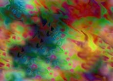

 [Esoteric and Occult](../index)   
[Mark Chaos' Website \[External Site\]](https://jaq.chaosmagic.com) 

------------------------------------------------------------------------

|                                     |                                              |
|-------------------------------------|----------------------------------------------|
|  | Chaos Magic |

These texts relate to the theory and practice of Chaos Magic. All of
these texts are pre-World-Wide-Web bulletin board postings. Much of this
material relates to the I.O.T. (Illuminates of Thanateros), and the Zos
Kia Cultus.

Some of this material overlaps with the [Internet Book of
Shadows](../../bos/index).

[Gnosis](gnosis.txt) \[Anon.\]  
[IOT](iti.txt) \[Anon.\]  
[Skullfuck
ritual](skulfck.txt) \[Anon.\]  
[Defining Chaos](chaosdef) by
Jaq D. Hawkins, aka Mark
Chao. This is an updated version of this article,
submitted by the author. Thanks!  
[Introduction to
Cybercraft](cybercft.txt), by Mike
Morgan  
[The Manifestation of Kali in
Universe as an Astrophysical Anomaly](kali.txt) By Persona Navitae 353  

------------------------------------------------------------------------

### Peter Carroll and the IOT

[Excerpts from Peter Carroll's Works
part 1](carroll.txt)  
[Excerpts from Peter Carroll's Works
part 2](carroll2.txt)  
[The Magus](magus.txt) by
Peter Carroll  
[Chaos
Monasticism](monastic.txt), by Peter Carroll  
[Octarine: Rituals and Spell
Objectives and Design in Eight Magics](octarine.txt) by Peter
Carroll  
[The Pact (IOT) - The Story So
Far](pact.txt), by Peter Carroll  
[Paradigm Shifts and
Aeonics](pdgmshft.txt), by Peter Carroll  
[The Magical Pact of The
Illuminnates Of Thanateros](thanat.txt) by Peter Carroll  
[Principia
Chaotica](princhao.txt) by Peter Carroll  

------------------------------------------------------------------------

### Austin Osman Spare and the Kos Kia Cultus

[Anathema of Zos: Automatic
Writing](anathema.txt) By Austin Osman
Spare  
[The Focus of Life](focus) by
Austin Osman Spare  
[The Book of Pleasure (Self-Love).
The Psychology of Ecstasy.](pleasure.txt) By Austin Osman Spare  
[The Sorceries of
Zos](zos.txt) (Austin O. Spare) from
Cults of the Shadow by Kenneth Grant  
[Austin Osman Spare and the Zos Kia
Cultus](sparezia.txt)  

------------------------------------------------------------------------

 Warning: Some of these texts are
copyrighted.
