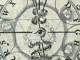

  
[Intangible Textual Heritage](../../index)  [Esoteric](../index) 
[Mysticism](../../myst/index)  [Index](index)  [Previous](cjb01) 
[Next](cjb03) 

------------------------------------------------------------------------

[Buy this Book on
Kindle](https://www.amazon.com/exec/obidos/ASIN/B0031574NM/internetsacredte)

------------------------------------------------------------------------

  
*The Confessions of Jacob Boehme*, by Jacob Boehme, ed. W. Scott Palmer
\[1920\], at Intangible Textual Heritage

------------------------------------------------------------------------

p. ix

IM Wasser lebt der Fisch, die Pflanze in der Erden,  
Der Vogel in der Luft, die Sonn’ am Firmament,  
Der Salamander muss im Feu’r erhalten werden,  
Und Gottes Herz ist Jakob Boehmes Element.  
                         *Angelas* *of Silesia*.

p. x p. xi

### INTRODUCTION

### I

JACOB BOEHME, who reveals to us in this book some of the secrets of his
inner life, was among the most original of the great Christian mystics.
With a natural genius for the things of the spirit, he also exhibited
many of the characteristics of the psychic, the seer, and the
metaphysician; and his influence on philosophy has been at least as
great as his influence on religious mysticism.

No mystic is born ready-made. He is, like other men, the product of
nurture no less than of nature. Tradition and environment condition both
his vision and its presentation. So, Boehme's peculiar and

p. xii

often difficult doctrine will better be understood when we know
something of his outer life and its influences. He was born of peasant
stock in 1575, at a village near Gorlitz on the borders of Saxony and
Silesia, and as a boy tended cattle in the fields. Of a pious, dreamy,
and brooding disposition, even in childhood he is said to have had
visionary experiences. Not being sufficiently robust for field-work, he
was apprenticed to a shoemaker; but, his severe moral ideas causing
disputes with the other workmen, he was dismissed and became a
travelling cobbler. During this enforced exile, which coincided with the
most impressionable period of youth, Boehme learned something of the
unsatisfactory religious conditions of his time; the bitter disputes and
mutual intolerance which divided Protestant Germany, the empty formalism
which passed for Christianity. He also came into contact with the
theosophic and

p. xiii

hermetic speculations which distinguished contemporary German thought,
and seemed to many to offer an escape into more spiritual regions from
the unrealities of institutional religion. He was himself full of doubts
and inward conflict; tortured not only by the craving for spiritual
certainty but also by the unruly impulses and passionate longings of
adolescence that "powerful contrarium" of which he so constantly speaks
which are often felt by the mystic in their most exaggerated form. His
religious demands were of the simplest kind: "I never desired to know
anything of the Divine Majesty … I sought only after the heart of Jesus
Christ, that I might hide myself therein from the wrathful anger of God
and the violent assaults of the Devil." Like St. Augustine in his study
of the Platonists, Boehme was seeking "the country which is no mere
vision, but a home"; and in this he already showed himself a true
mystic. His longings

p. xiv

and struggles for light were rewarded, as they have been in so many
seekers at the beginning of their quest, by an intuition of reality,
resolving for a time the disharmonies that tormented him. Conflict gave
way to a new sense of stability and "blessed peace." This lasted for
seven days, during which he felt himself to be "surrounded by the Divine
Light": an experience paralleled in the lives of many other
contemplatives.

At nineteen, Boehme returned to Gorlitz, where he married the butcher's
daughter. In 1599 he became a master-shoemaker and settled down to his
trade. In the following year, his first great illumination took place.
Its character was peculiar, and indicative of his abnormal psychic
constitution. Having lately passed through a new period of gloom and
depression, he was gazing dreamily at a polished pewter dish which
caught and reflected the rays of the sun. Thus brought, in a manner

p. xv

which any psychologist will understand, into a state of extreme
suggestibility, the mystical faculty took abrupt possession of the
mental field. It seemed to him that he had an inward vision of the true
character and meaning of all created things. Holding this state of
lucidity, so marvellous in its sense of renovation that he compares it
to resurrection from the dead, he went out into the fields. As Fox,
possessed by the same ecstatic consciousness, found that "all creation
gave another smell beyond what words can utter," so Boehme now gazed
into the heart of the herbs and grass, and perceived all nature ablaze
with the inward light of the Divine.

It was a pure intuition, exceeding his powers of speech and thought: but
he brooded over it in secret, "labouring in the mystery as a child that
goes to school," and felt its meaning "breeding within him" and
gradually unfolding "like a young plant." The inward light was not
constant;

p. xvi

his unruly lower nature persisted, and often prevented it from breaking
through into the outward mind. This state of psychic disequilibrium and
moral struggle, during which he read and meditated deeply, lasted for
nearly twelve years. At last, in 1610, it was resolved by another
experience, coordinating all his scattered intuitions in one great
vision of reality. Boehme now felt a strong impulse to write some record
of that which he had seen, and began in leisure hours his first book,
the *Aurora*. The title of this work, which he describes as "the Root or
Mother of Philosophy, Astrology, and Theology," shows the extent to
which he had absorbed current theosophic notions: but his own vivid
account—one of the most remarkable first-hand descriptions of automatic
or inspirational writing that exists—shows too how small a part his
surface mind played in the composition of this book, which he "set down
diligently in the impulse of God."

p. xvii

Boehme, like the ancient prophets and many lesser seers, was possessed
by a spirit which, whether we choose to regard it as an external power
or a phase of his own complex nature, was dissociated from the control
of his will, and "came and went as a sudden shower." It poured itself
forth in streams of strange and turbid eloquence, unchecked by the
critical action of the intellect. He has told us that during the years
when his vision was breeding within him he "perused many masterpieces of
writing." These almost certainly included the works of Valentine Weigel
and his disciples, and other hermetic and theosophic books; and the
fruit of these half-comprehended studies is manifest in the astrological
and alchemical symbolism which adds so much to the obscurity of his
style. Like many visionaries, he was abnormally sensitive to the
evocative power of words, using them as often for their suggestive
quality as for

p. xviii

their sense. A story is told of him that, hearing for the first time the
Greek word "Idea," he became intensely excited, and exclaimed: "I see a
pure and heavenly maiden!" It is to this faculty that we must probably
attribute his love of alchemical symbols and the high-sounding magical
jargon of his day.

A copy of the manuscript of the *Aurora* having fallen into the hands of
Gregorius Richter, the Pastor Primarius of Gorlitz, Boehme was violently
attacked for his unorthodox opinions, and even threatened with immediate
exile. Finally he was allowed to remain in the town but forbidden to
continue writing. He obeyed this decree for five years; for him, a
period of renewed struggle and gloom, during which he was torn between
respect for authority and the imperative need for selfexpression. His
opinions, however, became known. They brought him much
persecution—"shame, ignominy, and reproach,"

p. xix

he says, "budding and blossoming every day"—but also gained him friends
and admirers of the educated class, especially among the local students
of hermetic philosophy and mysticism. It was under their influence that
Boehme—his vocabulary now much enriched and his ideas clarified as the
result of numerous discussions began in 1619 to write again. In the five
years between this date and his death, he composed all his principal
works. Their bulk—and also, we must confess, their frequent obscurities
and repetitions—testify to the fury with which the spirit often drove
"the penman's hand." Some, however, do seem to have been written with
conscious art, to explain special points of difficulty; for Boehme's
first confused and overwhelming intuitions of reality had slowly given
place to a more lucid vision. The "Aurora" had turned to "a lovely
bright day," in which his vigorous intellect was able to deal with that
which he had

p. xx

seen "couched and wrapt up in the depths of the Deity." Thus the *Forty
Questions* gives his answers to problems stated by the learned Dr.
Walther, principal of the chemical laboratory at Dresden. His reputation
had now spread through Germany, and eminent scholars came to his
workshop to learn from him. In 1622 he left off the practice of his
trade and devoted himself entirely to writing and exposition.

The publication of the beautiful *Way to Christ*, which was privately
printed by one of these admirers in 1623, caused a fresh attack on the
part of his old enemy Richter. For once, Boehme condescended to
controversy, and replied with dignity to the violent accusations of
blasphemy and heresy brought against him. He was nevertheless compelled
by the magistrates to leave the town, where he now had a large number of
disciples. He went first to the electoral court of Dresden; there

p. xxi

meeting the chief theologians of the day, who were deeply impressed by
his prophetic earnestness and intense piety, and refused to uphold the
charge of heresy. In August 1624, the death of Richter allowed him to
return to Gorlitz; but he was already mortally ill, and died on November
21st of that year, at the age of forty-nine.

### II

In trying to estimate the character of Boehme's teaching, it is
important to realize the sources of his principal conceptions. Though
his early revelations, abruptly surging up from the unconscious region,
seemed to him to owe nothing to the art of reason, yet it is undeniable
that they were strongly influenced by memories of books read, beliefs
accepted, and experiences endured. The "lightning-flash" in which he had
his sudden visions of the Universe, also illuminated the furniture of
his own mind and gave to it a fresh significance

p. xxii

and authority. Thus it is often his own interior drama which he sees
reflected on the cosmic screen; a proceeding which the "theosophic"
doctrine of man as the microcosm of the Universe helped him to justify.
His unstable temperament, with its alternations between gloom and
illumination, its constant sense of struggle, its abrupt escapes into
the light the "powerful contrarium" with which he "stood in perpetual
combat"—conditions his picture of the eternal conflict between light and
darkness at the very heart of creation; the crude stuff of striving
nature and the formative Spirit of God. The "living running fire" which
he feels in his own spirit, is his assurance of the Divine fiery
creative energy.

Further, the Lutheran Christianity which formed the basis of his
religious life contributed many elements to his scheme. Thence came the
intense moral dualism, the Pauline opposition between the "dark-world"

p. xxiii

of unregenerate nature and the "light-world" of grace, the doctrines of
the Trinity and of regeneration, and generally those credal symbols
which he often uses in a theosophic sense. He is familiar with the
Bible, making constant though sometimes fantastic use of its language
and imagery. Finally, the German mystics and hermetic philosophers of
the Renaissance, in whom he was deeply read, gave him much of the raw
material of his philosophy. Alchemy in his day was still a favourite toy
of speculative minds; being understood partly in the physical, partly in
the transcendental sense. The "doctrine of signatures," which is the
subject of one of Boehme's later works, was still taken seriously as a
guide to practical medicine; the stuffed crocodile hung in the
laboratory, the toad and the spider were carefully distilled. Yet for
the spiritual alchemists the quest of the Stone was the quest of an
unearthly perfection,

p. xxiv

and human nature was the true matter of the "great work." This "hermetic
science," in which chemistry, magic, and mysticism were strangely
combined, plainly made a strong appeal to Boehme; and its influence upon
his work was not always fortunate. But his debt to the more genuinely
mystical writers of the sixteenth century, especially the Silesian
reformer, Caspar Schwenckfeld, and Valentine Weigel, is of far greater
importance. Certainly through Weigel, and perhaps also at first-hand, he
became acquainted with Paracelsus, whose doctrine of humanity as the sum
of three orders—the natural, the astral, and the divine—he adopts in the
*Threefold Life of Man* and *Three Principles of the Divine Essence*.
Through Weigel, too, he traces his descent from the great German mystics
of the fourteenth century; for the saintly pastor of Zschopau was soaked
in the works of Tauler, and edited that pearl of Christian mysticism

p. xxv

the *Theologia* *Germanica*. Boehme, therefore, was far from being an
isolated spiritual phenomenon. He was fed from many sources; but all
that he received was fused and remade in the furnace of his own inner
life. The result was a new creation, as unique as the White Stone which
the alchemist made from his mercury, sulphur, and salt; but we do it no
honour by ignoring the elements from which it sprang.

It is not possible to extract from Boehme's vast, prolix, and often
difficult works any closed system of philosophy. Often he repeats
himself, sometimes contradicts himself, or hides his meaning behind a
haze of inconsistent symbols; for his writing never wholly lost its
inspirational character. But as we study these writings we gradually
discern certain guiding lines, certain fixed characters, which help us
to find our way through the maze. These, thoroughly grasped, enable us
to recognize order and meaning in that

p. xxvi

which is often an apparent chaos; to enjoy and understand something of
that revelation which transformed the little Saxon cobbler into a
prophet of the Kingdom of God.

Boehme's map of reality is based, like that of most mystics, on the
number three, and has several interesting points of contact with
Neoplatonism. The universe in its essence consists of three worlds,
which are "none other than God Himself in His wonderful works." Without
and beyond Nature is the Abyss of the Deity, "the Eternal Good that is
the Eternal One": a Plotinian definition of the Absolute which may have
reached Boehme through Eckhart and his school. The three worlds are the
trinity of emanations through which the transcendent Unity achieves
self-expression. Boehme calls them the fire-world, the light-world, and
the dark-world. They are not mutually exclusive spheres, but aspects of
a whole. By them "we are to understand a threefold Being, or three

p. xxvii

worlds in one another"; and all have their part in the production of
that outward world of sense in which we live.

*Fire* is the eternal energetic Divine will towards creation; that
unresting life, born of a craving, which inspires the natural world of
becoming. "What ever is to come to anything must have Fire": it .is the
self-expression of the Father. From the primal fire or fount of
generation in its fierceness are born the pair of opposites through
which the Divine energy is manifested: the "dark-world" of conflict,
evil, and wrath which is Eternal Nature in itself, and the "light-world"
of wisdom and love, which is Eternal Spirit in itself the Platonic
*Nous*, the Son of Christian theology. The dark-world represents that
quality in life which is recalcitrant to all we call divine;
"unregenerate nature," which was for Boehme no illusion but a dreadful
fact. It is the sphere of undetermined non-moral striving, and of all
"biting, hating,

p. xxviii

and striking and arrogant self-will among men and beasts." The
light-world is the sphere of all determined goodness and beauty; the
state of being towards which the fiery impulse of becoming should tend.
It is the Word, or "Heart of God," as distinguished from His Will, and
holds within itself all those values which we speak of as divine. In the
Light is "the eternal original of all powers, colours, and virtues."
Here again, we perceive the Platonic ancestry of one of Boehme's most
characteristic ideas. In and through this Light the crude strivings of
the fiery life-force are sublimated; its titanic zest is transformed
into "the desire of love and joy." The Dark is necessary to it, because
"nothing without opposition can become manifest to itself."

The outer world in which we dwell according to the body is the creation
of the Fire and the Light. Ignoring the separate existence of the
dark-world, which

p. xxix

is then looked upon as one aspect of the Fire, Boehme sometimes speaks
of this physical order as the third Divine Principle, or sphere of the
Holy Spirit, the "Lord and Giver of Life"; who is thus assigned a
position very close to the Plotinian *Psyche*, or "soul of the world."
This outer world, he says, is "both evil and good, both terrible and
lovely," since in it love and wrath strive together. "The Nature-life
works unto Fire, and the Spirit-life unto Light." The business alike of
universal and of human life, the essence of its "salvation," is the
bringing of the Light out of its fiery origin—spiritual beauty out of
the raw stuff of energetic nature. This perpetual shooting up of life
from nature-dark to spirit-light is sometimes called by Boehme the "new
birth of Christ" and sometimes the "growing up of the Lily." It is
happening all the while; the triumphant self-realization of the
perfection of God. He

p. xxx

sees the universe as a vast alchemic process, a seething pot,
perpetually distilling the base metals into celestial gold.

As with the cosmos, so with its microcosm man. He, too, is in process of
becoming. The "great work" of the hermetists must be accomplished in
him, and he must accept its "anguish" the conflict of the fire and the
light. "Man must be at war with himself, if he wishes to be a heavenly
citizen." The combat is inevitable, and the victory is possible, because
we have the essence of all three worlds within us, and are "made of
*all* the powers of God." The eternal Light "glimmers" in every
consciousness. "When I see a right man," says Boehme, "there I see three
worlds standing." Hence human life is "a hinge between light and
darkness; to whichever it gives itself up, in that same does it burn."
Its possibilities of adventure are infinite. The arc through which it
may swing is as wide

p. xxxi

as the difference between hell and heaven. Fire—anguish, effort, and
conflict—it cannot escape; this is the manifestation of that will which
is life. But it can choose between the torment of its own separate dark
fire the self-centred craving which is the essence of sin and
self-abandonment to the divine fire of God's unresting will towards
perfection. The one sets up a whirlpool within the eternal process: the
other contributes its store of energy and love to that universal work
which transmutes the dark elements into the light, and heals the
apparent cleavage between "nature" and "spirit." "Our whole teaching,"
says Boehme, "is nothing else than how a man should kindle in himself
God's light-world." That world is here and now; and his one aim was to
open the eyes of other men to this encompassing and all-penetrating
reality. All lies in the direction of the will: "What we make of
ourselves, that we are."

p. xxxii

For him, the universe was primarily a religious fact: its fiery
energies, its impulse towards growth and change, were significant
because they were aspects of the life of God. His cosmic vision was the
direct outcome of spiritual experience; he told it, because he wished to
stimulate in all men the spiritual life, make them realize that "Heaven
and Hell are present everywhere, and it is but the turning of the *will*
either into God's love or into His wrath, that introduceth into them."
When the restlessness of becoming, the anxious craving, which should
lead both cosmic and human life to its bourne, is turned back on itself
and becomes a fiery self-devouring desire, a "wheel of anguish," the
alchemic process goes wrong. Then is produced the condition which Boehme
calls the *turba;* and the *turba* is the essence of hell. But everyone
who yields himself to the impulse of the Light stands by that very act
in the heaven of God's

p. xxxiii

heart; for "Heaven is nothing but a manifestation of the Eternal One,
wherein all worketh and willeth in quiet love."

Hence at the end of this vast dynamic vision, this astonishing harmony
of the scientific and the Christian universe, we find that the
imperatives which govern man's entry into truth are moral: patience,
courage, love, and surrender of the will. These evangelical virtues are
the condition of our knowledge of reality; for though "God dwells in all
things, nothing comprehends Him unless it be one with Him." This is the
doctrine of all the great mystics, and they have proved its truth in
their own lives. Such an attunement of human to divine life is the real
object of Christianity: and we must not forget that Boehme was before
all else a practical Christian, for whom his religion was a vital
process, not merely a creed. He complained that the orthodox of his day
were content to believe that Christ had once died for them; but

p. xxxiv

such acceptance of history saved none. "A true Christian is not a mere
historical new man"—he is a biological fact, the crown of the "great
work" of spiritual alchemy. Christian history is only "the cradle of the
Child"; the framework within which the law of regeneration is
perpetually manifested, and the "heavenly man," citizen of the eternal
light-world, is brought forth in the world of time. This, says Boehme,
"we heartily wish that the titular and Lip-Christians might once find by
experience in themselves, and so pass from the history into the
substance." It was from the fulness of his own experience that he wrote,
as this collection of his personal declarations shows. In it we see how
close was the connection between his inner life and his "mystical"
vision; the great moral demands and perpetual conflicts which
conditioned his intuitive knowledge of reality. That knowledge was the
fruit of the "earnest seeking" pursued

p. xxxv

from adolescence to the end of his earthly life: of a will and craving
persistently yet humbly set on the only rational object of desire, and
turning to its purposes every element of his threefold nature. Such
completeness of dedication is the foundation of all sane mysticism, and
works in those who achieve it a veritable change of consciousness, an
enhancement of life, inconceivable to other men.

"Make trial in this manner," says Boehme again, "and thou wilt quickly
see and feel another man with another sense and thoughts and
understanding. I speak as I know and have found by experience; a soldier
knows how it is in the wars. This I write out of love as one who telleth
in the spirit how it hath gone with himself, for an example to others,
to try if any would follow him and find out how true it is."

EVELYN UNDERHILL

------------------------------------------------------------------------

[Next: Chapter I](cjb03)

