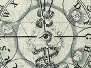

  
[Intangible Textual Heritage](../../index)  [Esoteric](../index) 
[Mysticism](../../myst/index)  [Index](index)  [Previous](cjb02) 
[Next](cjb04) 

------------------------------------------------------------------------

[Buy this Book on
Kindle](https://www.amazon.com/exec/obidos/ASIN/B0031574NM/internetsacredte)

------------------------------------------------------------------------

  
*The Confessions of Jacob Boehme*, by Jacob Boehme, ed. W. Scott Palmer
\[1920\], at Intangible Textual Heritage

------------------------------------------------------------------------

p. 1

# THE CONFESSIONS OF JACOB BOEHME

### CHAPTER I

ART has not wrote this, neither was there any time to consider how to
set it punctually down, according to the right understanding of letters,
but all was ordered according to the direction of the Spirit, which
often went in haste; so that in many words letters may be wanting, and
in some places a capital letter for a word. The Penman's hand, by reason
he was not accustomed to it, did often shake; and though I could have
wrote in a more accurate, fair, and plain manner, yet the reason I did
not was this, that the burning fire often forced forward with speed, and

p. 2

the hand and pen must hasten directly after it; for that fire comes and
goes as a sudden shower. I can write nothing of myself but as a child
which neither knows nor understands anything, which neither has ever
been learnt; and I write only that which the Lord vouchsafes to know in
me according to the measure as himself manifests in me.

I never desired to know anything of the Divine Mystery, much less
understood I the way to seek and find it. I knew nothing of it, which is
the condition of poor laymen in their simplicity.

I sought only after the heart of Jesus Christ, that I might hide myself
therein from the wrathful anger of God and the violent assaults of the
Devil. And I besought the Lord earnestly for his Holy Spirit and his
grace, that he would please to bless and guide me in him, and take that
away from me which turned me from him. I resigned myself wholly to him,

p. 3

that I might not live to my own will, but his; and that he only might
lead and direct me, to the end I might be his child in his son Jesus.

In this my earnest and Christian seeking and desire (wherein I suffered
many a shrewd repulse, but at last resolved rather to put myself in
hazard than leave off), the Gate was opened to me, that in one quarter
of an hour I saw and knew more than if I had been many years together at
an University, at which I exceedingly admired and thereupon turned my
praise to God for it.

So that I did not only greatly wonder at it, but did also exceedingly
rejoice; and presently it came powerfully into my mind to set the same
down in writing, for a memorial for myself, though I could very hardly
apprehend the same in my external man and express it with the pen. Yet,
however, I must begin to labour in this great mystery as a child that
goes to school.

p. 4

I saw it as in a great deep in the internal; for I had a thorough view
of the Universe, as a complex moving fulness wherein all things are
couched and wrapped up; but it was impossible for me to explain the
same.

Yet it opened itself in me, from time to time, as in a young plant. It
was with me for the space of twelve years, and was as it were breeding.
I found a powerful instigation within me before I could bring it forth
into external form of writing; but whatever I could apprehend with the
external principle of my mind, that I wrote down.

Afterwards, however, the Sun shone upon me a good while, but not
constantly, for sometimes the Sun hid itself, and then I knew not nor
well understood my own labour. Man must confess that his knowledge is
not his own but from God, who manifests the Ideas of Wisdom to the soul,
in what measure he pleases.

It is not to be understood that my reason is greater or higher than that
of all other

p. 5

men living; but I am the Lord's twig or branch, and a very mean and
little spark of his light; he may set me where he pleases, I cannot
hinder him in that.

Neither is this my natural will, that I can do it by my own small
ability; for if the Spirit were withdrawn from me, then I could neither
know nor understand my own writings.

 

O gracious amiable Blessedness and great Love, how sweet art thou! How
friendly and courteous art thou! How pleasant and lovely is thy relish
and taste! How ravishing sweetly dost thou smell! O noble Light, and
bright Glory, who can apprehend thy exceeding beauty? How comely adorned
is thy love! How curious and excellent are thy colours! And all this
eternally. Who can express it?

Or why and what do I write, whose tongue does but stammer like a child
which is learning to speak? With what shall I

p. 6

compare it? or to what shall I liken it? Shall I compare it with the
love of this world? No, that is but a mere dark valley to it.

O immense Greatness! I cannot compare thee with any thing, but only with
the resurrection from the dead; there will the Love-Fire rise up again
in us, and rekindle again our astringent, bitter, and cold, dark and
dead powers, and embrace us most courteously and friendly.

O gracious, amiable, blessed Love and clear bright Light, tarry with us,
I pray thee, for the evening is at hand.

------------------------------------------------------------------------

[Next: Chapter II](cjb04)

