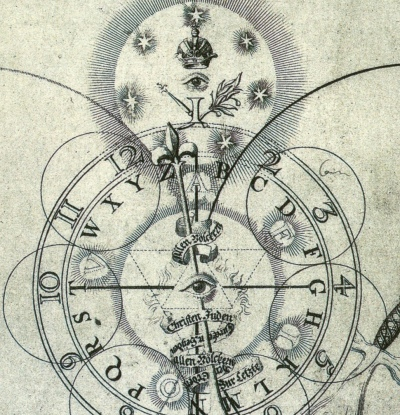

  
[Intangible Textual Heritage](../../index)  [Esoteric](../index) 
[Mysticism](../../myst/index) 

------------------------------------------------------------------------

[Buy this Book on
Kindle](https://www.amazon.com/exec/obidos/ASIN/B0031574NM/internetsacredte)

------------------------------------------------------------------------

<table width="75%">
<colgroup>
<col style="width: 50%" />
<col style="width: 50%" />
</colgroup>
<tbody>
<tr class="odd">
<td width="50%" data-valign="TOP"></td>
<td width="50%" data-valign="CENTER"><h1 id="the-confessions-of-jacob-boehme" data-align="CENTER">The Confessions of Jacob Boehme</h1>
<h2 id="by-jacob-boehme" data-align="CENTER">by Jacob Boehme</h2>
<h3 id="compiled-and-edited-by-w.-scott-palmer" data-align="CENTER">Compiled and Edited by W. Scott Palmer</h3>
<h4 id="section" data-align="CENTER">[1920]</h4></td>
</tr>
</tbody>
</table>

------------------------------------------------------------------------

[Contents](#contents)    [Start Reading](cjb00)    [Page
Index](pageidx)    [Text \[Zipped\]](cjb.txt.gz)

------------------------------------------------------------------------

|                                                                                                                           |
|---------------------------------------------------------------------------------------------------------------------------|
|  |

Jacob Boehme (b. 1575, d. 1624) was a German Christian mystic, who,
despite humble origins, wrote encyclopedic works detailing a visionary
universe, densely inhabited by spirits. Like many other mystics, Boehme
saw dualities and trinities everywhere. He believed that there were
three worlds: the world of Light, the world of Darkness, and the world
of Fire. He believed that heaven and hell overlap spatially. The Devil
is incapable of communicating with God, because (as we would say today)
he in is a parallel universe!

This book will serve as a gentle introduction to Boehme for curious
readers. Note that this work was not written by Boehme, but compiled by
Palmer from an 18th century translation of his complete works. Also
available at this site by Boehme is a translation of the complete work,
[The Signature of All Things](../sat/index).

------------------------------------------------------------------------

 [Title Page](cjb00)  
[Note by the Editor](cjb01)  
[Introduction](cjb02)  

 

[Chapter I](cjb03)  
[Chapter II](cjb04)  
[Chapter III](cjb05)  
[Chapter IV](cjb06)  
[Chapter V](cjb07)  
[Chapter VI](cjb08)  
[Chapter VII](cjb09)  
[Chapter VIII](cjb10)  
[Chapter IX](cjb11)  
[Chapter X](cjb12)  
[Chapter XI](cjb13)  
[Chapter XII](cjb14)  
[Chapter XIII](cjb15)  
[Chapter XIV](cjb16)  
[Chapter XV](cjb17)  
[Chapter XVI](cjb18)  
[Chapter XVII](cjb19)  
