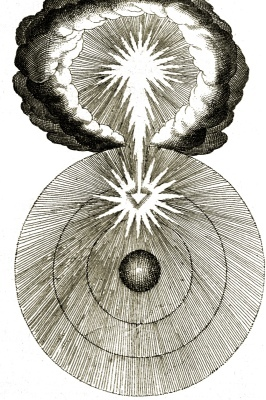

  
[Intangible Textual Heritage](../../index)  [Esoteric](../index) 

------------------------------------------------------------------------

[Buy this Book at
Amazon.com](https://www.amazon.com/exec/obidos/ASIN/B002DYIYAY/internetsacredte)

------------------------------------------------------------------------

<table width="75%">
<colgroup>
<col style="width: 50%" />
<col style="width: 50%" />
</colgroup>
<tbody>
<tr class="odd">
<td width="50%" data-valign="TOP"></td>
<td width="50%" data-valign="CENTER"><h1 id="the-cloud-upon-the-sanctuary" data-align="CENTER">The Cloud Upon the Sanctuary</h1>
<h2 id="by-karl-eckartshausen" data-align="CENTER">by Karl Eckartshausen</h2>
<h4 id="section" data-align="CENTER">[1909]</h4></td>
</tr>
</tbody>
</table>

------------------------------------------------------------------------

[Contents](#contents)    [Start Reading](cuts00)    [Page
Index](pageidx)    [Text \[Zipped\]](cuts.txt.gz)

------------------------------------------------------------------------

|                                                                                                                           |
|---------------------------------------------------------------------------------------------------------------------------|
|  |

Karl von Eckhartshausen (1752-1803) was an 18th century German mystic
who wrote extensively on esoteric topics. This work, The Cloud Upon the
Sanctuary, is Christian mysticism veiled in hermetic code.
Eckhartshausen was briefly a member of the Bavarian Illuminati, but left
for spiritual reasons. He cryptically mentions a "society of the Elect"
which has existed from the very beginning of time, "the invisible
celestial Church." He predicted that "it is the society whose members
form a theocratic republic, which one day will be the Regent Mother of
the whole World." This book later influenced the Order of the Golden
Dawn, and most notably, Aleister Crowley.--J.B. Hare

------------------------------------------------------------------------

 [Title Page](cuts00)  
[Contents](cuts01)  
[Introduction](cuts02)  
[Letter I](cuts03)  
[Letter II](cuts04)  
[Letter III](cuts05)  
[Letter IV](cuts06)  
[Letter V](cuts07)  
[Letter VI and Last](cuts08)  
