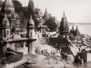

  
[Intangible Textual Heritage](../../index)  [Esoteric](../index) 
[Yoga](../../hin/yoga/index)  [Index](index)  [Previous](dsc07) 
[Next](dsc09) 

------------------------------------------------------------------------

[Buy this Book at
Amazon.com](https://www.amazon.com/exec/obidos/ASIN/1406777439/internetsacredte)

------------------------------------------------------------------------

  
*Yoga Lessons for Developing Spiritual Consciousness*, by A.P. Mukerji,
\[1911\], at Intangible Textual Heritage

------------------------------------------------------------------------

p. 34

### CHAPTER VI.

#### SPIRITUAL UNFOLDMENT.

THE heart of man pants for many things. *Desire moves man more than
aught else*. Passions may lash up the lake of his mind into a thousand
pulsations; grief may burn the iron of despair right into his brain, and
make him feel as one stranded; all his emotions and feelings may play
upon him; the world outside may fasten its grip upon him, toss him up
from pillar to post and beat him flat; yet the impress left by these is
sooner or later wiped out and man rises to his feet once more. But not
so the iron grip of desire. It holds on to him like grim death. It drags
out the soul minute after minute of our existence, electrifies the
unwilling hand to exertion and stimulates the brain to accomplish its
ends.

From the hoary, venerable sage, standing triumphant upon the heights of
spirituality, down to the most animalized, coarsened man—the Bushman,
the Central African savage—this phenomenon makes itself clearly visible
to the observant eye.

Now, there come moments in our lives, when even the greatest
money-spinners; the most persistent pleasure-hunters, turn aside from
their usual occupations to listen

p. 35

to a *voice* within them which is constantly asking, "*Man, where art
thou from? Where art thou drifting along? To what end is all
this?—Money, wife, children, and all that you hold next to your heart.
"What has a man gained, if he has gained the whole world and lost his
soul?*"

These and similar other questions beat upon our brains in spite of all
our contrary partialities, our thorough worldism.

All this unrest and discomfort *is quite in the nature of things*. Man
cannot always be building mud-pies and swallowing "goldpills." Something
more abiding, more permanent, is wanted. This yearning after the Eternal
makes us call a halt upon the pursuit of blind passions, the hunt after
pleasure,—which is the vanishing point between satiety and reaction.

The son wants to be united to the Father, his primal source. God becomes
an indispensable necessity. Without Him, life seems to be a dance after
fleeting shadows. Each word of advice, of guidance and of spiritual help
comes as a cup of cold water to the thirsting soul.

Life is simplicity itself. *It is governed everywhere by One Life, One
Law, One Word*,—such is the grand teaching of the Ancients. And as we,
by knowledge, experience and observation, get a clearer grasp of this
doctrine of *Unity*, we approach *Truth*.

As our vision of God grows more and more distinct, Life with its
million, million tongues, seems all music.

p. 36

\[paragraph continues\] Fear is sloughed
off like a dead skin. Peace, poise and power are all attracted to us by
the subtle magnetism of pure thoughts. Man eyes man with Love,
Compassion and Pity. The fibres of the mind have grown too finely strung
to stand the shock of evil thoughts and desires, and *these latter* fly
off from the keenly vibrant mind. Listen to Yogi Ramacharaka:

"From this point you will gradually develop into that consciousness
which assures you that when you say "I" you do not speak of the
individual entity with all its power and strength but know that the "I"
has behind it the power and strength of the spirit and is connected with
an inexhaustible supply of force, which may be drawn upon when needed.
Such an one can never experience Fear—for he has risen far above it.
Fear is the manifestation of weakness and, so long as we hug it to us
and make a bosom friend of it, we will be open to the influence of
others. *But by casting aside Fear we take several steps upwards in the
scale. . . . When man learns that nothing can really harm him, Fear
seems a folly*. And when man awakens to a realisation of his real nature
and destiny, he knows that nothing can harm him and consequently Fear is
discarded.

"It has been well said, "There is nothing to fear but fear." . . . The
abolition of Fear places in the hands of man a weapon of defence and
power which renders him almost invincible. Why do you not take this gift
which is so freely offered you? *Let your watchwords be* "*I am;*" "*I
am fearless and free*."

p. 37

The italics are mine. It is a lengthy quotation but each word will repay
perusal.

Thus we see that "Spiritual Unfoldment" means a gradual stripping off of
the dense and subtle sheaths in which man is clothed for the
manifestation of the spirit.

What is the Spirit? I can give you but a very poor idea. The spirit is
the highest principle, the most sublime attribute of Man. According to
the teachings of advanced occultists and the great sages of India. *Man
is a sevenfold creature; is also in seven sheaths;* manifests on seven
planes of being.

These are according to Yogi Ramacharaka's classification: 7 Spirit; 6
Spiritual mind; 5 Intellect; 4 Instinctive Mind; 3 Prana, Vital Force; 2
Astral Body; 1 physical body.

Few, almost none of the present race, have achieved the seventh
principle. The spirit in man is a spark from the Divine Flame. It
establishes a psychic connection, if I may so put it, between Man and
the Absolute. The noblest of men, the most wonderful geniuses, the most
brilliant master-minds, were the fortunate recipients of a few flashes
of the spirit, which is the Invincible Controlling Power in Man. In
moments of deep abstraction, the human consciousness, if concentrated
upon high ends, finds messages from the Spirit flash downwards, like a
streak of lightning; and the world is startled by the revelation.

As I have remarked before, Man is not a finished

p. 38

product of nature. He is a developing creature. He has to *master* all
these sheaths and realise the spirit within—*Himself*.

It is a long and serious task. Those that take it up consciously,
undertake the most trying task of life. Yet we are all going that way.

Here are three words:—*Instinct, Reason, Intuition*. These are the three
phases of mind, from the lowest up to the highest. They develop into
each other. Instinct dovetails into Reason, and Reason into Intuition.
Let us consider them categorically.

The instinct is a subconscious intelligence. There is a *self-preserving
principle* of the mind. The animal world illustrates this. One animal
fights another, kills another, to maintain its life. The duckling rushes
to the water as its natural element; the newly-fledged bird wants to be
on the wing; the child seeks the mother's breast as its source of
nourishment; our feet run away with us in moments of peril in spite of
ourselves;—*it is all Instinct*. The various work of the body,
digestion, assimilation, tissue change, etc., are all carried on along
this subconscious line of mentation. Passion is said to be *blind*,
because it is a part of the Instinct.

This lowest phase of the mind is most developed in man. It has no
reason, no volition.

As man grows, he begins to think, to compare himself with others, to
analyse things, to classify, to judge, and so on. This is Reason. It is
the Intellect, with the conscious entity, "I" as its monarch. The baby
ego,

p. 39

the hitherto sleeping soul, begins to wake up at its magic touch. *The
will becomes rationalized*. It shows itself *by assertions, demands and
commands*.

Through the intellect man learns to recognize his developing manhood.
His self-consciousness, the "*I am*" consciousness, expands and learns
to regard himself as a distinct, living, reasoning being.

The intellect controls the Instinctive mind. It checks it from picking
up suggestions dropped by others. The will as it develops swings brain
and body, the "lust of the flesh, the lust of the eyes, the pride of
life" round to its own mandates. The half developed intellect is a
source of misery. It sends fear thoughts, adverse suggestions, into the
Instinctive Mind, which, slave-like, carries out orders blindly.

Into the Intellect, when it has touched its zenith shades the Spiritual
Mind, Intuition. Intuition passes beyond, transcends the intellect. It
is the "Super-conscious Mind." All that is considered noble and lofty in
the mind comes from the spiritual mind. The "brotherhood" of man and the
"fatherhood" of God: "True religious feelings, kindness, humanity,
justice, unselfish love, mercy, sympathy, etc., come to us through
slowly unfolding spiritual mind"

Intuition is the highest phase of the human mind. it sees truth by
direct perception. It is the seat of prophesy, inspiration and spiritual
insight. As the mind becomes calm and controlled, rays of light
penetrate it from the realms of the spirit. Prophesy, the

p. 40

intuitive perception of some future event, often shows itself. It is a
faculty which belongs to the spiritual side of consciousness. It is
superior to our physical, astral and mental selves. It transcends the
human and shades into the Divine.

Such, in brief, is a crude conception of Spiritual Unfoldment. It does
scant justice to this subject, yet it may go to throw some light on some
dark problems.

Man is not a sack of flesh, blood and bones. We are all of us traveling
God-wards. We have not been born to dance to the orders of others; nor
is enjoyment the aim of. life.

Some people, who have developed a little intellect, regard themselves as
the *créme de la créme* of the universe. "We are in a higher sphere."
Such is the blindness of conceit. Those that cultivate such ideas will
find the ground cut from under their feet.

Let us pick out our line of action carefully. Let us not go into society
an Ishmael with our hand raised against every one. Selfish, grasping men
are the most unhappy of the whole lot of us. *Harm watch, harm catch*.

None of us are spotless. If there is any one who repels us, let us not
hate him. *There is nothing to hate but hatred*.

Wisdom and an understanding of our place in the vast cosmic Evolution
alone can rob Death of its terrors.

The warm, living impulses of the heart, if carried

p. 41

out, will surely work for our upliftment. Religion is life. Its mission
is to take the *animal-man* out of the *divine-man* and set us free from
this cage of flesh.

------------------------------------------------------------------------

[Next: Chapter VII. Cause and Effect](dsc09)
