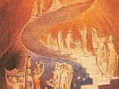

  
[Intangible Textual Heritage](../../index)  [Esoteric](../index) 
[Index](index)  [Previous](goal14)  [Next](goal16) 

------------------------------------------------------------------------

[Buy this Book at
Amazon.com](https://www.amazon.com/exec/obidos/ASIN/1428625305/internetsacredte)

------------------------------------------------------------------------

  
*The Goal of Life*, by Hiram Butler, \[1908\], at Intangible Textual
Heritage

------------------------------------------------------------------------

p. 122

### CHAPTER XI.

#### THE ELOHIM

It was the Elohim that the Lord Jesus
called his Father, and he made the astonishing statement that "no man
knoweth the Son, but the Father; neither knoweth any man the Father,
save the Son, and he to whomsoever the Son will reveal him (Mat. xi. 27)
I.

In the effort to reveal the Father, we necessarily assume thereby to be
the son, which does not mean that we assume to have in mind the Lord
Jesus Christ who was here nineteen hundred years ago, for the apostle
declared the great truth, "Now are we the sons of God, and it doth not
yet appear what we shall be" (I. John iii. 2); and the Lord Jesus left
on record the commandment, "Call no man your father upon earth: for one
is your Father, which is in heaven" (Mat. xxiii. 9).

If we are to reveal to you the Father, it is because we have followed
the leadings of the Spirit until the Father has revealed himself unto
us. But that revelation to our soul cannot become knowledge to you. We
make the effort to reveal to you in words that which we have come to
know

p. 123

as absolute truth, and you only obtain the knowledge of that truth by
the knowledge of the Spirit; "for as many as are led by the Spirit of
God, they are the sons of God" (Rom. viii. 14); and the Son of God said,
nineteen hundred years ago, "If I should say, I know him not, I shall be
a liar like unto you" (John viii. 55). Therefore it behooves us to give
you evidence from the Scriptures of Truth, which some of you hold dear.

The very first utterance of the Old Testament is, "In the beginning God
\[Elohim\] created the heaven and the earth." The noun Elohim is in the
plural form, and it would have been correct had the sentence been
translated, "In the beginning the Gods created the heaven and the
earth." Some authorities have ingeniously tried to evade the
consequences of the plural noun in this case by explaining that it is a
"plural of excellence." Others hold that it signifies a plurality of
attributes or manifestations; but the fact stands out incontrovertibly
that throughout is meant a plurality of individuals, and when we reach
the 26th verse, we read that Elohim said, "Let us make man in our image, after our likeness."

The thought here is unquestionably that of a company of persons of whom
one says to the others, Let us do thus and so—it is not, I will make.
(We are not, however, presenting to you a plurality of gods, but a God
organized of many members; therefore one God.) In the Hebrew "Let us
make"

p. 124

is a verbal form in the plural, emphasizing the conception of plurality
quite as much as is done in the English. We are thus brought face to
face with language which images this picture to our minds: A plurality
of Gods—or Personalities, if you please—deciding upon a concerted work
that is to be accomplished, and working together as one body, one man,
for the accomplishment of the work agreed upon.

In the second chapter of Genesis begins the use of the name Yahveh, frequently in connection with that of
the Elohim—Yahveh Elohim. In the
consideration of the name Yahveh we have
tried to present it as the embodiment of the idea of the Universal
Spirit, the Mind and Will which is the source of all life, mind and
action. Consequently, in the union (unity) of the two Divine names,
Yahveh Elohim, is brought to light
throughout the Scriptures, and in cases too numerous to mention, the
conception of the final attainment of man being the unity of his mind
and will with the mind and will of God.

Reasoning along this line of thought we come to the following
conclusion: Yahveh being the source of
all life, of all mind, of all action—Spirit, man in his creation must
have been formed of the substance of Yahveh, as Yahveh is the source of all that is. And not
only is he the cause of all energy, but his Infinite Mind is the source
of all order; and in order there must be a purpose, for without a

p. 125

purpose mind is in discord. Therefore, when Elohim said, "Let us make
man in our image, after our likeness," that declared purpose necessarily
embodied the thought of taking of the Father and forming the Son; and,
while we have no authority in the Scriptures for the statement, we have
reason to believe from what has been said that the Elohim are a body of
men that, in the æons of time past, were created even as we have been
created, and that, having developed through all the experiences of an
earthly life, they attained to the unity of their mind and will with the
mind and will of their Creator; and, as to the processes of evolution,
development, there is no end, they have passed on in knowing the Father,
Yahveh, becoming more and more like him,
until they have reached heights of attainment so far beyond the
possibility of our conception that they have become the Creators,
Preservers and Rulers, not of this earth alone, but probably of the
whole solar system.

Thus they have become the embodiment and expression of Yahveh, and have a right to be called Yahveh Elohim; and when they said, "Let us make
man in our image, after our likeness," they expressed the thought that
man, their creation, must pass through all the experiences of an earth
life, as they themselves had done, and that, in order to go on in his
attainment to that likeness, he must turn his thought and aspiration
toward Yahveh, and seek with all his
heart to be like him, in perfect

p. 126

harmony with the laws that gave him (man) existence, with the life of
which he is the embodiment. When man has reached the point in his
experience, where, through knowledge, he is able to give free expression
to the life that animates him, he will awaken to the realization that he
is the embodiment of Yahveh, and in his
unity with the body that is to be formed (see chapter entitled "The
Image of God."), he becomes the image of Elohim. That is—as we shall
have occasion to say further on—the "image" spoken of by Elohim in Gen.
i. 26, was not that of one man, but of a plurality of men; as the Spirit
said by the apostle, speaking as by the Christ, "a body hast thou
prepared for me," "many members in one body, and all members" in that
body. (See Rom. xii.)

Consequently, the revelation of Elohim in material and spiritual form
must necessarily be found in the revelation of the ultimation of the
expressed purpose to make man in his image and like him. The revelation
of this ultimate is brought to light by John the anointed, in his
Apocalypse, chaps. i., vii., xiv., xxi. and xxii. One fact, however, is
clearly manifest, which is this: All life is of the substance of God;
and as Yahveh is one, the one in which
not only we, but all that is, lives, moves and has its being, therefore
the life of man is the same life—on a lower plane, however—as that which
animates Yahveh Elohim. Consequently, all
are brethren; and, this being true, the Elohim,

p. 127

through the person of the Lord Christ, called himself our brother, and
the mighty angel who gave the Revelation to John and whose glory was so
great that the beloved disciple fell down to worship him, said, "See
thou do it not: for I am thy fellow-servant, and of thy brethren." While
Elohim rightfully commands our highest love and admiration, and even
veneration, yet our worship is of Yahveh;
and in our prayers when we feel the need of help, the real need of
something, we ask Yahveh Elohim as our
Elder Brother.

When we have come to know him, to have some idea of the depth of his
love, of the grandeur of his nature, the tenderness of his brooding care
of us, we approach him with a confidence that is born of boundless love
alone—we feel the absolute assurance that we shall always have that
which we desire; for, while Elohim is so far beyond us and so
incomprehensible to us, we must remember that we are his special care.
No wonder that, by the prophet, he compared us to "the apple of his
eye"!—the strongest thought-presentation possible. We know how sensitive
the eye is, and how much more carefully we preserve it from injury than
any other member of the body; such, then, is the loving care and
protection extended over us by Yahveh
Elohim.

When, through loving devotion to God, our true relation to him begins to
be the individual experience, then we shall be given to know God. No

p. 128

longer through belief, no longer by faith, will we apprehend God, but we
shall know the Father, and the Father will reveal himself to us as he
does not to the world—reveal himself to us not merely in thought, but we
shall see his form, feel his mighty power, hear his words, and be fed
from the limitless fountains of his love.

You who would have additional evidence from the Scriptures relative to
the truths presented in this chapter, we ask to follow the connection in
which the word Elohim is used throughout the Scriptures, and also its
use in combination with the name Yahveh—Yahveh
Elohim; we think enough has been said to give you a light to illumine
your search in this direction.

Some very satisfactory Scriptural evidence as to the unity of the body
of the Elohim has been given by Henry Proctor, M. R. A. S., F. R. S. L.,
in a paper which appeared in *The American Antiquarian* for January and
February, 1905. We quote:

"When the great Moses Maimonides wrote the thirteen articles of the
Jewish faith which gave an *absolute* sense to the unity of the Godhead,
which before had been understood in a compound sense, he departed
altogether from the teaching of the Hebrew Bible on this point; for it
is certain that the unity so strongly affirmed there can be nothing else
than a compound unity. If we take these very words, which Jewish
children are most carefully taught in order to guard them from believing
in the Christian Trinity, viz.: *Shema Yisrael* 

p. 129

\[paragraph continues\] *Adonai Elohim
Adonai* echad, [\*](#fn_4) we find that even here it is certainly a
compound unity that is expressed by the word *echad*, one, for this word
is derived from the root *yachad*, to unite, and occurs with a compound
meaning, hundreds of times in the *Tanach*, or Hebrew Bible; as in
Numbers xiii. 23, 'A branch with *one* cluster of grapes,' = many grapes
in one cluster, a compound unity. In Judges xx. 1, 8, 11, 'The
congregation assembled as *one* man'; 'all the people arose as *one*
man'; 'knit together as *one* man.' In all these passages *echad*
denotes a compound unity, as also in Genesis ii. 24, *basar echad*, 'one
flesh.' On the other hand, *yacheed*, which represents an absolute
unity, as in Genesis xxii. 2, 12, 16, '*Only* son,' Judges xi, 34,
'*Only* daughter,' is never used to express the unity of God. And not
only was *Elohim* [†](#fn_5) used with a plural
signification, but *Yahveh*, also, as in Genesis xi. 7, 'And *Yahveh*
said Let *Us* go down, and let *Us* confound.' And not only so, but the
Messiah is distinctly affirmed to be the son of Yahveh in Psalms ii. 2, 7, for in verse seven
He says to 'His Messiah,' *Beni attah*, 'My Son, Thou art.' In Proverbs
xxx. 4, His Son is again mentioned. And the earlier books abound with
narratives of the visits of Melech-Yahveh, [‡](#fn_6) who is recognized as being Himself, Yahveh,
or as the Jews say, 'Adonai Elohim.'

p. 130

'In a fuller sense the term 'Elohim' included not only the Son, the
Messiah, but also the angels, for in the 82nd Psalm, the Supreme God is
closely distinguished as *Elyon*, the Most High (v. 6), and He is
represented as standing in the congregation of the Gods, *En sunagogue
Theon*, and charging the angelic rulers of this world—that is, Satan and
his angels—'with folly.' Again in Psalm xcvii. 9, *cal-Elohim*, 'all the
Gods,' are commanded to worship the Messiah. This is rendered from the
Septuagint in Heb. i. 6, *Pantes aggeloi Theou*, 'All the angels of
God.' In Psalm viii. 5, 'A little lower than Elohim,' is rendered,
*Brachu ti par aggelous*, a 'little lower than angels.' So that in the
fuller concept of the Godhead, the *Melechim*, or *Aggeloi*, were
included in One Divine Unity. So that the Christian idea of the Godhead,
is far nearer to that taught by Moses, and in the whole Hebrew *Tanach*,
than the Jewish conception of the present day.

"Delitsch, in his 'Babel and Bibel,' says that the Old North Semitic
tribes [who](errata.htm#12) settled in Babylon, about B. C. 2500,
worshipped 'Yahwe, the existing, enduring one, the one devoid of all
change,' and that this Yahwe was the spiritual possession of those same
nomad tribes out of which, after a thousand years, the Israelites were
to emerge. This Being, they called 'El,' which means 'the goal,' to
which the eyes of man looking heavenward are turned,—'on whom hangs the
gaze of every man.' [\*](#fn_7) From this he
thought that the

p. 131

\[paragraph continues\] Hebrew idea of God
was evolved. But this may be regarded as one evidence among many, of the
existence of a primeval worship of El Elyon, the Supreme God, which has
been identified with the *Ilu Siru* of the of Hammurabi. [\*](#fn_8)

"The Biblical conception of God is [sometimes](errata.htm#13)
stigmatized as anthropomorphic, but this objection is the outcome of
ignorance, for although every appearance of celestial beings is
described as being in the form of man, yet it is clear, also, that they
believed in an Omnipresent, all-pervading, all-sustaining Spirit, [†](#fn_9) corresponding to the teaching of Paul on
Mars Hill, that 'He giveth to all, life and breath and all things,' for
'in Him we live and move and have our being;' and to that of John, that
'God is Spirit,' and that 'no man hath seen God at any time.' So that
the Biblical conception of God is that of an all-pervading Spirit, who
is everywhere, fills all space, fills all things, is the life and
intelligence of all things, and the motive power of all things; and that
the Messiah and all His messengers are 'His offspring' (*genus*), 'Sons
of the Most High' (*Benai El-Elyon*); that all were called 'Elohim,' but
over them all the Messiah is supreme, and to Him, as one with El Elyon,
the worship of all is due."

The thought presented in this chapter regarding Yahveh Elohim will meet with the strongest
prejudice arising in the preconceived ideas of long

p. 132

standing in the mind of the Christian world; ideas which existed, as
Professor Proctor says, among the early Semitic tribes. Because of
constant touch with lower races who worshipped the sun, moon and stars
and the various forces of nature as so many gods, the earliest Semitic
thinkers were necessarily driven to the opposite extreme, and in order
to preserve their people from leaving the worship of Yahveh Elohim and uniting with the heathen
around them in their worship of many gods, they were forced to keep ever
before the minds of the people that their God was not divided into many
gods, one warring against another, as were those of the heathen, but
that he was a Unity, *one* God. Therefore, as far back as we have any
knowledge of it, there have been repeated in the Israelitish ritual the
words, "Hear, O Israel: Yahveh our God is
one Yahveh," and also the words of the
Covenant, "Thou shalt have no other gods before me."

Now, that the great truth of the multiplicity in unity of the Godhead
was known to the writers of the Bible is shown in every utterance in
reference to the great Name and in reference to the Elohim; and even in
this most emphatic utterance, *Shema Yisrael Yahveh Elohim Yahveh echad*
("Hear, O Israel: Yahveh thy God is one
Yahveh"), it will be seen that the noun
Elohim (God) retains a plural form, and that also a plurality in unity
is "expressed by the word *echad*."

p. 133

But it may be argued that this is not alone a Jewish doctrine, that it
was also the doctrine of Christ; for, according to Mark's Gospel, when
asked which was the first commandment, he quoted the same words in
reply. It is remarkable, however, that, with the exception of Mark, none
of the apostles give this form to his reply to the question. Not to
question Mark's memory in regard to this matter, the Christ well knew
that for many centuries it would be necessary to guard the people
against the many gods of the heathen. And did he not well know the dark
period through which his revelation must pass before the dawn of the
eternal morning?

Were this not true, he would not have told them that he had many things
to tell them but that they were not ready to receive them then.
Consequently, he made but little effort to reveal to his disciples the
great mystery of the bringing together of a body of people and
harmonizing them so that they become one body, "many members, and all
the members of that one body," all members essential to the constitution
of that body. But he laid the foundation for this doctrine in the
parable wherein he said, "I am the vine, ye are the branches." Now, you
that think, can readily discern the governing law manifest here: Through
the vine flows the same life-giving sap that nourishes all the branches.

Being a member of the body of Yahveh
Elohim

p. 134

he frequently emphasized the thought, "I can of mine own self do
nothing," which was equivalent to saying, Severed from the body of the
Elohim I have no power. In his last great prayer (John xvii.) he prayed
for those who should believe on him, that they might be one, as he and
the Father were one: "I in them, and thou in me, that they may be made
perfect in one." Here in most unmistakable terms is expressed
multiplicity in unity, not only in the body of his believers, but also
in the body of the Elohim, which he called his Father. Bear in mind the
words, "that they may be one, even as *we* are one"—in the same way.
This is unmistakable language.

But we will not extend the argument. While a multitude of texts might be
quoted from the Scripture to show that what has been said is indubitably
a truth, we know how futile argument is, and realizing the force of the
words of the Christ we rest these truths upon them: "He that is of God
heareth God's words."

------------------------------------------------------------------------

### Footnotes

[129:\*](goal15.htm#fr_4) "Hear, O Israel,
Yahveh, thine Elohim, is *Yahveh* one."

[129:†](goal15.htm#fr_5) Genesis i. 26.

[129:‡](goal15.htm#fr_6) Genesis xviii. 8, 14;
Exodus iii. 2 et seq.

[130:\*](goal15.htm#fr_7) Job xxxvi. 25.

[131:\*](goal15.htm#fr_8) "Biblia," June 1902.
Vide "Code Hammurabi" and article "El El-yon"

[131:†](goal15.htm#fr_9) Psalm 139. 7-9.

------------------------------------------------------------------------

[Next: Chapter XII. The Eternal Order of Melchisedek](goal16)
