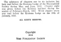

  
[Intangible Textual Heritage](../../index)  [Esoteric](../index) 
[Index](index)  [Next](htaq01) 

------------------------------------------------------------------------

[Buy this Book at
Amazon.com](https://www.amazon.com/exec/obidos/ASIN/0911662316/internetsacredte)

------------------------------------------------------------------------

  
*Hidden Treasures of the Ancient Qabalah*, by Elias Gewurz, \[1918\], at
Intangible Textual Heritage

------------------------------------------------------------------------

p. 1

  [  
Click to enlarge](img/title.jpg)  
Title Page  

# THE HIDDEN TREASURES

# OF THE

# ANCIENT QABALAH

###### BY

## ELIAS GEWURZ

<table data-border="0" width="25%">
<colgroup>
<col style="width: 100%" />
</colgroup>
<tbody>
<tr class="odd">
<td data-valign="top" width="655">
"<em>And cherish deep within thy heart the memory of those who have served as a channel of light to thy perplexed soul, and be thou grateful to them</em>." 
—From the Golden Precepts of Trismegistus.
</td>
</tr>
</tbody>
</table>

### VOL. I

### THE TRANSMUTATION OF PASSION INTO POWER

#### YOGI PUBLICATION SOCIETY

#### Masonic Temple

#### Chicago, Ill.

#### \[1918\]

Scanned, proofed and formatted at Intangible Textual Heritage by John
Bruno Hare, March 2008. This text is in the public domain in the US
because it was published prior to 1923.

p. 2

 
[  
Click to enlarge](img/verso.jpg)  
Verso  

|                                                                                                                                                                                                                                                                                                                                                              |
|--------------------------------------------------------------------------------------------------------------------------------------------------------------------------------------------------------------------------------------------------------------------------------------------------------------------------------------------------------------|
| The substance of chapters one to six inclusive has been read before the Krotona Lodge of the Theosophical Society during May and June, 1915. Chapter eight was given before the Krotona institute during the session of February-March, 1915. While chapter seven was read before the Krotona Lodge on the 19th of January, 1915. |

------------------------------------------------------------------------

[Next: What is the Qabalah?](htaq01)
