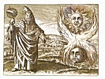

  
[Intangible Textual Heritage](../../index)  [Esoteric](../index) 
[Index](index)  [Previous](htaq10)  [Next](htaq12) 

------------------------------------------------------------------------

[Buy this Book at
Amazon.com](https://www.amazon.com/exec/obidos/ASIN/0911662316/internetsacredte)

------------------------------------------------------------------------

  
*Hidden Treasures of the Ancient Qabalah*, by Elias Gewurz, \[1918\], at
Intangible Textual Heritage

------------------------------------------------------------------------

p. 119

*The Light Eternal According to the Qabalah*

p. 120

|                                                                                                                                                                                                                                                                                                                |
|----------------------------------------------------------------------------------------------------------------------------------------------------------------------------------------------------------------------------------------------------------------------------------------------------------------|
| The secret Brotherhoods which formed the splendour of Egypt taught that life itself is the great Initiator, and the Qabalah, from which the Wisdom of the Egyptian Hierophants was derived, enjoined upon its students to "store the melody of life in their hearts" and to learn from it all that is needful. |

p. 121

### IX.

### THE LIGHT ETERNAL ACCORDING TO THE QABALAH

The Light Eternal comes from the bosom of God and shines in the eyes of
every good man. It illuminates the face and lends a gentle touch to its
expression and features. It is wholly absent in the countenance of the
ungodly and no effort of theirs will imitate it. It is a gift from the
good God to the children of light, and he bestows it upon them as a mark
of his special affection.

Blessed be the man in whom this light has been lighted, for he will
never lack anything needful, and even the wrath of his enemies will work
goad for him. It is the light which the Prophets spoke of, and the
Patriarchs desired so very much. It is the priceless pearl which it is
well worth while to search after. Seek it, O Man! but not outside thee.

------------------------------------------------------------------------

[Next: X. Regeneration According to the Qabalah](htaq12)
