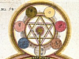

  
[Intangible Textual Heritage](../../index)  [Esoteric](../index) 
[Index](index)  [Previous](ihas22)  [Next](ihas24) 

------------------------------------------------------------------------

[Buy this Book at
Amazon.com](https://www.amazon.com/exec/obidos/ASIN/0853301107/internetsacredte)

------------------------------------------------------------------------

  
*Initiation, Human and Solar*, by Alice A. Bailey, \[1922\], at
Intangible Textual Heritage

------------------------------------------------------------------------

p. 209

### AN ESOTERIC CATECHISM

The following are some words from Archive XIII of the Masters’ Records,
that carry with them a message for the struggler on the Way. They are
somewhat on the line of an old catechism, and used to be recited by the
participants in the lesser mysteries before they passed on into the
greater.

What seest thou, O Pilgrim? Lift up thine eyes and tell what thou
beholdest.

\[paragraph continues\] I see a ladder,
mounting within the vault of blue, its feet lost sight of in the mists
and fogs that circle round our planet.

Where standest thou, O Pilgrim? On what are placed thy feet?

\[paragraph continues\] I stand upon a
portion of the ladder, the fourth division well nigh mounted; its latter
part stretches before me into the darkness of a stormy night. Beyond
that sphere of utter gloom I see the ladder rise again, radiant and
glowing in its fifth division.

What marks those portions which you thus describe as separated from
another part? Do not all form but one completed ladder of clearly marked
proportions?

\[paragraph continues\] Always a gap
appeareth to the eye, which (when approached more closely) resolveth
then itself into a Cross, by which one mounteth to the next division.

p. 210

What causeth then the Cross? How mount you by its aid?

\[paragraph continues\] The Cross is
formed by aspirations, instilled by Godlike urge, which cut athwart the
lower world desires, implanted by the life developed from below.

Explain more clearly what you mean, and how that Cross becomes the Way.

\[paragraph continues\] The arms that form
the Cross become the great dividing line, placed twixt the lower and the
higher. Upon those arms the hands are nailed,—the hands that grasp and
hold, ministering to the lower needs, trained thus through many aeons.
Lo, when the hands are helpless held, and cannot grasp and hold, the
inner life slips from its sheath, mounting the limb upright. It passeth
from the lower fourth, and the Cross doth bridge the gap.

Pass they with ease that mount that limb, and leave the fourth behind?

\[paragraph continues\] They pass through
tears, through clouds and mists; they suffer and they die. They bid
adieu to all earth's friends; they mount the Way alone; they bridge the
gap with loving deeds done in the pain of living; they lift one hand
aloft to Him Who standeth just above; they lean one downward to the man
who standeth next below. The hands, freed from the transverse arms, are
freed but to be held. Only the empty nail-marked hands can keep the
chain complete.

Where ends the ladder's length? What point of gloom is pierced by it and
where projects its end?

\[paragraph continues\] It cuts the
crystallising sphere with all its myriad forms; it

p. 211

pierces through the watery plane, washed by the swirling tides; it
passes through the nethermost hell, down into densest maya, and ends
within the latent fire, the molten lake of fiercest burning, touching
the denizens of fire, the Agnichaitans of the scarlet heat.

Where mounts the ladder's length? Where is its consummation?

\[paragraph continues\] It mounteth
through the radiant spheres, through all their six divisions. It riseth
to the mighty Seat within the final fifth, and passeth from that mighty
Seat to yet another greater.

Who sits upon that mighty Seat within the final fifth?

\[paragraph continues\] He with the Name
we mention not, save in utter adoration; the Youth of Endless Summers,
the Light of Life itself, the Wondrous One, the Ancient One, Lord of
Venusian Love, the great Kumara with the Flaming Sword, the Peace of all
the Earth.

Sits He alone, this Wondrous One, upon His sapphire throne?

\[paragraph continues\] He sits alone, yet
close upon the rainbow steps there stand three other Lords, garnering
the product of Their work and sacrificing all Their gain to aid the Lord
of Love.

Are They assisted in Their work? Do other Ones of greater powers than
ours stand too upon the ladder?

\[paragraph continues\] These mighty Four,
Action and Love, in wise co-operation work with Their Brothers of a
lesser grade, the three Great Lords we know.

p. 212

Who aid these mighty Lords? Who carry on Their work, linking the lower
with the higher?

\[paragraph continues\] The Brothers of
Logoic Love in all Their many grades. They stay within the final fifth
till it absorbeth all the fourth.

Where mounts the ladder then?

\[paragraph continues\] To the greatest
Lord of all, before Whom e’en that Ancient One bends in obeisance low;
before Whose throne of effulgent light Angels of highest rank, Masters
and Lords of uttermost compassion, prostrate Themselves and humbly bend,
waiting the Word to rise.

When sounds that *Word* and what transpires when it echoes through the
spheres?

\[paragraph continues\] That *Word* sounds
not till all is done, until the Lord of endless love deemeth the work
correct. He uttereth then a lesser Word that vibrateth through the
scheme. The greater Lord of cosmic Love, hearing the circling sound,
addeth completion to the chord, and breatheth forth the whole.

What will be seen, O Pilgrim on the Way, when sounds that final chord?

\[paragraph continues\] The music of the
endless spheres, the merging of the seven; the end of tears, of sin, of
strife, the shattering of forms; the finish of the ladder, the blending
in the All, completion of the circling spheres and their entry into
peace.

What part, O Pilgrim on the Way, play you within this scheme? How will
you enter into peace? How stand before your Lord?

\[paragraph continues\] I play my part
with stern resolve, with earnest aspiration;

p. 213

\[paragraph continues\] I look above, I
help below; I dream not, nor I rest; I toil; I serve; I reap; I pray; I
am the Cross; I am the Way; I tread upon the work I do; I mount upon my
slain self; I kill desire, and I strive, forgetting all reward. I forego
peace; I forfeit rest, and in the stress of pain I lose myself and find
Myself and enter into peace.

------------------------------------------------------------------------

[Next: The Great Invocation](ihas24)
