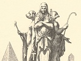

  
[Intangible Textual Heritage](../../index)  [Esoteric](../index) 
[Index](index)  [Next](isi01) 

------------------------------------------------------------------------

[Buy this Book at
Amazon.com](https://www.amazon.com/exec/obidos/ASIN/0766181146/internetsacredte)

------------------------------------------------------------------------

  
*The Isiac Tablet of Cardinal Bembo*, by W. Wynn Westcott, \[1887\], at
Intangible Textual Heritage

------------------------------------------------------------------------

# TABULA BEMBINA

###### SIVE

### MENSA ISIACA.

## THE ISIAC TABLET

###### OF

##### CARDINAL BEMBO.

#### Its History and occult Significance.

###### BY

### W. WYNN WESTCOTT,

Hon. Magus Soc. Ros. in Ang.

Hon. Member Hermetic Soc.

"Une belle action, est une joie éternelle."

#### BATH:

#### ROBT. H. FRYAR,

#### \[1887\]

(*Year of jubilee*)

Scanned, proofed and formatted at Intangible Textual Heritage, December
2007 by John Bruno Hare. This text is in the public domain in the US
because it was published prior to 1923. These files may be used for any
purpose.

  [  
Click to enlarge](img/title.jpg)  
Title Page  

------------------------------------------------------------------------

[Next: Synopsis of Monograph](isi01)
