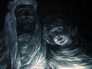

  
[Intangible Textual Heritage](../../index)  [Esoteric](../index) 
[Christianity](../../chr/index)  [Index](index)  [Previous](jlgi04) 
[Next](jlgi06) 

------------------------------------------------------------------------

[Buy this Book at
Amazon.com](https://www.amazon.com/exec/obidos/ASIN/156459498X/internetsacredte)

------------------------------------------------------------------------

[Buy this Book on
Kindle](https://www.amazon.com/exec/obidos/ASIN/B0031574J6/internetsacredte)

------------------------------------------------------------------------

  
*Jesus, the Last Great Initiate*, by Edouard Schuré, \[1908\], at
Intangible Textual Heritage

------------------------------------------------------------------------

p. 39

### CHAPTER III

### THE ESSENES—JOHN THE BAPTIST—THE TEMPTATION

What he wished to know he could learn
from none other than the Essenes.

The Gospels have maintained perfect silence as to the deeds of Jesus,
previous to his meeting with John the Baptist, through whom, according
to them, he in some way took possession of his ministry. Immediately
afterwards he makes his appearance in Galilee with a clearly defined
doctrine, the assurance of a prophet, and the consciousness of the
Messiah. But evidently this bold and premeditated début was preceded by
the long development of a veritable initiation. No less certain is it
that this initiation must have taken place in the sole association in
Israel, which, at that time, preserved the real traditions of the
prophets and adopted their mode of living. There can be no doubt of this
among those who, rising above the superstition of literal
interpretation, have the courage to discover how things are linked
together by their spirit. This arises not merely from the intimate
relations seen to exist between the doctrine of Jesus and that of the
Essenes, but even from the very silence kept by the Christ and his
disciples concerning this sect. Why does he who attacks with
unparalleled courage all the religious sects of his day, never mention
the Essenes? And why do neither the apostles nor evangelists speak

p. 40

of them? Evidently because they considered the Essenes as belonging to
themselves, as being linked with them by the oath of the mysteries, and
linked to the sect of the Christians.

The Order of the Essenes constituted in the time of Jesus the final
remnant of those brotherhoods of prophets organized by Samuel. The
despotism of the rulers of Palestine, the jealousy of an ambitious and
servile priesthood, had forced them to take refuge in silence and
solitude. They no longer struggled as did their predecessors, but
contented themselves with preserving their traditions. They had two
principal centers, one in Egypt, on the banks of Lake Maoris, the other
in Palestine, at Engaddi, near the Dead Sea. The name of Essenes they
had adopted came from the Syrian word "Asaya," physician—in Greek,
therapeutes; for their only acknowledged ministry with regard to the
public was that of healing disease, both physical and moral. "They
studied with great diligence," says Josephus, "certain medical writings
dealing with the occult virtues of plants and minerals." [1](#fn_16)

Some of them possessed the gift of prophecy, as, e. g., Menahim, who had
prophesied to Herod that he should reign. "They serve God," said Philo,
"with great piety, not by offering victims but by sanctifying the
spirit; avoiding towns, they devote themselves to the arts of peace; not
a single slave is to be found among them; they are all free and work for
one another." [2](#fn_17) The rules of the Order
were strict; in order to enter, a year's novitiate was necessary. If one
had given sufficient proofs of temperance, he was admitted to the
ablutions,

p. 41

though without entering into relations with the masters of the Order.
Tests, extending over another two years, were necessary before being
received into the brotherhood. They swore "by terrible oaths" to observe
the rules of the Order and to betray none of its secrets. Then only did
they participate in the common repasts, which were celebrated with great
solemnity and constituted the inner worship of the Essenes. The garment
they had worn during these repasts they looked upon as sacred and to be
removed before resuming work. These fraternal love-feasts, primitive
form of the Supper instituted by Jesus, began and ended by prayer. The
first interpretation of the sacred books of Moses and the prophets was
here given. But the explanation of the texts allowed of three
significations, just as there were three degrees of initiation. Very few
attained to the highest degree. All this wonderfully resembles the
organization of the Pythagoreans, [1](#fn_18)
but certainly it was almost the same among the ancient prophets, for it
is to he found wherever initiation has existed. It must be added that
the Essenes professed the essential dogma of the Orphic and Pythagorean
doctrine; that of the preexistence of the soul, the consequence and
reason of its immortality. "The soul," they said, "descending from the
most subtle ether, and attracted into the body by

p. 42

a certain natural charm (ἰυγγί τινι φυσικῇ), remains there as in a
prison; freed from the bonds of the body, as from a long servitude, it
joyfully takes its flight" (Josephus, *A. J.*, ii. 8).

Among the Essenes, the brothers, properly so called, lived under a
community of property, and in a condition of celibacy, cultivating the
ground, and, at times, educating the children of strangers: The married
Essenes formed a class affiliated and under subjection to the other.
Silent, gentle, and grave, they were to be met with here and there,
cultivating the arts of peace. Carpenters, weavers, vine-planters, or
gardeners, never gunsmiths or merchants. Scattered in small groups about
the whole of Palestine, and in Egypt, even as far as Mount Horeb, they
offered one another the most complete hospitality. Thus we see Jesus and
his disciples journeying from town to town, and from province to
province, and always certain of finding shelter and lodging. "The
Essenes," said Josephus, "were of an exemplary morality, they forced
themselves to suppress passion and anger; always benevolent, peaceable,
and trustworthy. Their word was more powerful than an oath, which, in
ordinary life, they looked upon as superfluous, and almost as perjury.
They endured the most cruel of tortures, with admirable steadfastness of
soul and smiling countenance rather than violate the slightest religious
precept." Indifferent to the outward pomp of worship at Jerusalem,
repelled by the harshness of the Sadducees, and the prayers of the
Pharisees, as well as by the pedantry of the synagogue, Jesus was
attracted towards the Essenes by natural affinity. [1](#fn_19)

p. 43

The premature death of Joseph set entirely free Mary's son, now grown
into a man. His brothers could continue the father's trade and supply
all family needs, so Mary gave him permission to leave secretly for
Engaddi. Welcomed as a brother and one of the elect, he rapidly acquired
over his very masters an invincible ascendancy, by reason of his
superior faculties, his ardent love, and an indescribable divine element
manifested throughout his entire being. From the Essenes he received
what they alone could give him: the esoteric tradition of the prophets,
and by its means, his own historical and religious tendency or trend. He
came to understand how wide a gulf separated the official Jewish
doctrine from the ancient wisdom of the initiates, the veritable mother
of religions, though ever persecuted by Satan, *i. e.*, by the spirit of
evil, of egoism, hatred, and denial, allied with absolute political
power and priestly imposture. He learned that Genesis, under the seal of
its symbolism, concealed a theogony and cosmogony as far removed from
their literal signification as is the profoundest truth of science from
a child's fable. He contemplated the days of Aelohim, or the eternal
creation by emanation of the elements and the formation of the worlds,
the origin of the floating souls, and their return to God by progressive
existences or generations of Adam. He was struck with the grandeur of
the thought of Moses, whose intention had been to prepare the religious
unity of the nations by establishing the worship of the one God, and
incarnating this idea into a people.

p. 44

Afterwards he was instructed in the doctrine of the divine Word, already
taught by Krishna in India, by the priests of Osiris, by Orpheus and
Pythagoras in Greece, and known to the prophets under the name of *the
Mysteries of the Son of Man and of the Son of God*. According to this
doctrine, the highest manifestation of God is man, who, in constitution,
form, organs, and intelligence is the image of the Universal Being,
whose faculties he possesses. In the earthly evolution of humanity,
however, God is scattered, split up, and mutilated, so to speak, in the
multiplicity of men and of human imperfections. In it he suffers,
struggles, and tries to find himself, he is the Son of Man, the perfect
Man, the Man-Type, the profoundest thought of God, remaining hidden in
the infinite abyss of his desire and power. And yet at certain epochs,
when humanity is to be saved from some terrible gulf, and set on a
higher stand, a chosen one identifies himself with divinity, attracts it
to himself by strength, wisdom, and love, and manifests it anew to men.
Then, divinity, by virtue and breath of the Spirit, is completely
present in him: the Son of Man becomes the Son of God, and his living
word. In other ages and among other nations, there had already appeared
sons of God, but since Moses, none had arisen in Israel. All the
prophets were expecting this Messiah. The Seers even said that this time
he would call himself the Son of Woman, of the Heavenly Isis, of the
divine light which is the Bride of God, for the light of Love would
shine in him, above every other light, with a dazzling splendor,
hitherto unknown on earth.

All these secrets which the patriarch of the Essenes unfolded to the
young Galilean on the solitary banks of

p. 45

the Dead Sea, in lonely Engaddi, seemed to him wonderful, but yet known.
It was with no ordinary emotion that he heard the chief of the Order
comment on the words still to be read in the Book of Henoch: "From the
beginning the Son of Man was in the mystery. The Father kept him near
his mighty presence, and manifested him to his elect.… But the Kings
shall be afraid and shall prostrate themselves to the ground with
terror, when they shall see the Son of Woman seated on the throne of his
glory.… Then the elect shall summon all the forces of heaven, all the
saints from on high and the power of God; and the Cherubim, the
Seraphim, the Ophanim, all the angels of *Might*, all the angels of the
*Lord*, *i. e.* of the Elect and *of the other Might,* serving on earth
and above the waters, shall raise their voices." [1](#fn_20)

At these revelations the words of the prophets, read and meditated upon
times innumerable, appeared before the eyes of the Nazarene, with a
profound and terrible light, like lightning flashes in the night. Who
could this Elect be, and when would he appear before Israel?

Jesus passed a series of years among the Essenes. He submitted to their
discipline, studied with them the secrets of nature, and the occult
power of healing. To develop his spirit, he gained entire mastery over
his body. Not a day passed without self-questioning and meditation on
the destiny of humanity. That was a

p. 46

memorable night for the Order of Essenes and the new adept, when he
received in profoundest secrecy the superior initiation of the fourth
degree, the one granted only in the special case of a prophetic mission,
requested by the brother, and confirmed by the Elders. A meeting was
held in a cave cut into the mountain, and resembling a vast hall with an
altar of stone seats. The chief of the Order was there with a few
Elders. Sometimes two or three initiates, prophetesses also, Essenes,
were admitted to the mysterious ceremony. Bearing torches and branches
of palm trees, they greeted the new Initiate who was clothed in a robe
of white linen, as "Bridegroom and King," the one they had seen in
vision, and whom they now looked upon perhaps for the last time! Then,
the chief of the Order, generally an old centenarian (Josephus states
that the Essenes lived to an advanced age) offered him *the golden
chalice* as a symbol of the final initiation, containing *the wine of
the Lord's vineyard*, symbol of divine inspiration. Some said that Moses
and the seventy had drunk therefrom; others trace it back from Abraham,
who received from Melchisedek this very initiation under the elements of
bread and wine. [1](#fn_21) The Eiders never
offered the cup to anyone in whom they had not recognized, with distinct
certainty, the signs of a prophetic mission. But no one could define
this mission, he was to find it himself; such is the law of the
initiates—nothing from without, everything from within. Henceforth he
was free, master of his own actions, liberated from the Order, a very
hierophant, obedient to the impulses of the spirit which could fling him
into the depths or transport him on high, far above scenes of torture
and human passion.

p. 47

When after the songs and prayers and sacramental words of the Elder the
Nazarene took the cup, a pale ray of the sun shooting through a rugged
mountain crag ran in and about the torches and the flowing white
garments of the Essene prophetesses. They too shuddered as they saw it
fall on the Galilean's beautiful countenance, now overshadowed with a
look of infinite sorrow. Were his thoughts dwelling on the poor wretches
of Siloam; had he already, in that ever-present anguish, caught a
glimpse of the path he was to traverse?

About this time, John the Baptist was preaching on the banks of the
Jordan. He was not an Essene but a prophet of the people, belonging to
the sturdy race of Judah. Driven into the wilderness by a fierce
unyielding piety, he had there, in prayer, fasting, and mortification,
lived a life of the strictest asceticism. Over his bare sun-tanned skin
he wore a camel's-hair cloak, symbol of the penitence he wished to
impose both on himself and on his people. Deeply did he feel Israel's
distress, and ardently did he await deliverance. According to the Jewish
idea, he imagined the Messiah would soon come as an Avenger and a Judge;
that, like another Maccabæus, he would rouse the people to revolt, drive
out the Romans, punish the guilty, and finally enter Jerusalem in
triumph, where, in peace and justice, he would re-establish the kingdom
of Israel over all nations. He announced to the multitudes, who eagerly
drank in his words, that the time was nigh for the coming of this
Messiah, adding that they might prepare for it in a spirit of true
repentance. Adopting the Essenian custom of ablution and transforming
it, he had looked upon baptism in the Jordan as a visible symbol, a
public accomplishment of the inner purification he insisted

p. 48

upon. This new ceremony, this earnest preaching to immense crowds of
people, with the wilderness as a background, and beside the sacred
waters of the Jordan, near the rugged mountains of Peraea and Judaea,
seized hold of the imagination, and attracted multitudes. It recalled
the glorious days of the prophets of old, and gave the people what the
temple could not give them, an inner shock, and, after the terrors of
repentance had passed, a vague though mighty hope. They came from every
part of Palestine, and even from more distant lands, to hear the
desert-saint who foretold the coming of the Messiah. The populace,
attracted by his message, remained there in camps, for weeks at a time,
listening to him daily, unwilling to depart, awaiting the Messiah's
coming. Many asked to take up arms under his command, and to recommence
the holy war. Herod Antipas and the priests of Jerusalem began to be
uneasy at this excitement of the populace. The signs of the times, too,
were ominous; Tiberius, at the age of seventy-four, was rapidly
hastening his death by scenes of debauchery at Capreae; Pontius Pilate
was persecuting the Jews with redoubled fury; while, in Egypt, the
priests had given forth that the Phœnix was about to spring again to
birth from her ashes. [1](#fn_22)

Jesus, who felt the prophetic calling even more emphatic within his
soul, though as yet he was still feeling his way, came also to the
desert of the Jordan, accompanied by a few Essenes, who already
acknowledged him as master. He wished to see the Baptist, to listen to
his message, and be baptized in public. His desire was to present
himself in an humble and respectful attitude towards the prophet who had
the courage to

p. 49

denounce the present rulers, and arouse from slumber the soul of Israel.

He saw the rough ascete, hairy and bearded, with his prophetic lionlike
head, standing in a wooden pulpit under a rustic tent covered with
branches and goatskins. All around among the scanty desert shrubs was a
mighty crowd, an entire camp: publicans, soldiers of Herod, Samaritans,
Levites from Jerusalem; Idumeans with their flocks of sheep, even Arabs
with their camels, tents and caravans arrested by "the voice crying in
the wilderness," and this voice of thunder passed over these multitudes.
It said: "Repent ye; prepare ye the way of the Lord, make His paths
straight." He called the Pharisees and Scribes "a race of vipers." He
added that "the axe was already laid unto the root of the trees," and
said of the Messiah: "I baptize you with water only, but He shall
baptize you with fire." Then, about sunset, he saw the crowds press
towards a cove on the water's bank, and Herod's mercenaries bend their
rough backs beneath the water poured over them by the Baptist. He drew
nearer; John did not know Jesus, knew nothing whatever concerning him,
but he recognized the Essene by his linen garment. He saw him, a mere
unit in the crowd, enter the water up to the girdle, and humbly bend to
receive the baptismal sprinkling. When the neophyte arose, the savage
preacher's fiery eyes met the Galilean's calm, gentle gaze. A quiver ran
through the man of the wilderness as he saw the look of wondrous
sweetness beaming from the eyes of Jesus, and involuntarily the question
escaped his lips: "Art thou the Messiah?" [1](#fn_23)

p. 50

The mysterious Essene made no reply, but with bowed head and crossed
hands, he awaited the blessing. John knew that silence was the law of
the Essene novices. After solemnly extending both hands, the Nazarean
disappeared with his companions among the water reeds.

The Baptist saw him depart with mingled feelings of doubt, secret joy,
and profound sadness. What was his own knowledge, his own prophetic hope
compared with the light he had seen in the eyes of the unknown, a light
which seemed to illuminate his whole being? Ah! if the handsome young
Galilean were the Messiah, then indeed had the brightest day of his life
dawned! But his own part would now be over, his own voice silent. From
this day forward he preached in deeper and more emotional tones on the
melancholy theme: "He must increase and I must decrease." He was
beginning to feel the gloom and weariness of an old lion tired of
roaring, and now silently awaiting the end.

Could it be that he were the Messiah? The Baptist's question also found
an echo in the soul of Jesus. Ever since his consciousness had sprung to
life, he had found God within himself, and the certainty of the kingdom
of Heaven in the radiant beauty of his visions. Then came the suffering
of humanity which had filled his heart with the awful outpour of its
anguish. The wise Essenes had taught him the secret of religions and of
mysteries,

p. 51

they had shown him the spiritual decadence of humanity, and its
expectation of a savior. But how could he find the strength needed to
rescue it from the pit? And now, the direct call of John the Baptist
fell on the silence of his meditations like a thunderbolt from Sinai.
Could he be the Messiah?

Jesus could answer this question only by inmost meditation. Hence this
retreat, this forty days’ fast, narrated by Matthew in the form of a
symbolic legend. The Temptation in reality represents in the life of
Jesus this great crisis, this sovereign vision of truth, which all
prophets, all religious initiates, must infallibly experience before
beginning their work.

Over above Engaddi, where the Essenes cultivated sesame and the vine, a
steep footpath led to a cave or grotto opening out on to the
mountainside. It was entered by way of Dorian columns cut out of the
rough rock, similar to those of the "Apostles" retreat in the valley of
Jehosophat. There one remained suspended above the yawning precipice as
though from an eagle's nest. Below, in a gorge, could be seen vineyards
and human dwellings away in the distance, the Dead Sea motionless and
grey, and the lonely mountains of Moab. The Essenes had appointed this
retreat for such among them as wished to submit to the test of solitude.
In this spot were several rolls of the prophets, strengthening spices,
dry figs, and a small stream of trickling water, sole nourishment of the
ascete in meditation. It was to this cave that Jesus retired. First of
all, he mentally reviewed the whole of humanity's past life, and
estimated the gravity of the present times. Rome was in sovereign power,
and with her what the Persian magi had called the reign of Ahrimanes,
and the prophets the

p. 52

reign of Satan, the sign of the Beast, the apotheosis of Evil. Darkness
covered humanity, the soul of earth.

The people of Israel had received from Moses the royal and sacerdotal
mission of representing the male religion of the Father of the pure
Spirit, of teaching it to other nations, and effecting its triumph. Had
its kings and prophets fulfilled this mission? The prophets who alone
had been conscious of it, replied unanimously: No! Israel was in her
last throes, crushed beneath the might of Rome. Ought a rising of the
people to be hazarded once more as the Pharisees still expected; a
restoration by force of the temporal royalty of Israel? Should he
declare himself son of David, and exclaim with Isaiah: "In my wrath I
will trample upon the people… and overthrow their might"? Should he be a
second Maccabæus, and allow himself to be nominated pontifex-king? Jesus
might have made the attempt. He had seen the crowds ready to rise at the
voice of John the Baptist, and the strength he was himself conscious of
was far greater than that of the prophet of the wilderness! But then,
would violence overcome violence? Would the sword put an end to
government by the sword? Would there not be thus supplied fresh recruits
to the powers of darkness who were watching their prey in secret?

Ought he not rather to place within the reach of all mankind this truth,
which hitherto had remained the privilege of a few sanctuaries and
initiates, to open every heart to receive it, until the time should be
ripe for it to penetrate the mind by inner revelation and science,
*i. e.* to preach the kingdom of Heaven to the poor and lowly,
substitute the reign of Grace for that

p. 53

of the Law, transform humanity from its very base by regeneration of
souls?

But to whom would victory belong, to Satan or to God? To the spirit of
evil who reigns with the formidable powers of earth, or to the divine
spirit who is enthroned above the invisible regions of heaven, and
sleeps in the heart of man just as the spark lies hidden in the flint?
What would be the fate of the prophet who should dare to tear away the
veil from the temple and lay bare the emptiness of the sanctuary,
braving at once Herod and Cæsar?

And yet it must be done! The inner voice did not say to him as it did to
Isaiah: "Take a large volume and write therein with a man's pen!" The
voice of God tried out to him, "Rise and speak!" The word of life must
be found, the faith which removes mountains, the strength which shatters
the bulwarks of evil.

Jesus began fervently to pray. Then a feeling of uneasiness, an
increasing trouble came over his soul. He had a feeling that he was
losing the marvellous felicity he had participated in, and that he was
sinking into a very pit of darkness. A black, dense mist came over him,
peopled with phantoms of every kind. He recognized his brothers, his
Essene masters, his mother. One after the other they said to him: "It is
madness for you to wish for what can never be! You know not what is
before you! Renounce it all!" The invincible inner voice replied: "I
must go on!" Thus he struggled for a series of days and nights, at times
standing, then again on his knees or prostrate on the ground. The abyss
in which he was sinking became deeper and deeper, and thicker and
thicker the enveloping mist. He

p. 54

felt as though he were approaching something inexpressibly terrible.

Finally, he entered that state of lucid ecstasy in which the very depth
of consciousness awakens, enters into communication with the living
Spirit of things, and projects in dreams the images of past and future.
His eyes close, and the outer world disappears. The Seer contemplates
truth in the light which floods his whole being, and converts his
intelligence into a burning furnace.

Then came the clash of thunder, the mountain shook to its foundations. A
whirlwind coming from distant space carried off the Seer to the top of
the temple at Jerusalem. Down below shone roofs and minarets like a
forest of gold and silver. Hymns were ascending from the Holy of Holies,
waves of incense arose from every altar and formed in eddying circles
beneath his feet. People in festive garb filled the porticos, while
women joyfully sang into the air their hymns of ardent devotion.
Trumpets sounded, and a mighty chorus of voices exclaimed: "Glory to the
Messiah! the King of Israel!" "Thou shalt be this King if thou wilt
worship me," said a voice from below. "Who art thou?" asked Jesus.

Again the wind carried him through space to the summit of a mountain. At
his feet lay, in their golden glory, all the kingdoms of the earth.

"I am the king of spirits and the prince of the earth," answered the
voice from below.… "I know who thou art," said Jesus; "thy forms are
innumerable, thy name is Satan. Appear in thy earthly form." … The
figure of a crowned monarch appeared, enthroned in the clouds. Around
his imperial head shone a faint,

p. 55

pale halo. The sombre figure stood out against a blood-red nimbus, with
its pallid, ghastly countenance, and eyes flashing forth a cold steely
light. He said: "I am Cæsar. Only bow down before me, and I will give
thee all these kingdoms." Jesus said to him: "Get thee behind me,
tempter! It is written: Thou shalt worship only the Lord thy God."
Immediately the vision faded away.

Finding himself alone in the cave of Engaddi, Jesus said: "By what sign
shall I overcome the powers of the earth?" … "By the sign of the Son of
Man," said a voice from above. "Show me this sign," said Jesus.

Away on the horizon appeared a shining constellation, four stars in the
sign of a cross. The Galilean recognized the sign of ancient initiations
familiar to Egypt and preserved by the Essenes. When the world was
young, the sons of Japhet had worshipped it as the sign of earthly and
heavenly fire, the sign of Life with all its joys, of Love with all its
wonders. Later the Egyptian initiates had seen in it the symbol of the
great mystery, Trinity dominated by Unity, the image of the sacrifice of
the ineffable Being who breaks himself in order to manifest himself in
the universe. Symbol at once of life, death, and resurrection, it
covered innumerable hypogea, temples and tombs.… The brilliant cross
grew larger and came nearer, as though attracted by the heart of the
Seer. The four living stars shone forth like suns of light and glory.
"Behold the magic sign of Life and Immortality!" said the heavenly
voice. "In ancient times it was in the possession of men, now it is
lost. Wilt thou restore it to them?" … "I

p. 56

will," said Jesus.… "Then look, behold thy destiny!"

Suddenly the four stars disappeared. It was night; loud thunderclaps
shook the mountains to their foundations; while from the depths of the
Dead Sea emerged a dark, sombre mountain, surmounted with a black cross.
On it was nailed a man in the agony of death. The mountain was covered
with a demon-stricken mob, crying out in hellish jeers: "If thou art the
Messiah, save thyself!" The Seer opened wide his eyes, then fell back,
cold drops of perspiration streaming down his face, for this crucified
man was himself.… He had understood. In order to overcome, he must
identify himself with this terror-stricken image, summoned up by
himself, and placed there before him like an evil-boding omen. Wavering
in his uncertainty as to the emptiness of infinite space, Jesus felt at
once the tortures of the crucified one, the insults of men, and the
profound silence of heaven.… "Thou canst take it or reject it," said the
angelic voice. The vision of the cross-phantom and the crucified victim
began to grow dim, when of a sudden Jesus saw once more by his side the
sick wretches of the pool of Siloam, and behind them myriads of
despairing souls murmuring, with clasped hands: "Without thee we are
lost; save us, thou who knowest how to love!" Then the Galilean slowly
arose, and with outstretched arms, in an attitude of supreme love,
exclaimed: "Mine be the cross! Let but the world be saved!" Immediately
Jesus felt a mighty rending asunder throughout his frame, and a terrible
groan escaped his lips.… At the same time the dark, sombre mountain and
the cross faded away, a gentle radiant beam of divine felicity entered
the soul of the

p. 57

\[paragraph continues\] Seer, and from the
heights of heaven a voice descended, saying, "Satan is no longer master!
Death is overthrown! Glory to the Son of Man! Glory to the Son of God!"

When Jesus awoke from this vision nothing around him had changed; the
rising sun cast his golden beams on the sides of the cave of Engaddi;
soothing dewdrops—veritable tears of angelic love—bathed his bruised
feet, and light clouds of mist were rising from the Red Sea. But he was
no longer the same. A definite event had taken place in the fathomless
depths of his consciousness, he had solved the problem of life and had
won peace, the great certainty had entered his soul. From the rejection
of his earthly being, which he had trodden under foot and cast into the
pit, a new consciousness had arisen in radiant majesty.… He knew he had
become the Messiah by an irrevocable act of his will.

Soon after, he once more descended to the village of the Essenes, where
he learned that John the Baptist had just been seized by Antipas and
imprisoned in the fortress of Makerous. Far from showing fear at this
omen, he saw therein a sign that the time was ripe and that he in his
turn must act. Accordingly, he gave out to the Essenes that he was about
to preach in Galilee, "the Gospel of the kingdom of Heaven." That meant,
to bring the great mysteries within reach of the poor and lowly, to
translate for them the doctrine of the initiates. Like boldness had
never been seen since the days when Cakia Mouni, the last Buddha, moved
by mighty compassion, had preached on the banks of the Ganges. The same
sublime compassion for humanity animated Jesus. To it he joined inner
illumination, capacity

p. 58

for loving, a grandeur of faith and energy of action belonging to
himself alone. From the abyss of death which he had fathomed, and whose
bitterness he had tasted beforehand, he brought both hope and life for
all his brethren.

------------------------------------------------------------------------

### Footnotes

[40:1](jlgi05.htm#fr_16) Josephus, "Wars of the
Jews," xxx. 2, &c.; "Antiquities," xiii. 5-9; xviii. 1-5.

[40:2](jlgi05.htm#fr_17) Philo, "On the
Contemplative Life."

[41:1](jlgi05.htm#fr_18) Points in common
between Essenes and Pythagoreans: Prayer at sunrise; linen garments,
fraternal love-feasts; one year's novitiate; three degrees of
initiation; organization of the Order and community of possessions
managed by trustees; the law of silence; the oath of the mysteries; the
division of instruction into three parts: (1) Science of the universal
principles of Theogony, what Philo calls Logic; (2) Physics or
Cosmogony; (3) Morals, *i. e.*, everything dealing with man, the
conscience to which the healers specially devoted themselves.

[42:1](jlgi05.htm#fr_19) Points in common
between the doctrines of the Essenes and those of Jesus: "Love of one's
neighbor, emphasized as one's first p. 43
duty; prohibition of the oath as witnesses to truth; hatred of lying;
meekness; institution of the Supper, borrowed from the fraternal
love-feasts of the Essenes, but with a new significance, that of
sacrifice."

[45:1](jlgi05.htm#fr_20) Book of Henoch, chaps.
xlviii. and lxi. This passage shows that the doctrine of the Word, the
Trinity found in the Gospel of John existed in Israel long before the
time of Jesus, and came from the very depths of esoteric prophecy. In
the Book of Henoch, the Lord of Spirits represents the Father, the Elect
represents the Son, and the other Might, the Holy Ghost.

[46:1](jlgi05.htm#fr_21) Genesis xiv. 18

[48:1](jlgi05.htm#fr_22) Tacitus, Annals, vi.
28, 31.

[49:1](jlgi05.htm#fr_23) According to the
Gospels, John immediately recognized Jesus as the Messiah, and baptized
him as such. There are contradictory p. 50
accounts on this point, for, at a later time, when a prisoner of Antipas
at Makerous asks the question of Jesus, "Art thou he that should come,
or do we look for another?" this tardy doubt proves that though he might
have suspected Jesus to be the Messiah, he was not convinced of it. The
first compilers of the Gospels, however, being Jews, wished to present
Jesus as having received his mission and consecration from John the
Baptist, a popular prophet of Judaea.

------------------------------------------------------------------------

[Next: Chapter IV. The Public Life of Jesus—Popular and Esoteric
Instruction—Miracles—Apostles—Women](jlgi06)

